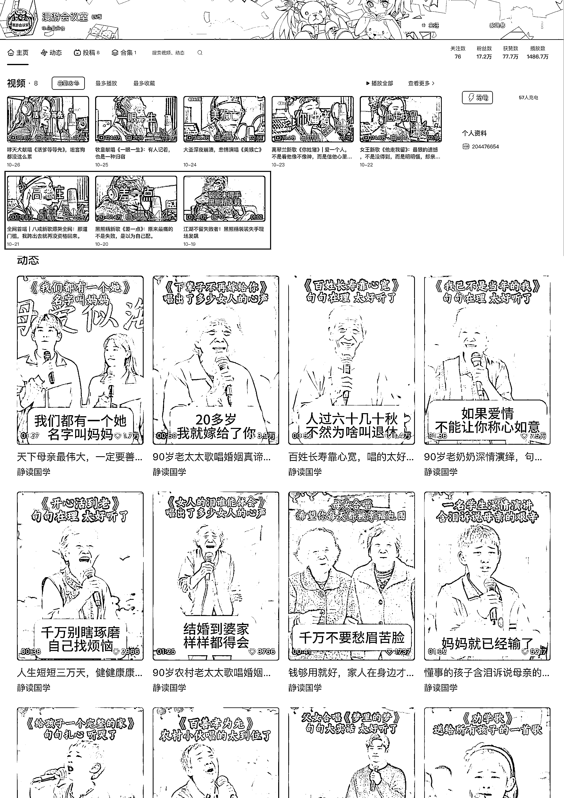
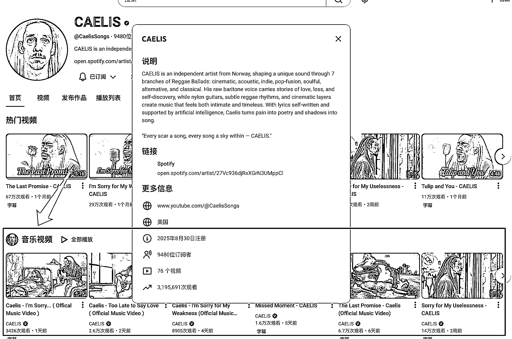
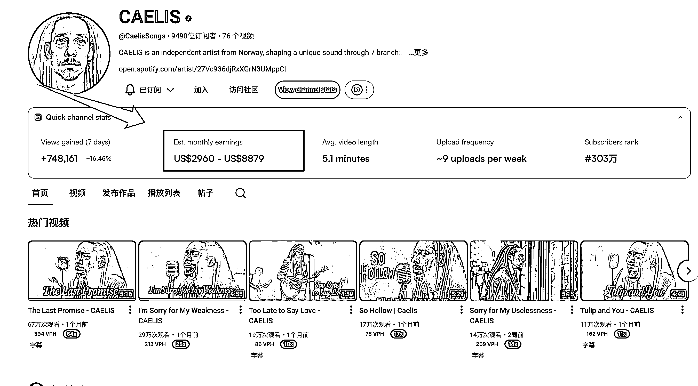
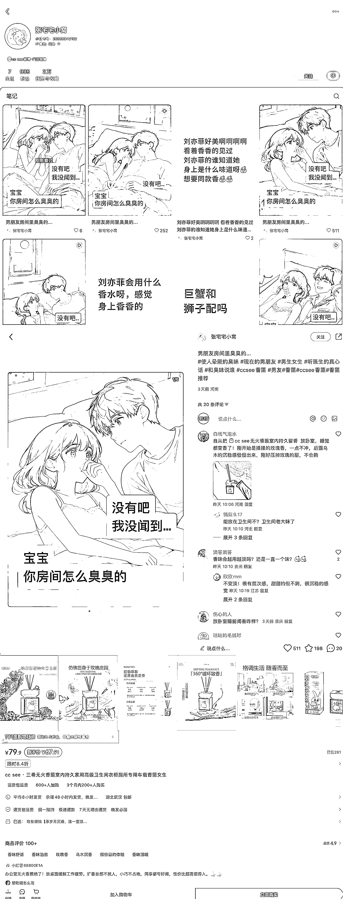
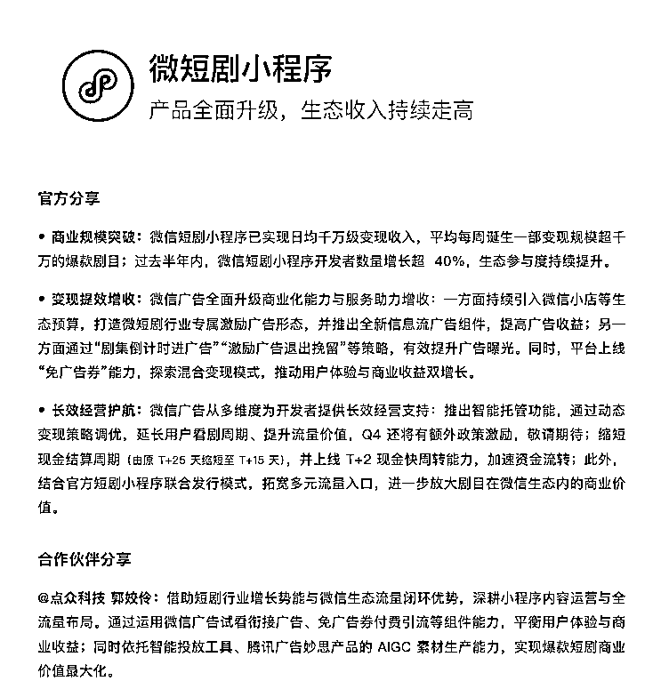
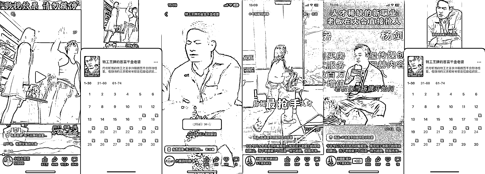
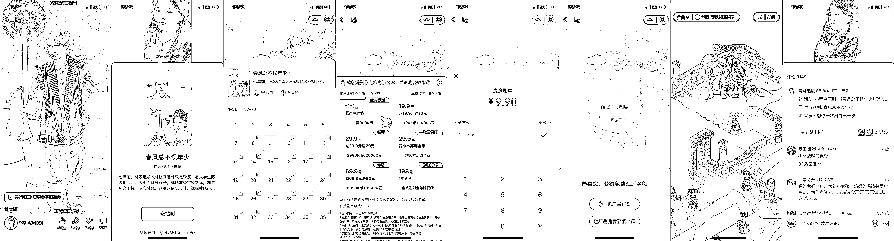
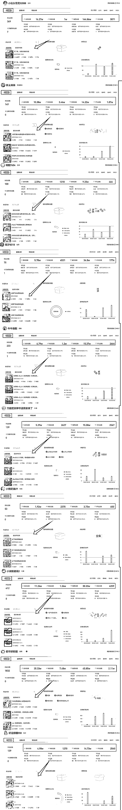
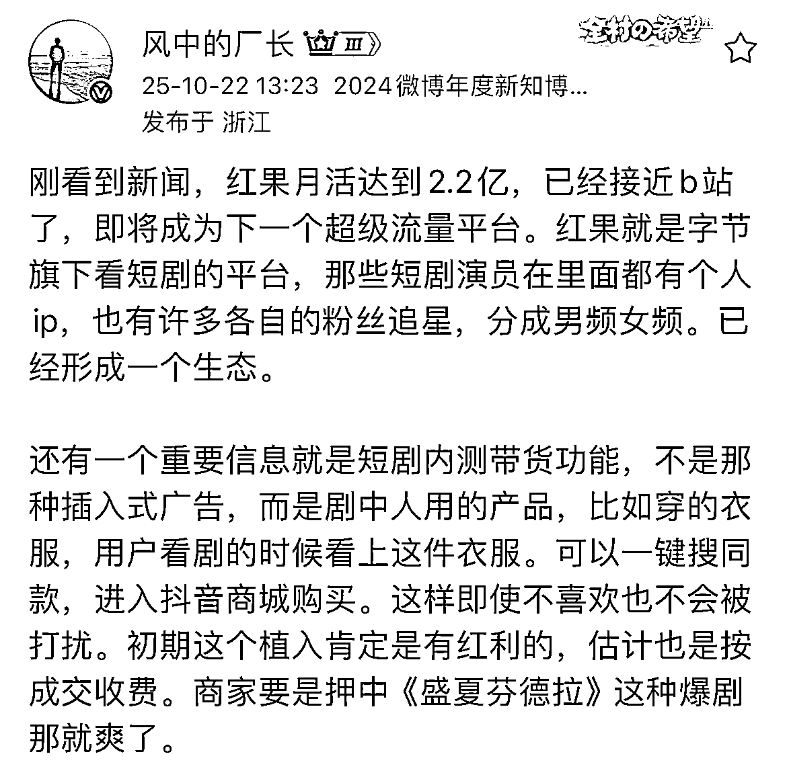

# (精华帖)(78 赞)第四期：《SCBI 第四期：我们观察到一些“新内容实验”》

> 原文：[`www.yuque.com/for_lazy/zhoubao/su1khng0agbgb5wq`](https://www.yuque.com/for_lazy/zhoubao/su1khng0agbgb5wq)

## (精华帖)(78 赞)第四期：《SCBI 第四期：我们观察到一些“新内容实验”》

作者： 杨爽@生财有术

日期：2025-10-29

来啦来啦，收到大家的催更了。

确实，该更新了。

这段时间，我们新增了一点工作量，开始招募更多的情报员，一起找项目、拆项目、验证项目。

真的很感谢大家对生财的支持，第一期的帖子下面说招聘，收到了很多圈友的简历，说实话我真的很开心有机会和大家聊一聊关于怎么找项目这件事。

聊下来才发现原来大家对“怎么找项目”这件事，都有自己的方法论：

有的圈友可以花四五个小时，就为了找到好项目“眼前一亮”的瞬间；

有的圈友和我分享自己是怎么搭建自己的情报线索网的，潜伏在各个群里，做一线的情报侦察机；

有的圈友靠订阅取胜，关注了几百个海内外的博主，做项目中转站；

也有圈友是效率党，用 AI 搭建自动化线索系统，一天能抓几百条。

......

总之，真的是百花齐放，各有各的招，很有趣。

学习了大家那么多，总要反哺一下，这不一有空我就来更新第四期了，给大家分享分享我们 SCBI 这一期的有趣项目。

对啦，如果你是第一次看到 SCBI，可以先去翻翻前几期

1.  第一期：SCBI 是什么 👉  [`t.zsxq.com/CaJxT`](https://t.zsxq.com/CaJxT)

2.  第二期：高通过率线索长什么样 👉  [`t.zsxq.com/NWFTD`](https://t.zsxq.com/NWFTD)

3.  第三期：那些奇怪但有趣的野路子 👉  [`t.zsxq.com/wezdY`](https://t.zsxq.com/wezdY)

好了，回到正题。这期我们选了三个方向都挺特别的项目，它们各自的逻辑不一样，但都值得被看到。

### **案例 1：AI MV——孙悟空都开始深夜 emo，唱歌了**

图 1、图 2

图 3

在 B 站、YouTube 最近火起来的一类内容，是“AI
MV”。最初看到有人让孙悟空唱《美猴亡》，艾莎唱《后来》我还以为是玩梗。结果点进去，声音、画面、情绪都很真实。

这一类 AI MV 通常由四个环节组成：

1.  AI 角色生成：用 Flux、Runway 等生成角色或场景；

2.  AI 拟声：用 Suno、So-VITS、DiffSinger 模拟人物声音；

3.  歌词生成：Claude 或 DeepSeek 写词，让剧情更贴情绪；

4.  视频包装：录音棚/舞台类 MV 模板一键成片。

我去找了一些在做的圈友询问，单条内容制作成本大概 40-200 元。

当然，不仅是 B 站，在 YouTube 上，已经出现了上百个 AI Music Cover 频道，@吴必得 找的一个案例（上图 3）是 8
月底刚注册的新号，不到两个月，单月收益预估在 2000 美元左右啦。

与此同时，视频号（上图 2）上也出现了一批面向中青年、中老年群体的 AI 歌曲号，内容风格更偏“情感治愈”和“怀旧经典”，播放量同样很可观。

总结下来，这类内容的门槛其实不高，一个人、一台电脑、一套模板，就能量产内容，而播放量上万、甚至上百万的视频，现在已经非常常见。

这里会有什么机会呢？

过去做音乐内容需要团队，现在一个创作者就能完成。AI
让“声音+情绪+画面”都能自动生成，内容成本大幅下降、情绪传播能力大幅提升，谁能做出稳定、有创造力风格的 AI MV，谁就能提前占领这个内容新流量口。

### **案例 2：这么硬的广告，也就小红书垂直小店能卖出去了吧**

第二个项目来自小红书，一个叫「张宅宅小窝」的账号，粉丝不到 1000，却卖出 261 单香薰产品。

内容非常简单，AI 生成动漫风情侣画面，文字是一句生活对白：

“宝贝，你房间怎么臭臭的？”

“没有吧，我没闻到啊……”

然后画面一转，出现香薰图和购买链接，没有复杂脚本，也没有大场景——就是一句像人说话的文案 + 一张 AI 图。

这里的项目逻辑也很好理解：

1.  用 AI 生成图解决拍摄成本；

2.  用剧情式文案解决广告生硬问题；

3.  用小红书垂类流量池做成交闭环。

这其实是“AI 内容 + 带货”最直接的结合。不靠粉丝量，不靠投流，靠的是：图像吸引注意力，文字触发购买。

对于会写、会审美的人，这是一个门槛极低、回报可见的项目。AI 生成图 + 小剧场文案 + 垂直产品，一个人就能跑出能出单的图文号。

### **案例 3：短剧推广/短剧带货，微短剧的空间值得想象**

图 1

图 2

图 3

图 4

图 5

9 月 25 日，微信官宣“微短剧小程序”升级。我们一直在观察这个生态的变化。过去两周，确实看到不少新的变现场景出现。

**场景一（图 2）：看广告解锁下一集**

短剧，看广告解锁下一集，这个玩法大家都见怪不怪了吧。

用户看到关键剧情时弹出提示，“看广告即可解锁下一集。”

点击后直接跳转到另一个视频号，看完 10 秒广告，再自动解锁下一集。我测试截图时，甚至被导到了航海家 @孙圈圈老板的视频号。

这说明什么？说明生态已经实现了内容互导流量。

这个广告效果如何，大家要是感兴趣不妨自己试试，要是这条第四期点赞超过上一期，我就去请圈圈老师分享、揭秘效果如何。

**场景二（图 3、图 4）：评论区挂付费小程序**

这一点在最近的短剧生态里特别明显，不少账号开始在评论区挂上可点击的付费小程序链接或音乐推广入口。

比如参考图 3 这种：用户在刷短剧时，往下滑就能看到置顶评论，写着“活动：小程序短剧““付费短剧”“音乐：XXX”点进去后，就会直接跳转到小程序页面或音乐推广页。

这背后的逻辑是：剧情负责留人，评论区负责变现。短剧本身带来的高停留，让这些广告点击率极高。而且广告主愿意付得高，因为剧情停顿的瞬间就是用户注意力最集中的时刻。

有的圈友分享，热门短剧一天能靠广告分成收入数千元。当然了，这是热门短剧，而且视频也爆的情况下。

**场景三（图 5）：短剧带货**

这是最近在抖音、小程序短剧里开放的内侧玩法，以前观众看剧，只是看故事；现在观众可以直接买到剧里的商品。

比如：

女主穿的毛衣下方自动弹出“同款毛衣”购买链接；

男主喝的咖啡杯点击后可直接跳转到抖音商城购买同品牌；

剧中场景里摆放的香薰、首饰、眼镜，也都能被挂上“商品卡”。

这种玩法的核心逻辑是：把剧情变成广告场景，把观看变成购买路径。观众在沉浸剧情的同时，也在无意识地浏览商品。这类“剧情即货架”的模式，让短剧不再只是赚流量分成，还可以通过带货直接变现。

如果剧方真的在服化道上花时间和投入心思，这个新的场景或许真的值得关注。参考前阵子的爆剧许我耀眼，不知道养活了多少服装账号。

这一期的三个项目，其实都体现了同一个方向：AI 降低了内容生产成本，而平台正在重塑内容的商业边界。

你可以把它理解为：内容不再只是讲故事，而是在嵌入交易逻辑。谁能最早理解这些机制，谁就能拿到先手。

好啦，今天就先聊到这里。

如果你最近也刷到什么奇怪、好玩、有潜力的项目，欢迎留言或私信我。

也许下一次 SCBI 更新，写的就是你发现的机会。

* * *

评论区：

勤学 : 感觉杨爽老师打开了生财自营内容生产的新天地[庆祝][庆祝][庆祝] 从杨爽老师开始，以后生财各个业务板块的负责老师都有希望开始在星球更新文章 ⬛️ 风向标 ⬛️ 大航海 ⬛️ 深海圈 ⬛️ 航海家 ⬛️ 线下办公 ⬛️ 官网进化 。。
通过这种方式，有利于圈友更深入的使用好生财提供的各项资源，也有利于更多的圈友加入生财的共创。
每一个生财版块发展到一定阶段，复杂度几何级提高，都需要负责人定期出来跟大家唠一唠，有利于大家更深入的了解、使用这个板块。
以我自己为例，我之前的注意力更多的是放在航海手册、精华帖上，从第一期追更 SCBI 到现在，才慢慢意识到：哦，原来风向标是这么玩的啊，有意思，里面大有乾坤。
所以，如果生财更多的版块有类似 SCBI 这样的定期内容输出，一定是有利于圈友更深度的用好生财的。

刘同学 : 建议多看风向标

杨爽@生财有术 : 感谢勤学的反馈，也很开心内容对你有些许帮助，之后也欢迎你多关注！

搞钱萌新 : 很难不哇塞

篮子🍀 : 感谢更新