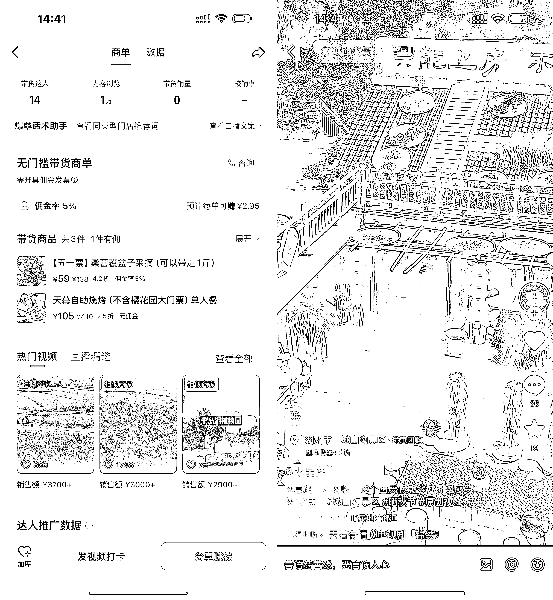
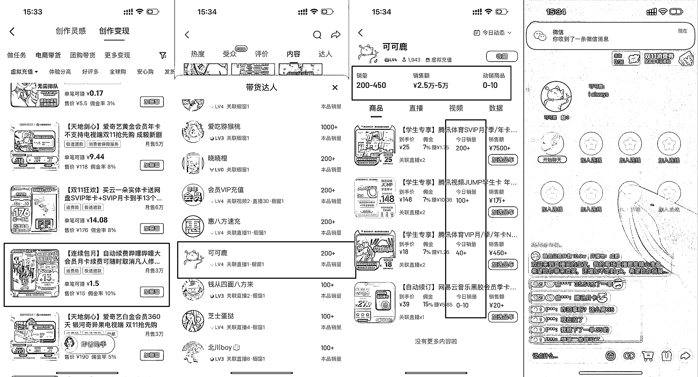

# (精华帖)(77 赞)SCBI 第五期：这样的 SCBI 真的是大家需要的吗？

> 原文：[`www.yuque.com/for_lazy/zhoubao/yltzm819t1do2n4g`](https://www.yuque.com/for_lazy/zhoubao/yltzm819t1do2n4g)

## (精华帖)(77 赞)SCBI 第五期：这样的 SCBI 真的是大家需要的吗？

作者： 杨爽@生财有术

日期：2025-10-31

今晚深夜局，是不是又有不少圈友没睡。

朋友们，亦仁昨天给我提了个问题：

这个问题我思考了很久，甚至和我们部门的同事展开了很激烈的讨论：

> 有同事说——“2 个小时，我们就该尽量多呈现更多机会”；
> 
> 也有同事说——“不对，我们要把那几个最有价值的机会讲透，让大家真正感受到风向标的魅力”；
> 
> 还有同事问——“真的有人会想听我们讲两个小时吗？”
> 
> ......

说实话，其实我们部门讨论的时候我还有点骄傲的。

为啥呢？

因为知道没人说真的有那么多项目可以分享吗？至少在找项目这件事上，没有人打退堂鼓。

在我们讨论的火热的时候，我收到了亦仁的第二条消息：

嗯，我好像被老板看透了，在我准备大展宏图、指点江山、挥斥方裘的时候，他的这句话让我冷静下来了。

他没有和我说增长，没有和我说要多大的流量，也没有和我说项目内容要做的多么一鸣惊人。

他只说：**站在圈友的角度，一周只有一个小时来看看外面有哪些赚钱机会，你会给她呈现什么内容？**

亦仁还是一如既往的，淡淡地，给人一种大道至简的感觉。

说到这里，和大家分享一下我经常有时候和亦仁聊天的时候，就是拿着一个自己以为举世无双的好方案，然后被他一顿追问，但你要真说，其实每次他都只需要我回答一个问题，这真的是生财圈友最需要的吗？

我想了很久，我也大道至简一下，问问不就知道了：

**1****.** **大家需要 1 周 2 小时的直播，了解一下这一周外面有哪些赚钱机会吗？**

**  **

**2****.** **如果需要的话，大家想在 2 小时的直播里听到些什么内容呢？**

**  **

**3****.** **我已经更新第五期了，这样的项目颗粒度是大家想要的吗？**

**  **

**4****.** **你对于这个直播会有一些什么样的建议和期待吗？**

当然啦，都不白来啊，这一期还是给大家分享一些有趣的项目线索，这期是抖音专场：

### **案例 1：抖音 AI 文旅推广，有圈友说一场军事策展营收几千万**

这个项目是做文旅的圈友和我分享的，第一次注意到这个方向，是国庆阅兵之后，各地开始出现各种“军事策展”“主题展”，亦仁参加完航海家大会后让我们猜，这样的一场活动能有多少盈利。

答案是上千万。

听起来夸张吧？但仔细一想，也合理。

因为现在，文旅活动的主战场，已经从线下搬到了抖音。从景区到展会，从节日活动到乡村游，几乎所有项目的流量入口都在这。

最近刷视频，我也发现越来越多景区视频下面，直接挂了团购卡。原本只是“拍风景”，现在成了能卖票的生意。

比如前几天看到一个湖南郊区的景点视频，挂的是“桑葚采摘票”，售价 ¥59，佣金 5%，每卖一单创作者拿 ¥2.95。

视频不算爆，播放量也就几千，但销售额能跑到 ¥3000 左右。

算下来，作者一条视频能拿 ¥150–¥200。

这种量级不大，但能跑通、能变现，一个月三五千并不难。

更有意思的是，这种视频现在特别多。不只是景区，各种地方活动都开始上抖音卖票：花海、农场、乐园、军事展、游船、露营地……甚至有圈友承包地方活动，靠这一波线上推广，一场营收能做到上千万。

仔细想想，我们现在出门玩，是不是也都习惯了在抖音上“刷地方”？刷到哪好玩、直接订票、周末就去了。视频成了“去哪儿”的入口，视频链接成了“一键买单”的入口。

当然，还有个有意思的观察，AI 让这一切变得更简单，你甚至不用去现场，就能做出“探店感”的视频。

圈友和我说一个人，一台电脑，1 小时能出三条。

### **案例 2：抖音啊抖音，你真的是我看不透的存在**

这段时间刷抖音，陆续刷到几个做虚拟充值的账号。

一个主打“腾讯会员 9.9 元”，一个卖“中国燃料卡 156 抵 200 元”。

内容几乎一样：一个封面，一段静态视频。从 2 月份一直更到现在，评论区还挺热闹。

起初我以为只是小众玩法。想看看虚拟充值这个赛道，结果深入调研下来，发现类似的账号不少，有的挂绿幕循环播放，有的干脆开语音直播。

比如有个叫“可可鹿”的账号，整场放着歌，甚至都不说话，但成交一直在走，评论区不断有人留言：

“我买了一个 35 的。”

“想第二个就没了。”

……

没什么情绪，也没剧情，但显然在卖货。

但仔细想这类账号的逻辑其实挺清晰：

1.  高频复购：会员、加油卡、流量包，本来就是重复购买的品类；

2.  系统自动履约：下单自动发货，不用客服；

3.  门槛低：不露脸、不剪辑，语音+挂车就能做。

你在抖音的创作灵感页搜“虚拟充值”“会员卡”“加油卡”，会发现这类商品都有明确的带货类目，官方支持。甚至有达人在靠这种语音直播，一个月稳定卖出几千单。

它有趣的地方在于，当大家都在卷剧情、卷人设、卷内容时，有人选择回到最简单的生意逻辑：满足刚需。

观众不是因为喜欢，而是因为“刚好要用”，这种交易关系更纯粹。

### **案例 3：电商谁爱玩谁玩，我不玩了，今天起我投入抖音伙伴计划/精选视频的怀抱**

**  **

这条更多是来自生财圈友一线的一些观察和实战分享，所以我贴了星球的原链接方便大家查看。

跳转链接 1：[`t.zsxq.com/9w7la`](https://t.zsxq.com/9w7la)

跳转链接 2：[`t.zsxq.com/C7hgF`](https://t.zsxq.com/C7hgF)

跳转链接 3：[`t.zsxq.com/bJH75`](https://t.zsxq.com/bJH75)

事情是这样的，我的同事@彩虹在寻找航海教练的时候，给我发了条消息。

问抖音创作者分成是不是有大机会，说是在聊一个圈友：“一个人 30 天涨 1 万活粉，一个号一个月收益几千，现在带货都不做了，开始专心做精选视频。”

说实话，这个项目其实在 7 月，我就找了不少圈友聊，比如@浮生若梦、@唐杰......，大家都感受到了加入抖音创作者伙伴独家签约和精选计划的创作者，收益非常高。

按照大家说的：

360.9 万播放收益 11051.48 元；

25 万的播放收益 2104.61 元；

甚至 2.6 万的播放收益 1142.78 元；

......

不难发现的是抖音已开放了 AI 创作内容的激励，对“AI+剧情类视频”纳入轻创意视频赛道；用户对 AI
效果的夸张、违和感接受度也在逐渐增高，这类视频停留表现也越来越好。

AI 技术的引入，让更多经典老剧、热门影视剧甚至于原创 AI
视频都有了新的活力。甄嬛传的每个人都有机会成为主角了；唐僧也可以喝红酒，唱 rap 了；甚至于亮剑也可以隔空 20 年实现了老李和老李的对话......

这背后的机会很简单：一是平台主动放量——抖音希望扩大创作者群体；二是用户对 AI 内容的接受度显著提高，观众不再追求“真假”，而是追求“有趣、有节奏、有想象力”，而 AI 的加入，刚好降低了这一切的成本。

抖音创作者伙伴 / 精选视频的背后，其实是新一轮内容红利的起点。

这期我们聊的三个项目，其实都挺有意思的：

一个是地方文旅靠短视频卖出上千万；

一个是靠“静态语音直播”稳定出单；

还有一个，是用 AI 拿平台激励的创作者新玩法。

写完这一期，我好像有点理解了为什么亦仁会问我这个问题：**“如果圈友每周只有一个小时来看外面的机会，你会呈现什么？”**

说实话，这句话一直在我脑子里转，也许我们不需要每周找到几十个项目，而是找到那几个能让人眼前一亮、真想动手去试的机会。

这也是 SCBI 的初心：**帮大家更快看到好的赚钱机会，不是“多的”，是“更快”是“好的”。**

最后，我也想把这个问题抛给你，如果你每周只有一个小时，你希望在我的直播里听到些什么内容？

留言告诉我吧，或许在之后的直播里我真的可以分享给你。

一个提醒，如果今天是你第一次看到 SCBI，可以先去翻翻前几期。

1.  第一期：SCBI 是什么 👉  [`t.zsxq.com/CaJxT`](https://t.zsxq.com/CaJxT)

2.  第二期：高通过率线索长什么样 👉  [`t.zsxq.com/NWFTD`](https://t.zsxq.com/NWFTD)

3.  第三期：那些奇怪但有趣的野路子 👉  [`t.zsxq.com/wezdY`](https://t.zsxq.com/wezdY)

4.  第四期：一些正在发生的“新内容实验”👉  [`t.zsxq.com/NHAyq`](https://t.zsxq.com/NHAyq)

最后，希望大家周末愉快！☀️

* * *

评论区：

感恩学习相信-小陶 : 我是对风向标非常感兴趣的人[偷笑]如果有直播，记得通知我[玫瑰][玫瑰][玫瑰]

杨爽@生财有术 : 好嘞，我记下了！

锦拾年(同路人) : 我也对风向标感兴趣，经常挖标[得意] 哈哈，备注一下。感谢啦 [调皮]

浅笑 : 我也是对风向标非常感兴趣的人，如果有直播，也请通知我🤪🫡🤭[玫瑰][玫瑰][玫瑰]

金天 : 哈哈。微信生态，公众号，视频号，直播可以多拆解一些风向标信息吗？

张昭 : 漏斗应该是：先铺信息面，然后看项目点击热度，然后针对项目拆解，然后组织 mini 航海，再大航海，再挑选精锐进孵化器。这样才能串联和联动。各个板块割裂的太严重了。

阿牛 : 我也对风向标感兴趣，如果有直播麻烦也请通知我下，谢谢！

杨爽@生财有术 : 好的好的，默默记下了！