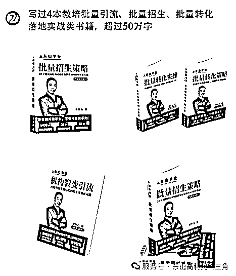
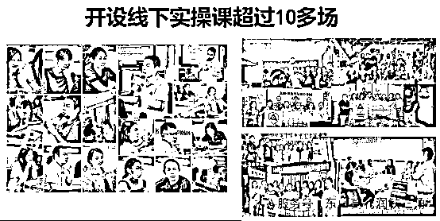
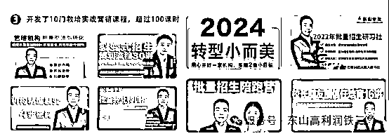

# (精华帖)(66 赞)创办一家利润高的小公司，并且持续做下去

> 原文：[`www.yuque.com/for_lazy/zhoubao/go97bfbz999q11rg`](https://www.yuque.com/for_lazy/zhoubao/go97bfbz999q11rg)

## (精华帖)(66 赞)创办一家利润高的小公司，并且持续做下去

作者： 东山老师

日期：2025-10-25

**01**

**凭什么“不费力气就赚钱”的人，不能是你？**

**  **

“这年头，创业太难了！”

过去十年，这句话我听了上千遍，却打心底里不认。

我 2003 年创业至今 22 年，从山沟沟农娃到流水线工人，从开工厂喝到胃出血，到做电商亏光积蓄，再到跑遍全国招生——22 年摔过的坑、淌过的泪，让我悟透一件事：

**高利润的好生意，从来不是咬牙扛出来的，而是靠正确的系统“长”出来的。创业就像种树，根系扎得对，自然枝繁叶茂。**

**  **

所以，每当有老板跟我吐槽“创业太难了！”时，我总问他：

**“在你方圆三公里，朋友圈里，有没有人没费多大力气，却赚得盆满钵满的？”**

**  **

他们几乎脱口而出：“有啊！那个谁谁谁，不知道用了什么‘邪道’，近几年闷声发大财！”

我就会马上打断他，盯着眼睛反问：“**那凭什么，那个‘不费力气就赚钱’的人，不能是你呢？”**

**  **

一句话，堵住所有抱怨的嘴。

实话实说，近五六年创业大环境确实变了：以前靠“努力+时代红利”就能赚钱，现在不灵了。

尤其口罩后这几年，老板们的各种叹气声像绵针，从电话里、社群里、朋友圈里往我耳朵里扎。

上个月清晨，我点开微信，一条凌晨 3 点的留言跳出来——是个教培校长，她哭着说：

“**东山老师，我被招生团队坑了 17 万，那是给老师发工资和准备交房租的钱……我撑不下去了，怎么办啊？”**

**  **

我隔着手机屏幕就仿佛看见：在空荡荡的客厅里，她捂着嘴不敢哭出声，手机屏幕的光惨白地映着满脸泪。

我握着手机暗暗的叹气，这几年，我已经接到上百条类似消息——有的老板蹲在停车场哭到天亮，有的把父母养老钱填进公司窟窿，有的对着空教室发呆，说“学生走了，桌椅板凳都在笑我傻”。

可我转念一想：我 22 年创业历程，哪一步不难？

我从 1998 年中专毕业攥着毕业证到处碰壁找工作，到被迫无奈蹲在深圳电子厂的流水线上拧螺丝拧到手指发麻；

从 2003 年开工厂时为 25 万货款喝到胃出血，醒来攥着欠条和碎牙到做 2013 年做天猫电商亏光积蓄，躺在医院看输液管滴成泪；

从 2016 年开始跑天南地北跑招生到冰冷的凌晨拼命赶 5 点的飞机到女儿视频里问“爸爸什么时候回家”，我对着手机屏幕擦汗又擦泪的场景。

创业 22 年来，我做过几次转型，也见过不低于 8000 个老板，直接倒闭在眼前的老板也有小几百个，关于创业，我比谁都懂“难”字怎么写，但我更知道：

**难，从来不是崩溃的理由。**

**  **

如果创业像喝可乐一样轻松，凭什么成功的人必然是你？

**  **

那些喊“创业太难”的人，总盯着脚下的泥，却忘了抬头找梯子。

我见过靠“系统”赚钱的老板：

教培校长用“体验课升单系统”，转化率从 25%飙到 87%；

美业老板靠“差异化护理套餐”，客单价翻 3 倍还排队；

健身房教练用“体态评估+私教剧本”，9.9 元体验课转 5 万私教课……

他们不仅工作很努力，而且还把努力用对了地方——把力气花在“建系统”上，而不是“扛困难”上。

这篇文章，我不想讲什么狗屁大道理。

我希望把我 22 年来摔的坑、熬的泪，还有花了 10 年提炼的【高利润铁三角】，我掏心窝子讲给你听。

这一万多字，每个字都是血泪换的经验。

看完你会懂：**原来创业，就算不拼命，生意也能赚得稳、活得久，还有就是：不要犟的像头驴。**

**  **

**02**

**最早的坑：我曾以为“拼命”就是创业的全部**

**  **

我跟庄稼一样，都是在农田里长大的。

现在童年留给我的背景音，都还是田地里的虫鸣和老妈挥锄头的喘息声。

我自小家里就特别穷，我老爸常年跟着村里的包工头去海南做建筑泥水工人，一年才回家一次的那种；我老妈则在家里种田卖菜拉扯着我们 3 个兄妹长大。

那七八亩地、十几头猪就是我们全家人活下去的指望。

我在小学五六年级时，作为家中的长子，我不得不含着泪谁学会犁田耙田割稻插秧等各种农活。

暑假的太阳把我稚嫩的背晒脱皮，稻穗割得我手指全是血珠，我蹲在田埂上喝冷粥时，我就一个劲的发誓：我绝不能困在这破山沟里，我绝不要靠农活过一辈子。

小时候的重担成了我内心的阴影导致我现在对老家农村都没什么好印象。

1995 年，我初中毕业，县一中的录取通知书在手里发烫，我却咬牙撕了——我选择了“模具设计与制造”专业的中专。

只为我那时听说这个模具这个专业毕业后很好找工作，工资也很高，能让我逃离这破山沟沟。那时的我恨不得连夜跑出去，更何况能在家少读 3 年书就能少干 3 年农活。

**但我的这个选择成了我一生中最后悔的决策。**

**  **

现在，每当我在面对纪老板，亦仁等高认知高学历的成功人士时，我总是莫名的感觉到无形的自卑，我常常暗地里叹气：我如果当年咬牙多读 3 年书，考个好大学，我的人生会不会完全不一样？

**但人生哪有那么多如果，人生每个不经意的选择，暗地里都标明了代价。**

**  **

中专高昂的学费对我们这个穷家庭而言太高了，每学期的学费我都要到处去借。

至于生活费就我只能靠我每天埋头写稿投到各种小报社和杂志社赚点稿费和做各种小生意去养活自己。

此外，我还非常积极的创办了我们学校的一个文学社社团，带着上千人搞活动，当然，这个文学社也是让我每年赚几千块生活费的工作，所以我乐此不疲。

整个中专期间我根本没怎么认真学专业，所以等我 1998 年中专毕业时，我的模具设计与制造差的一塌糊涂，基本上靠作弊和走人情拉关系，才勉强混了个毕业证。

这样的专业能力，让我在深圳想找个模具学徒都不容易，在我弹尽粮绝的时我站在深圳布吉关口的街头茫然不知所措：

一边是回家种田的老路，一边是电子厂流水线的轰鸣，怎么办？

我咬咬牙选了后者——至少，对我而言，城市的霓虹灯还是比农田的烈日更温柔些。

电子厂的日子单调乏味，我每天拧螺丝拧到手指发麻，在流水线的轰鸣声里，我时常盯着自己的影子发呆：难道这辈子，就困在这方寸之间了？

**但，我真没想到，这次“不甘心”，竟成了我命运的裂缝。**

有次下班，我看到隔壁有一个新开的台湾电子厂招募业务员，底薪只有 250 元+提成。

不甘心一辈子在流水线上拧螺丝的我揣着中专毕业证就去面试了：这破毕业证没让我找到对口的模具设计工作，但应聘业务员，竟成了我改命的“敲门砖”。

我很珍惜这次改命的机会，在没网络的年代，我每天打 100 多通黄页电话，只要电话那头的采购员愿意见我，不管多远都坐公交去拜访。

那几年，基本上广州，深圳，东莞，惠州，中山，珠海，佛山等珠三角的大大小小工业区我都坐公共汽车去过，我三个月走烂一双廉价皮鞋，脚底的水泡磨成茧，人晒得像块黑炭一样。

就 1 年时间，我成了工厂的销冠，我一个人的业绩顶了其他 11 个业务员加起来的业绩还多。

2000 年后的那 2 年，我每个月可以拿到 2 万多的提成，我很深刻的记得，那时深圳布吉关口的龙珠花园还不到 2000 元一平方呢。

我看着工资条咧着嘴傻笑：原来，拼命真的能改变命运。

**但我还不知道：那些靠拼命赚的钱，早晚会被“拼命”的惯性亏回去。**

**  **

2003 年，我决定创业开工厂，我真的把“拼命的基因”刻进了骨子里：

我每天 7 点到厂，打包、对账、跑业务、送货全是我，一天干 10 多个小时，全年无休。

绝大部分采购员只认我，说“找别人不放心”；员工也依赖我，连个订单都要打电话问“这单怎么接，这个客户怎么处理？”。

有次，我被汽车碰了一下在医院躺了好几天，工厂就停了转——他们不知道该怎么排单，客户也找不到人对接，等我撑着病体回去，好几单生意已经黄了。

我安慰自己说：“**没事，我再拼命点就好了** 。”现在回想起来，那时的我就是个“蛮干的疯子”。

那时我以为“只要我比以前更拼命，就一定能成”，可现实给了我狠狠一巴掌。

从账面上算，工厂每年是有三五百万的盈利的，但现实是，我常年陷在“低利润+三角债”里打转转。

我每天像个陀螺一样催款、付款，催来的货款转手就给了催得更狠的供应商，我手里永远都没见过什么钱。最难的时候，为了给工人发工资，我差点挪用妈妈的治病钱；

还有一次，为了要回 25 万货款，对方说“喝一杯酒给一万”，我硬喝了 25 杯，胃出血被送进医院，醒来时手里还攥着皱巴巴的欠条和一颗想杀人的心。

我心里烧着一把火：拼命真的有用吗？我把自己逼到绝境，怎么还是赚不到钱？

我不甘心，2013 年前后听说做电商很好，于是一头扎进去做天猫电商。

都说线上生意是轻资产，结果我还是掉坑里了，双十一为了冲一波销量，囤了上百万的货，结果在抢流量时没经验，仓库堆得满满当当的没卖出去；

我每天傻逼一样天天盯着后台看流量、改详情页、跟同行比价，利润薄得像刀片一样，真的是一毛一毛的死抠，转眼就拿去烧直通车了。

有次为了抢一个活动坑位，熬了三个通宵优化页面，最后虽然报上了，却因为库存没算准，超卖了几百单，赔了钱还挨了投诉，我一下子理解了什么叫**坑位** 。

做电商这个决策让我把这些年所有的积蓄都搭了进去，还亏了一两百万，灰溜溜的一夜回到解放前。

我躺在病床上看着输液管的药水跟我的眼泪一样一滴一滴往下掉，我才突然明白：

创业，再努力也没屌用，我天天努力的“左右腾挪到处扑火，结果一个失误还是赔的精光。

**拼命干，只能赚辛苦钱，搭建赚钱系统才能稳定赚钱。这道理，我用 10 年血泪才换来。**

**  **

**03**

**从“招生锦鲤”到深夜胃痛：我用 4 年 1400 场招生，悟透一个残酷真相**

**  **

创业失败后，我深刻认识到我读书少认知低的局限，我开始玩命的补课，一头扎进学习里：学教练技术，泡互联网社群，一个连 PPT 都不会做的工厂老板，硬啃起了线上运营的各种资料。

2015 年前后微商和社交电商很火，我也趁势做了一些朋友圈文案培训和微商个人品牌培训等，

2016 年，我和晓婷偶然接了个活：帮一家少儿美术机构做招生。

那时我哪懂教培？

全凭一股“死磕”劲：熬两个通宵把“体验课”拆成“孩子作品展示+家长见证分享”，然后用当时比较热门的朋友圈裂变和社群裂变的方法去招生。

结果 3 天招了 150 个精准体验生，校长抓着我的手喊：“东山老师，你就是我们的锦鲤！”

“锦鲤”这个词，让我们误打误撞闯进了教培招生的赛道。

接下来四年，我们组建了 10 多个人的小团队，成了真正的“空中飞人”：每周飞 1-2 个城市，一年跑几十个地方，累计做了 1400 多场招生活动。

校长们追着喊我们“招生锦鲤”，可没人知道：

我常常周三凌晨 12 点还在给机构做复盘，周四清晨 5 点我已经出现在了机场，我要赶最早一班飞机去到另一个陌生的城市启动一场新的活动的那种疲惫。

就这么常常凌晨赶飞机，机场就着矿泉水啃面包是常态，胃药常年揣在包里，经常半夜一个人在陌生的酒店胃痛到打滚，蜷在床上盯着天花板，想喝口水都够不着。

女儿经常视频里问“爸爸，你什么时候回家陪我过生日呀”时，我正蹲在机场候机厅里给手机充电，手机屏幕映着她的小脸，我擦了擦汗，又偷偷擦了擦眼角。

我捏着手机问自己：**这钱，赚得值吗？**

**  **

比胃痛更扎心的是一个越来越清晰的残酷真相：我们帮机构招到的体验生，像泼出去的水，他们大多留不住。

因为他们的体验课升单流程太随意，太差劲了。

有个做舞蹈机构的校长，我们帮她招了 200 个体验生，她却随便排课，安排新手老师去上课，到销转升单时就递张价目表就算了，最后只留住 20 个；

还有家琴行，等不及我们排期，找了个“299 元 48 节课”的联合招生团队，结果招来一堆只图便宜的家长，不仅没赚钱，还欠了 21 万课消，直接拖垮了机构。

我发现：**90%的校长都陷在一个误区里出不来，他们总把“机构不赚钱”全归罪于“生源少”**

**  **

**于是疯狂找招生团队“救火”，病急乱投医的他们成了骗子招生团队眼里的“肥肉”。大多数机构都被坑惨了，最后只能关门。**

**  **

2022 年的春天，我和晓婷在给安徽阜阳一家大机构做完招生，在合肥转机回广州时，被隔离了。

这个小插曲，硬生生的给我们忙碌的飞行生活按下一个暂停键，晓婷望着窗外说：“我们帮得了 1500 家机构做一场招生，可教培行业有几十万家，这样一个个救火，什么时候是个头？而且孩子都快不认我们了……难道我们还要一直这样跑下去吗？什么时候是个头？”

我突然惊醒：我们缓解得了机构的“急症”，却治不了他们的“慢性病”

我们给他们招生是输血，他们自己能够搞定招生转化才是造血。

**输血能救一时，只有持续造血才能活命。**

**  **

隔离那 7 天，我们又下了一个重决策：“我们不做‘锦鲤’了，要做‘医生’。

我对晓婷说，“我们可以教会他们自己做招生、做转化，让他们自己长出赚钱的能力——这才是真的帮他们，也能够让我们陪孩子长大。”

下来决心的那天夜里，我第一次没被胃痛惊醒。当窗外的月光照进来时，我突然明白：**真正的赋能，不是替别人走路，而是教会他怎么跑。**

**  **

**04**

**三次顿悟：高利润铁三角，让利润自己长出来的秘密**

**  **

回到广州的当天，在一片质疑声和遗憾中，我们宣布解散了团队，然后在家门口租了间办公室开始新的征程。

以后谁再喊我出去给他们做招生，我就摇头：“我们不帮招生了，但我们可以教会你自己做招生。

于是，我们从“帮”机构校长做招生转型为“教”机构校长自己搞定招生和转化。

**第一次顿悟：转化率不是“讲”出来的，是“看见”出来的**

**  **

转型第一步，除了持续的做线上的裂变式招生陪跑以外，我盯上了校长们最头疼的“体验课升单转化的问题”，我下决心解决这个难题。

我花了半年时间，把我这几年支持校长做体验课转化的经验细细的嚼碎拆解，写出了 35 万字的 2 本书，分别是《批量转化策略篇》和《批量转化实操篇》。

并用这 2 套书打磨出了对应的【批量转化实战营】线下课，后来又录制成了 60 节的【批量转化特训营】线上课。

这套批量转化课成了我的“手术刀”，剖开了机构提升转化的真相：家长不为“课程多好”买单，只为“孩子变化多大”掏钱。

少儿口才校长学完，把体验课从“教孩子绕口令”改成“带家长看孩子上课录像”——指着视频里孩子从躲在桌底到当众演讲的变化，问：“如果跟我们学一年，您觉得孩子会变成什么样？”转化率从 25%飙到 55%；

昆明中国舞机构老板，我把她 10 次体验课压缩成 6 次“主题训练营”，每 2 次课嵌入 1 次成果展示，最后加 1 次 1 对 1 家庭沟通。家长看着孩子从顺拐到劈叉的视频，转化率从 40%冲到 87%。

她在电话里喊：“以前以为是生源不够，现在才知道——转化不是说服，是让家长亲眼看见‘钱花在哪’！”

**第二次顿悟：没有差异化，就没有定价权**

**  **

陪跑一年后，在 2023 年我发现：80%的校长仍陷在“低利润泥潭”里挣扎——明明招生量和转化率都上去了，可还是一个一个的都天天哭穷。

有校长苦笑着对我说：“别看我表面上开奔驰，其实背地里加油钱都要赊账了。”

为什么？

他们的利润太低了！

于是我和几百个老板在线下课里核算，在社群里核算，直到有一天，我蹲在办公室翻了 100 家机构的价目表，才终于看清真相：

**90%机构的定价都太低太低了。**

**  **

他们只是持续的靠招生转化续费的现金流维持着，但是并没有真正的产生利润。

当我进一步调研时发现，他们定价偏低的根源在于：**产品同质化太严重了，只能打价格战。**

**  **

别看每个机构看起来完全不一样，但是回到产品上，基本上都大差不差的一样：

**1：卖时间的思维**

**  **

少儿教培机构，无论是体验课，还是常规课，或者是其他什么课，基本上无一例外的都是“多少钱多少次课”的卖时间思维。

不管你课程真实的内容有多好，但是家长看到的就是 XXXX 元 XX 次课，他们简单经过口算就知道你一次课多少钱了。然后就知道你的课程比别人的贵了 5 块钱。

这时，你再怎么强调你的课程比别人的课程多好，家长都捂住耳朵说：我不听，我不听，你不降到同样的价格再送一个礼品，我就不报名了.....

**2：宣传物料的同质化**

**  **

钢琴课都说“专业师资”，美术课都喊“创意教学”，所以大家的机构宣传语、课程定价、服务流程，机构介绍，师资介绍等几乎一模一样，简直就是同一套模板出来。

对于家长来说：她真的无法从一堆的宣传海报中看出来谁的机构和课程更好一点，就像菜市场里的菜农，大家都卖白菜，只能比谁卖得更便宜。

所以，90%的机构都在卖“时间”，不是卖“价值”：

书法课都说“专业师资”，家长只会比“谁便宜 50 块”；机器人课都喊“培养创造力”，最后变成“99 元 10 节课”的恶性竞争。

有个校长哭丧着脸说：“东山老师，我想涨价又怕家长跑了。”

我反问：“你能说清你的课比隔壁好在哪吗？”他张口结舌。

那之后，我们开始带客户“死磕产品差异化和价值塑造”：

我帮一家书法机构提炼“3 周写好名字”的训练营，海报从“招生”改成“孩子名字被老师贴在班级光荣榜”；

我给一家机器人机构设计“体验课-竞赛营-名校升学通道”，家长说“别家卖课，你们卖孩子的未来”；

有个做少儿口才的校长合伙人更狠，暑假期间打磨了一个“班干部竞选训练营”，孩子经过暑假的特训后，新学期真的当上了班长。

消息传出去后，就算她把课程涨价 30%，结果报名人数翻倍——家长说“以前觉得贵，现在知道贵在哪了，值！”

看着校长报喜时眼里的光，我突然顿悟：利润不是来自“招多少人”，是来自“每单赚多少”。

你的课程如果没有明显差异化和价值感，就像在菜市场卖白菜，只能比谁更贱——你卖 3 块，别人敢卖 2 块 5，最后大家一起饿死。

产品没有差异化，就没有定价权——**你如果卖的是白菜价，凭什么能够赚龙虾的钱？**

**  **

**第三次顿悟：酒香也怕巷子深，获客要靠“信任种草”**

**  **

我支持客户们解决了升单转化率和产品打磨后，校长们的新问题又冒出来了：“课是好课，可没人知道啊！”

有个少儿编程校长，她把产品打磨得像艺术品，我看到了都想把孩子快递过去跟她学。

但是她却天天在朋友圈发“求介绍生源”。我骂醒他：“你是老师，不是乞丐！”

为了支持他们解决这个难题，我们除了带着客户一年做 3-4 次批量种草式裂变招生外，开始带客户做“内容获客”：用故事建信任，让家长主动说“我想了解”。

我让他们在朋友圈里不要发广告，而是发“孩子学编程后自己做了个小游戏”，配文：“这是 8 岁的小宇上周的作品——3 个月前他连鼠标都不会握”；

他们在视频号不拍机构的环境，而是拍“家长哭着说‘孩子现在主动跟我讲代码逻辑’”，评论区家长追着问“怎么报名”；

我让他们在公众号不写软文，写“从‘上课坐不住’到‘主动留堂问问题’，这个孩子经历了什么”，文末留“体验课预约入口”，静默转化率 20%。

校长很听话，死磕坚持了 3 个月，视频号引来 200 多个精准咨询，她说：“以前求爷爷告奶奶招生，现在家长主动说‘我看了你半年朋友圈，就信你’！”

**高利润铁三角闭环：差异化产品-精准获客-升单转化，一个都不能少**

**  **

当我支持他们把这些都搞顺后，我发现很多少儿教培的老板也会有一个特性：容易做着做着就走偏了，就会瞎搞。

于是，我又带着他们去用**营销日历** 把“产品、获客、转化”这 3 个常规动作串起来，做成表格和 KT 板钉在办公室里，这样就不会跑偏了。

我教他们用**循环工作法** 让他们记得每年、每季度、每月、每周、每日定时定点做固定的事情，然后一个一个的就真的慢慢都在用正确的方式去做正确的事情，利润就一点一点的做起来了。

他们基本上每天循环先做 3 件事，然后再去做其他事：

1：用差异化产品筑高墙，别人卖课你卖“成长结果”，家长说“贵点也值”；

2：用内容获客引流量，不做硬广做“信任种草”，线索像自来水一样流进来；

3：用体验式转化锁利润：让家长“看见”价值再买单，转化率翻倍不是事。

我一直觉得，创业哪有什么特别的，只要能够每天把所有的心思和时间都用在“磨产品，做获客，谈转化，促续费”这几件直接来钱的事上，每天就都有正反馈，哪有那么多乱七八糟的内耗？

有个在广州做少儿美术的校长跟着我就跑了一年，从“每月亏 5 万不想做了”到“第 2 年赚了一百万”。

有个在昆明做练字的机构，夫妻俩都打好离婚协议书要分家当了，听了我的课决定再干一年，现在换了更大的新校区了。

她复盘时说：“以前总觉得是自己命不好，现在才懂——做生意不是靠运气，是靠系统，产品、获客、转化，三个齿轮一起转，利润自然就来了。”

这就是我摔了 22 年才悟透的“高利润铁三角”——**做生意不是什么玄学，就是让每个环节都帮你赚钱，而不是耗钱。**

**  **

只要用正确的方法把“**产品矩阵-持续获客-升单转化** ”这个高利润铁三角做透，利润就能自然生长。

**05**

**一业通，百业通：所有“体验式生意”，都在同一个逻辑里赚钱**

**  **

**现在想来，我在好长一段时间里，都犟的像头驴****，** 我只认“少儿艺术教培老板”这一类客户一头扎进教培行业不肯抬头。

近几年，我经常在生财、玩赚社群等写文章分享我的一些思考，就时不时的有一些老板加我微信，我一概不点通过；

我在一些创业社群做一些分享后，总有十个八个跨行业老板追着加好友，我假装没看见。

我心里嘀咕：“你又不是做教培的，加我干嘛？”在此给很多曾经加过我但我没听过的朋友道个歉：抱歉！

有次，我参加生财有术的线下局，一个美业老板拽着我胳膊问：“东山老师，你帮教培机构做的那套，能不能教我用在我的美容院上？”

我直接拒绝了：“不能，教培是教培，美业是美业，这两码事！你那个行当我都不会，咋教你呢？。”

她红着眼眶顶回来：“怎么是两码事呢？你们教培机构卖体验课，我们卖体验护理；你们靠体验课升年卡，我们靠体验护理升年卡——不都是先尝后买的逻辑吗？你告诉我有啥不一样？”

我没接她的话，但心里却“咯噔”一声，像有根刺扎进去了。

三个月后，在广州一场创业者沙龙上，一位前辈随意说的一句话当场炸醒了我：“**做生意只要回归本质，真的一业通，百业通。** ”

那瞬间，我脑子里的迷雾突然散了——对啊！

少儿教培的“9.9 元体验课”，不就是美业的“99 元清洁护理”吗？

健身房的“私教体验课”，不就是装修公司的“免费量房设计”吗？

宠物店的“训犬试训”，不就是知识 IP 的“低价公开课”吗？

如果剥掉所有体验式升单行业的皮囊，其实全都是同一个骨架：**前端用体验品吸引客户前来体验，后端在体验的过程中呈现价值，实现升单。**

**  **

那天起，我像着了魔似的拆解所有低转高体验营销的行业，越拆越后悔：

瑜伽馆的“9.9 元体验课”，和教培的“低价体验营”真没区别——都是让客户先“尝甜头”，再用效果锁长期；

装修公司的“免费设计”，本质是教培的“体验课展示”——用专业方案让客户觉得“这钱花得值”；

宠物店的“训犬试训”，都和教培的“公开课转化”一个路数：用“狗狗 3 天学会定点排便”的效果，让主人心甘情愿办年卡。

基本上所有“体验式生意”，都在同一个公式里赚钱：差异化体验品（引流）+ 信任种草内容（获客）+ 阶梯式升单（转化）。

我拿朋友的瑜伽房试了一下——

这个老板原先搞“9.9 元 3 节体验课”，来的都是薅羊毛的，上完课连水杯都顺走的那种。

我让他把“体验课”改成“3 天体态评估+1 节私教体验”：

体验时不推销，只蹲下来帮客户按揉酸痛的腰，指着体态报告说“你圆肩是因为长期低头看手机，这里的肌肉已经僵硬了”；

老客户带新客户来，送老客户“季度体态复查”，给新客户“专属训练手册”。

三个月后，老板打电话时声音都在抖：“我这个月业绩翻了一倍！以前靠打折拉人，现在客户说‘你们懂我，贵点也值’！”

我又帮一个做知识 IP 改产品——

他原先卖“1980 元线上训练营课”，学员买完就躺平，学习完成度和复购率连 20%都不到。

我让他把“卖课”改成“卖结果”：升级成“2 万轻咨询+年度陪跑”，每周 1 次 1 对 1 诊断，每月 1 次案例拆解，结果复购率冲到 50%。

学员在社群里晒聊天记录：“以前买的是课，现在买的是‘陪我拿到结果’——这 2 万，比我请 3 个助理都值！”

我越拆越看到一个真相：**行业只是不同的皮囊，商业底层才是骨架。**

**  **

那天夜里，我盯着电脑上 20 多个行业的拆解表，突然笑出声——表格里密密麻麻的“体验引流、信任种草、升单转化”，像一把把钥匙，插进不同行业的锁孔，竟都能转动。

原来我近 10 年，不知不觉早把“高利润铁三角”的底层逻辑摸透了：

体验是钩子，信任是钥匙，利润是结果。 管你是教培、美业还是健身房，只要是“前端体验、后端升单”的生意，这套逻辑就像万能公式，往里套就能出结果。

行业会变，工具会变，但“用体验换信任，用信任换利润”的本质，永远不变。

这世上哪有那么多“隔行如隔山”？不过是没看透生意的根罢了，我的视野又打开了。

**06**

**AI 不是替代人，是帮好人更快成功**

**  **

今年我成了 AI 的“重度玩家”——每天泡在里面 5、6 个小时，像老匠人打磨玉器，用 AI 把“高利润铁三角”的生意模型一点点抠出了棱角。

我越用越后背发凉：AI 哪是来抢饭碗的？它是给“敢用工具的人”架云梯——别人爬十年的坡，你踩着它一年就能登顶。

客户机构的课程主管私下偷偷问我，声音发颤：“东山老师，我老板要是用了你的 AI，是不是就没我这岗位了？”

我没说话，拉着她试了一周——

以前花一周做市场调研，AI 两小时甩来 30 页报告，连“3 公里内竞品体验课定价漏洞”都标红加粗；

以前设计海报要等美工半天，现在 AI 半小时出 5 版，还能按“宝妈喜欢的暖色调”自动调滤镜；

最绝的是“AI 销冠陪练”：新人对着屏幕练话术，AI 突然切换成“挑剔家长”模式，冷不丁抛一句：“你们课比隔壁贵 500，凭什么？”

老师支支吾吾时，AI 立刻标红“漏洞”：“没说清孩子 3 个月后的变化，家长看不到价值！”——两周后，这老师的转化率从 30%冲到 75%，销冠榜直接霸榜。

老板们摸着 AI 生成的方案笑：“原来 AI 不是抢活儿的，是给我们腾出手干正事——比如蹲下来听家长说‘孩子坐不住怎么办’，比如把课程磨成家长眼里的‘非报不可’。”

AI 最让我惊喜的，是把“产品打磨”这苦差事，变成了“拼乐高”一样，让我乐此不疲。

以前我教校长做产品调研，得蹲竞品门口数家长、翻 500 条大众点评差评，折腾半月还摸不准“家长到底怕什么”。

现在丢给 AI 一句“拆透珠海香洲区 3 公里内儿童美术机构家长痛点”，2 分钟后它甩来一张表：“3-6 岁家长怕‘孩子坐不住’，7-12 岁家长愁‘作品能不能参展’”——AI 比老板本人还懂本地家长。

要提炼产品卖点？

以前得关会议室拍桌子吵两小时，现在 AI 分分钟生成“家长决策清单”，连“为什么不选隔壁”的怼人话术都帮你写好了：“隔壁教画画，我们教孩子 3 个月敢上台讲画——您要的是画，还是孩子敢表达的底气？”

8 月，我开了个小范围的【21 天 AI 高利润铁三角训练营】，拉了 10 几个跨行业老板实战。

第一个“破防”的是珠海开少儿美术机构的李姐——快 50 岁的人，以前她连电脑都不会用的人，当她第一次用 AI 生成“儿童美术产品矩阵图”时，老花镜滑到鼻尖都没察觉，指着屏幕喊：太神了！”

她照着 AI 给的“3-6 岁创意涂鸦营+7-12 岁考级冲刺班”组合，国庆前把年费涨了 1000 块，报名的家长反倒多了三成。

李姐在电话里笑出眼泪：“原本我都准备关了这个破店去带孙子算了，现在觉得，我还能再干 10 年！”

杭州的张老板更绝，他在杭州做房产中介 10 年，天天跟同行卷“中介费打 8 折”，累得想把门店钥匙扔钱塘江。

当他跟着 AI 拆解“高端房产服务差异化”后，把“免费带看”改成“3 天家庭资产配置诊断”：给客户出“学区+投资+居住”三维报告，连“孩子 12 年后升学政策”都标出来。

上个月成交的第一单，客单价直接从 200 万跳到 800 万，他拍着报告说：“以前客户喊我‘带看房的’，现在递烟喊‘张老师’——这感觉，比赚差价踏实 100 倍！”他笑着跟我说：我仿佛看到了年赚 500 万的曙光.....

结营那天，晓婷翻着满屏报喜消息，突然说：“以前觉得跨行业难如翻山，现在才懂，AI 就是‘万能翻译官’——把‘高利润铁三角’的逻辑，翻译成教培、美业、房产都能听懂的话。”

我深以为然：

教培校长用 AI 生成“体验课升单话术”，美业老板套着做“护理体验转化脚本”；

健身房用 AI 分析“私教客户流失原因”，知识 IP 拿去优化“课程复购策略”。

**AI 不是来淘汰人的，是帮“愿意改变的人”把成功提速 10 倍。**

**  **

你用 AI 三小时摸透的客户需求，对手熬夜三月还在瞎猜；

你靠 AI 搭好的利润系统，同行半年后才看懂逻辑——这就是降维打击。

这年头，创业早不是“谁更能扛”的苦熬，是“谁先用对工具”的赛跑。

而 AI，就是那双让你甩开对手十条街的“超级跑鞋”。

毕竟，时代不会等不肯弯腰捡工具的人。

**07**

**让好生意被看见，让好人更赚钱**

**  **

在熬了 40 多个日日夜夜后，我把 22 年摔过的坑、淌过的泪，和 AI 工具拧成了两根“利润课程”——5 天**【高利润铁三角实战营】**
和 3 天 2 夜**【AI 高利润铁三角闭门课】** 。

我对这 2 个课程非常有信心，都做了超强的零风险承诺：

**9.9 元的 5 天的实战营跟着学完觉得没用，退 10 块，赠品都给你了。**

**4800 元的 3 天 2 夜线下课上完第一天，觉得没用，退 5000 元，多出的 200 元就当是表达歉意，请你喝咖啡道个歉了。**

对的，我又一次做了转型。

从此，我自豪的宣告：我的客户名单里，不再只有“教培校长”。

只要你做的是“前端体验、后端升单”的生意——不管是教培、美业、健身房，还是知识 IP、宠物训犬、高端家装......我都能拉你一把。

**创业的终极答案，永远是“利润”二字——毕竟做生意说一千道一万，赚不到钱王八蛋，对吧？**

**  **

我月初刚结束的【5 天高利润铁三角实战营】，像一场“利润魔术秀”。我带着 100 个老板，每天用 AI 啃一个硬骨头：

**第一天拆“产品差异化”** ，有人当场把“书法体验课”劈成“3 周写好名字特训营”；

**第三天搭建“AI 内容工厂”** ，校长们半小时生成够发一个月的朋友圈文案、公众号文章、短视频脚本，电脑的那一头，我感觉我听到了他们无数次拍大腿的啪啪声。

**第四天练“AI 销冠和教练** ”，教培校长对着 AI 模拟家长提问，从“结结巴巴说优点”到“三句话戳中家长心窝”；美业老板更狠，把“9.9 元清洁护理”的客户，硬生生用几句话术升成 5800 元年卡。

最让我鼻尖发酸的，是云南做少儿阅读的林校长。她学完第二天就拆了旧课表：把 12 次“泛读课”砍成 6 次“阅读力爆破营”，家长会上直接投屏——视频里孩子从“结结巴巴念课文”到“3 分钟讲完《小王子》”，价格翻了小一倍，报名的家长反倒多了 40%。

她在结营直播里抹着眼泪笑：“以前总怕涨价会吓跑客户，现在才懂——好产品会筛选客户，而不是讨好客户。”

所以这门 5 天【高利润铁三角实战营】，我决定一直开下去，我不是为了赚那 9.9 元——才一杯奶茶钱，连电费都不够。而是因为每天收到的报喜消息，让我非常开心。

这套课程适合所有需要前端体验、后端升单的教培老板、实体门店老板、知识付费 IP 博主等，我自己也有了更广阔的空间。

这套课程打磨出来后，我做一人公司感觉更容易了，因为人群宽了很多。

在做转型之前，7 月份去了杭州跟程弈人老板学了微信系统获客后，我们回来其实就在狠狠的打磨直播获客模式，一比一复制李一舟，陈晶等的直播，我觉得整体表现，稿件都不错了，但很难获客，也花钱投流了，但都要么花不出去，要么来的 100 个人里，98 个都不是教培的，特别的难。

但现在从单一的教培老板换为“所有低转高体验式升单”的业务群体后，发现整个正反馈来的强烈多了。基本上能够做到 2000-3000 的场观，也有比较多的客户报名了。

所以，有时候创业真的不能认死理，不轴不行，太轴了也不行！

回望这 22 年，我从流水线拧螺丝的工人，到喝到胃出血的工厂老板，再到带着上千个老板翻身的创业老中医，我比谁都懂：

**创业不是马拉松，是找梯子——找对了梯子，别人爬 10 年的坡，你 1 年就能登顶。**

“**这年头，创业拼的不是‘谁更能扛’，是‘谁能先用 AI 搭建赚钱系统’——你不必把自己熬成陀螺，你只需要让利润自己转起来。”**

**  **

未来的路还长，希望能和你一起，把小生意做稳，把利润做高，把日子过好。

最后一句话就是：真的要狠狠的用 AI！

* * *

评论区：

东山老师 : 写这个帖子，其实就是因为前天看到小马宋老师的公众号，有一个置顶的文章，写自己一路来的创业经历，我觉得特好，回想起我这 22 年来操蛋的创业生涯，百感交集，所以也学着写了一下。
就当给自己一个交代吧！

黄粱一梦 : 感谢东山老师，学到很多！

黄浩在观察 : 看得出真的狠狠用了 AI，至少文风肯定训练过的[666]

邓瑜 : 好熟悉的 ai 味[呲牙][呲牙][呲牙]

木子年华 : 东山老师链接事物本质的能力太牛了[强]