# (精华帖)(72 赞)当我收集了上万个 Shopify App 和数十万条评论数据之后，我发现 Shopify Apps 市场大有可为

> 原文：[`www.yuque.com/for_lazy/zhoubao/sfdt8nnzekke2np3`](https://www.yuque.com/for_lazy/zhoubao/sfdt8nnzekke2np3)

## (精华帖)(72 赞)当我收集了上万个 Shopify App 和数十万条评论数据之后，我发现 Shopify Apps 市场大有可为

作者： 吴大白

日期：2025-10-29

大家好，我是吴大白。

很久没有更新了，前段时间生财找到我，想了解一下 shopify apps 这个方向的一些赚钱机会。

因为我自己工作背景的原因，对于技术和电商都有所涉及，几年前也基于自己公司的需求让技术团队开发了两个内部使用的 shopify
app，所以对于这块也算有所了解。

但为了更加深入的去了解这块市场，所以撸了个采集程序收集了目前 shopify app store 几乎所有的 apps 数据，从而有了今天这篇文章。

废话不多说，我们接下来从以下几个方面来聊一聊 shopify app 这个方向的一些赚钱机会。

一、Shopify App 数据总览

二、在 shopify 中主要的收费模式是什么？

三、基于评分与评论背后的“市场信号”

四、在 shopify app 生态中，个人开发者有机会吗？

五、数据告诉我们什么样的 App 最有赚钱潜力？

六、写在最后：关于 AI 时代技术与电商结合的机会

## **一、Shopify App 数据总览**

据非官方各种渠道统计，到目前为止 shopify 总共商家数量超过了 500 万家，但在此次数据收集中，我只收集了将近 12000 个 apps（排除掉所有未上线和已下架的），目前来说应该是最全的了。

因为我分不同地区不同语种做了收集，“漏网之鱼”应该不多，悬殊的商家和 app 数量比例证明了这块的市场仍未被饱和。

此次收集的 app 共分布在 32 个一级分类，110 多个二级分类之中。

其中发货解决方案分类最多，达到了 2000 多个 app；关于礼品分类的最少，只有 100 多个。

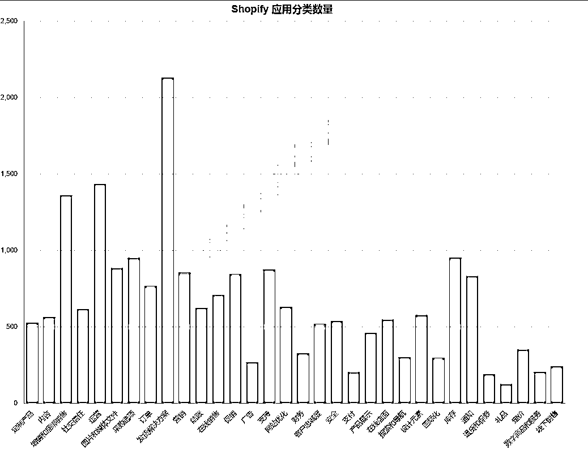

（图 1）

在所有 app 中总计评论预计有五十多万条，其中评论为 0 的占比 56.2%，大于 500 条以上的 app 总计只有不到 2%。

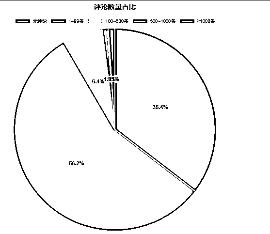

（图 2）

我们继续来看一下关于所有 app 的评分数据，我们发现一个细节，发货订单类 APP 占比超过 30%，但用户评分最高的反而是“定价”和“礼品”类赛道。

这意味着：竞争激烈 ≠ 市场饱和，有时候越“冷门”的方向，反而越有机会。

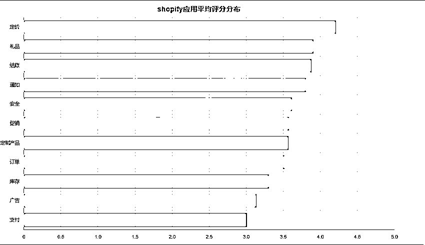

（图 3）

在 app 上架时间这块，2009 年才上线了几个，一直到了 2019 年才开始有爆发增加，截止到今年为止，每年新增 app 数都比往年要变多，今年 2025 年是新增最多的，达到了将近 2500 个。

说明越来越多的开发者，开始盯上这块还没饱和的蓝海。

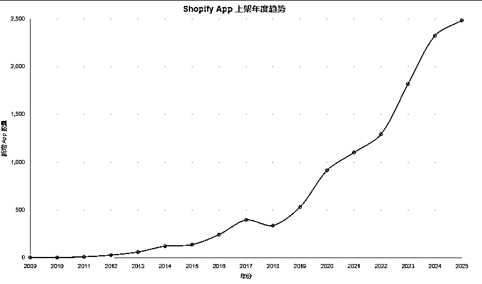

（图 4）

## **二、在 shopify 中主要的收费模式是什么？**

我们看完了上述的 app 基本大盘数据之后，我们继续来分析一个大家都比较关注的问题，就是目前这么多 app 他们的收费模式是什么，做的最好的预估收益是什么样的。

我们先来看一下具体的一个数据图表，其中纯免费的 app 占了 3.1%，先免费再收费的占了 96.9%，数据表明绝大多数 app 都是通过先免费再收费的方式来进行，这说明免费
App 更容易吸引新用户。

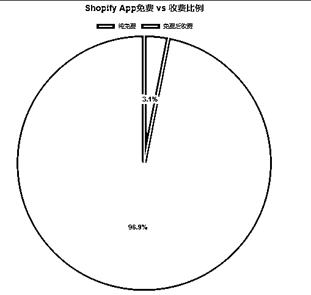

（图 5）

在所有 app 中，几乎都是订阅制收费，这也是 shopify 官方支持的一种收费模式，我们继续来统计一下所有 app 的收费区间情况。

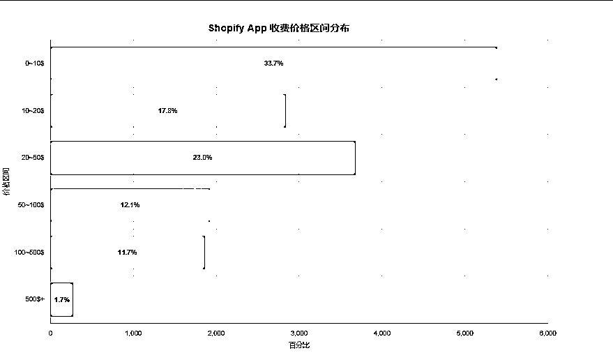

（图 6）

从图表中我们可以看出将近 75%的 app 收费还是在 50 美金以下的（月费居多），达到 100 以上的占比只有 13%不到，并且收费居高的大部分都是以年费为主。

我们接下来举一个实际的例子，就以 Essential Announcement
Bar（[[`apps.shopify.com/essential-announcement-bar?locale=zh-`](https://apps.shopify.com/essential-announcement-bar?locale=zh-) CN）]([`apps.shopify.com/essential-announcement-bar?locale=zh-`](https://apps.shopify.com/essential-announcement-bar?locale=zh-) CN）这个 app 为例。)这个 app 为例。

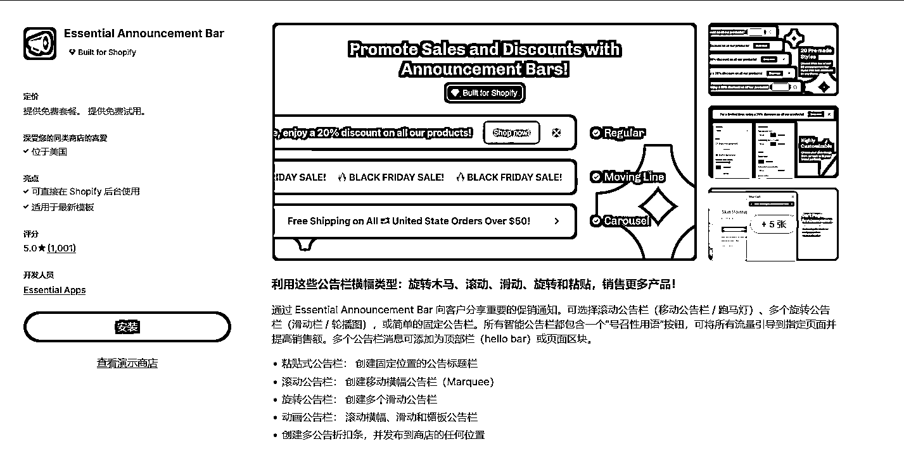

（图 7）

这个 app 的作者来自立陶宛这个国家，app 是 2023 年 8 月 9 日上线的 shopify 的，主要是公告栏相关的功能。

截止到目前共有 1001 个评论，总体评分为 5 分，收费模式也是经典的免费转付费，月费 19 美元，年费 199 美元。

我们来预估一下他的收入（基于个人行业经验估算）。

因为评论是 1000 个，我们预估一下他的用户总数为：

评论转化率 = 5% → 1000 / 0.05 = 20000 用户。

按照 5%左右的（这块完全可以做到，shopify 用户质量付费意识高）的用户转化率来算的话就是 20000*10%=2000 个付费用户（其实也就是评论的两倍，这数据是完全低估的）。

其中月费占 70%，年费占 30%（因为好评率高），那么就是 2000*0.7*19*6（只算续费了 6 个月）+2000*0.3*199=159600+119400=279000 美元，预估年收入为 198 万人民币。

总整体收入来算是非常客观的，在 shopify 中， “高评分付费工具型 App”是更容易被长期使用、获得稳定收入的方向。

## **三、基于评分与评论背后的“市场需求”**

我们基于 shopify 的收费模式已经分析了当前大致的市场，接下来我们从评分和评论两个数据来看下市场切入点。

以下数据表明大部分 App 的评分集中在 4.5~5.0 之间。

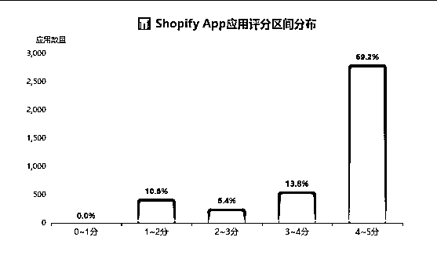

（图 8）

但评论数量差异巨大（图 2），新 App
想“突围”，口碑积累是关键；对于独立开发者来说，前期可以考虑通过免费策略换取早期评价，同时也需要寻找新的功能开发切入点。

这块从未被满足的市场切入可能会更有机会，如“定价”和“礼品”类赛道。

当然现有成熟的 app 也可以通过用户的一些评论发现需求点。

我们接下来从用户评论来分析一下当下 shopify app 的一些市场开发方向。我们还是以 Essential Announcement
Bar 这个 app 为例，他总共评论数据有 1000 多条。

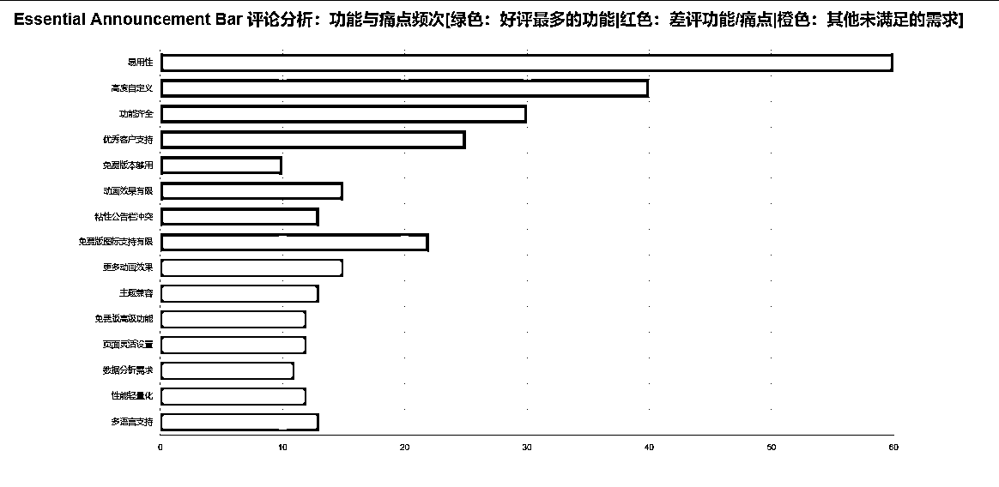

（图 9）

其中关于 app 最差评的功能：动画效果有限（仅滚动或静态），粘性公告栏与主题头部冲突，免费版图标支持有限。

还有其他未被满足但在评论中一直出现的需求：更多动画效果、与各种主题兼容、支持更多页面/区域灵活设置、多语言 / 国际化支持等。

以上都是一些常规化的公告栏需求，但现有 app 是没有被满足的，我们如果寻找新的机会，完全可以对标成熟 app，然后再满足用户这些未被满足的需求，这也是一个市场方向。

## **四、在 shopify app 生态中，个人开发者有机会吗？**

从 shopify app 开发的技术难度层面来说，个人认为是没有什么太大难度的（这个因篇幅有限，不做过多介绍），尤其在 AI 这么牛叉的时代。

我们接下来继续分析一下整个 shopify 有多少开发者，个人开发者占比多少，平均每个开发者在 shopify app store 市场中上架了多少个 app。

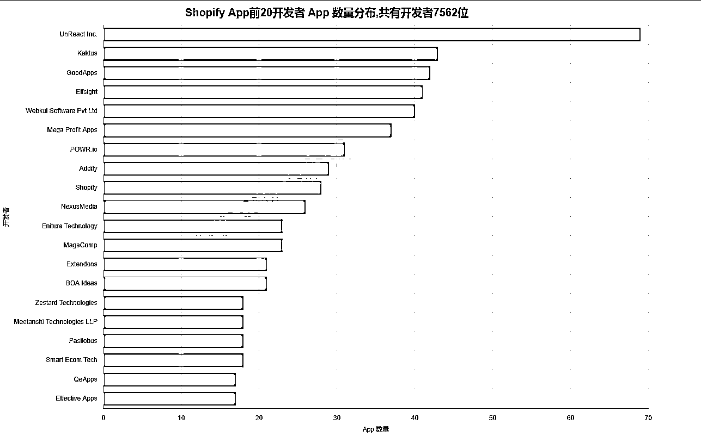

（图 10）

上图显示在 shopify 应用市场共有 7562 位开发者，其中开发应用最多的有 69 个应用。

这个开发者来自日本，shopify 主页为[`apps.shopify.com/partners/unreact5?locale=zh-
CN`](https://apps.shopify.com/partners/unreact5?locale=zh-CN，大家可以去看一下。) ，大家可以去看一下。

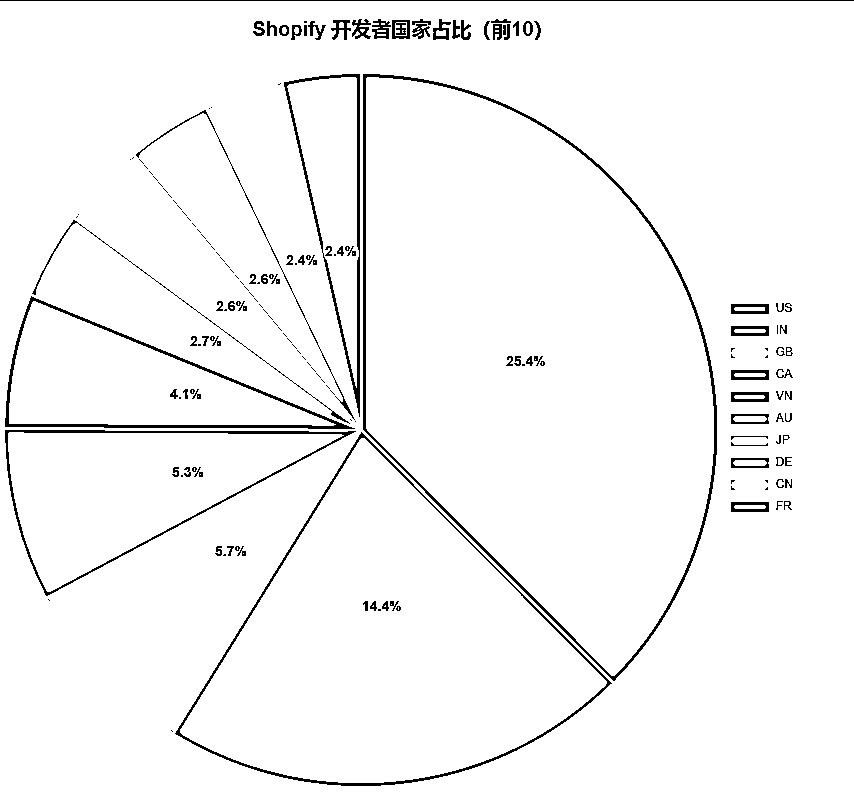

（图 11）

从开发者分布国家（只显示了前 10）来看，美国是最多的，其次是印度，我们中国在 shopify 应用市场开发者占比还不到 3%。

（图 10）

当然完整的开发者所在国家还是有很多的，覆盖了全球大几十个国家，证明 shopify 的开发者在全球很多国家都存在。

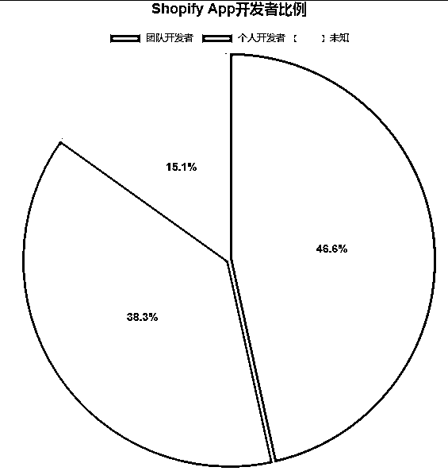

（图 11）

在整个 shopify 中个人开发者占了 38.3%，团队开发者占了 46.6%。

但是我从上架时间和评论数据分析来看，发现很多团队开发者都是从独立开发者向团队开发者转变的，当 app 有了一定的收入之后才开始组建团队，开发自己的官网来承接客户的一些答疑。

个人开发者依然有机会，只是门槛从‘会写代码’，变成‘能理解需求’**。**

## **五、数据告诉我们什么样的 App 最有赚钱潜力？**

当我看完这一整套数据之后，我的最大感受是，shopify app 市场真的大有可为。

因为 shopify 本身有数百万电商卖家，他们每天都在寻找更聪明、更自动化、性价比跟高的工具来帮他们卖得更好。

我们之前展示了各种 app 的分析数据，结合评分、评论、更新时间、付费方式等数据，我初步筛选出了几类“高潜力方向”可以给大家参考一下（下面表格是我把数据喂给 AI，AI 给我总结出来的）：

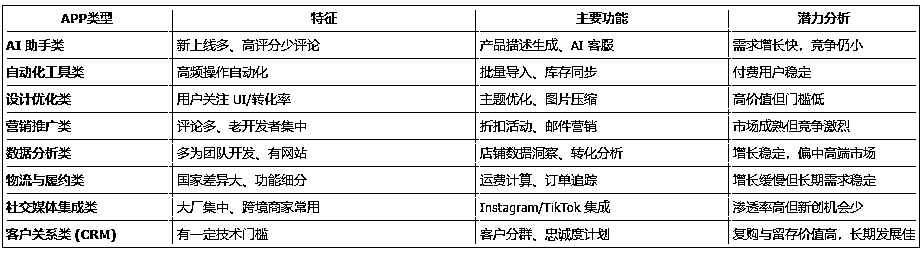

上述所列举出来的都是基于目前数据得来的，具体的可以进入 shopify app store 官网去对应的竞品，可以通过之前的分析方式去挖掘具体需求。

我记得几年前我在生财开了一次关键词挖掘大航海，有兴趣的也可以去看看，里面有比较完整的一些需求挖掘方法论。

## **六、写在最后：关于 AI 时代技术与电商结合的机会**

到此为止，基于 shopify app 应用的一些数据已经分析完毕。

最后我们来聊聊关于 AI 时代技术与电商结合的一些机会思考。

上述所聊的都是基于 shopify
app 的一些应用数据，但是我想表达的一个点是上述的每一个 app 都代表了电商的某一个需求，它目前只是只是展示在 shopify 中，换一个场景它的市场还是存在。

比如基于 WordPress 的插件？如 ecommerce。

比如基于浏览器的电商插件？如 AliPrice。_

_

比如针对物流的实时追踪？如 17TRACK。_

_

等等还有很多类似的，都是非常牛叉的产品，盈利能力也非常强，当然这些都是公司形式在运作，但是也有很多独立开发者的产品做得非常不错。

在我看来，电商人是互联网上最舍得花钱的一群人，只要能帮他们多卖 1 单，他们就愿意掏钱，并且粘性特别高，因为电商是跟用户和数据打交道的，一旦习惯了某一个解决方案，基本不会换。

在如今 AI 时代，写代码已经不是难事了，找到一个解决部分人痛点的需求，一个月收入破万个人认为是非常轻松的，当然如果实在没有什么头绪，那就从 shopify
app 这种基于应用市场的需求开始，成本最低，反馈最快。

无需复杂的前端设计，不必有庞大的团队，只要能解决一个痛点，就可能变成“月入几千刀的小生意”。

好吧，感谢你能看到这里，如果上述内容对你有所帮助，那是我的荣幸。

**（此内容发于生财，谢绝任何形式的转载）**

* * *

评论区：

七天@生财有术 : 很干货，AI 产品的机会来源于最有粘性的群体的刚性增量需求，做电商的老板们就是这样的画像。分享很有启发的一段：如果实在没有什么头绪，那就从 shopify
app 这种基于应用市场的需求开始，成本最低，反馈最快。 无需复杂的前端设计，不必有庞大的团队，只要能解决一个痛点，就可能变成“月入几千刀的小生意

你在哪 : shopify 是干嘛的。。谁会在上面订阅？哪个平台的商家啊

龙咖 : 这个是绝对的干货！！

龙咖 : 这。。。。。。[撇嘴][撇嘴][撇嘴][撇嘴]

蓝星空 : 写的非常详细，感谢分享！

唐 : 好文，我最近也在看这方面的机会，期待更多 Shopify 的分享

希声 : 做海外独立站都会用的平台，准确来说是建站工具

希声 : 有启发，很棒的切入点