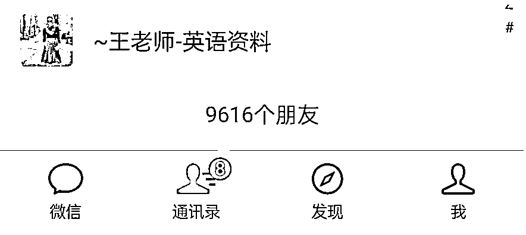
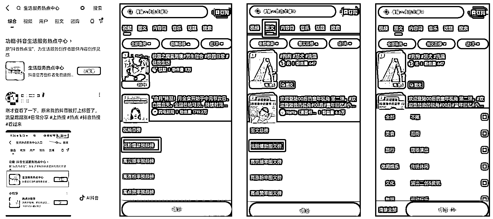
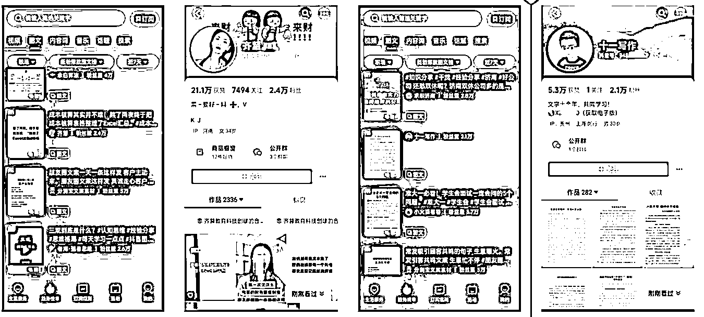
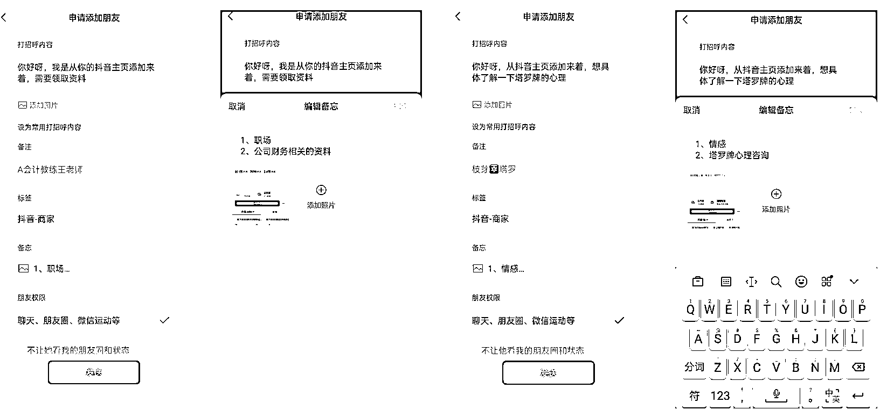
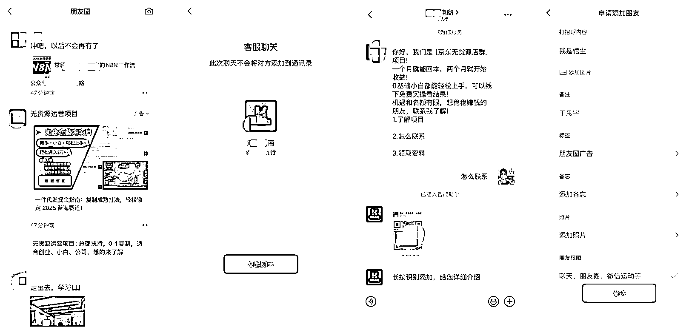
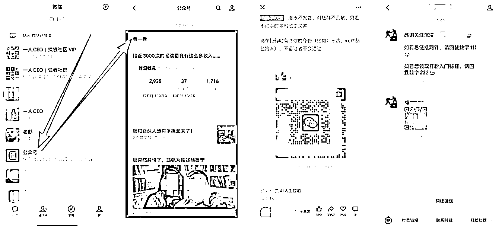
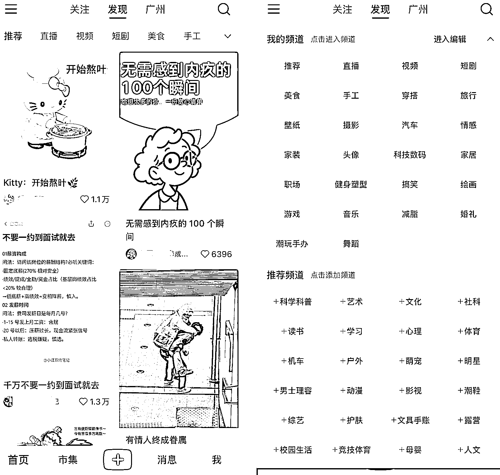
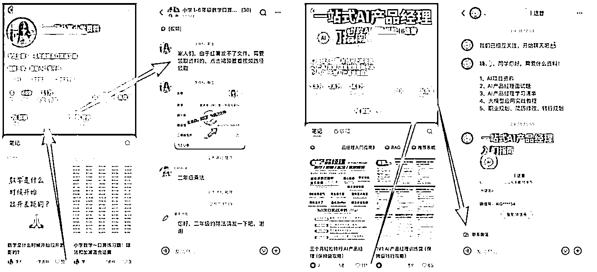
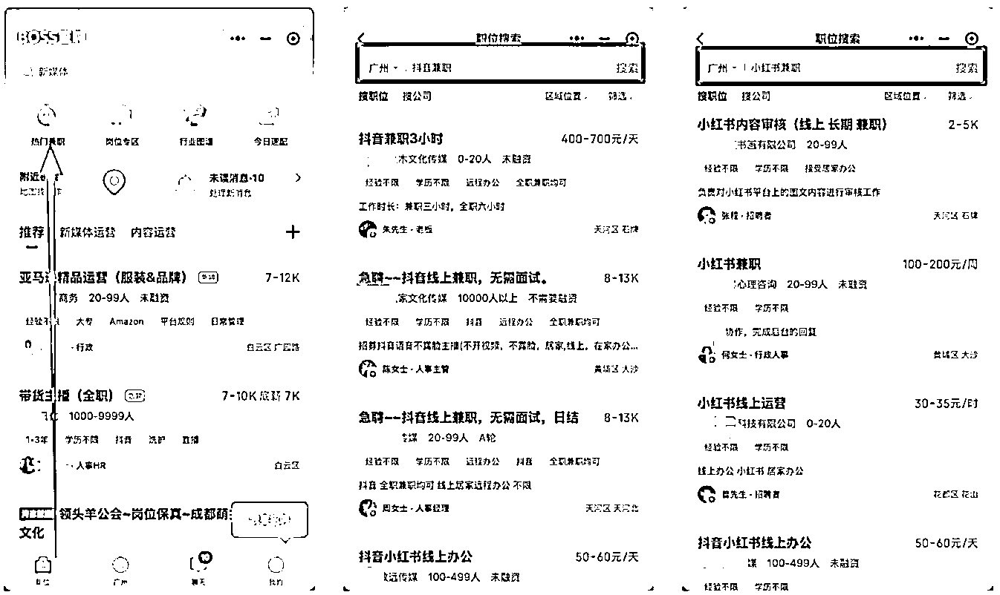

# (31 赞)如何精准添加 10000 名商家好友，并打造一个商业微信

> 原文：[`www.yuque.com/for_lazy/zhoubao/xvmwhza42gxhnv7l`](https://www.yuque.com/for_lazy/zhoubao/xvmwhza42gxhnv7l)

## (31 赞)如何精准添加 10000 名商家好友，并打造一个商业微信

作者： 馆主

日期：2025-10-25

给小伙伴们分享一个普通人也能赚钱的商业思维，在内容平台上主动添加「垂直类」商家的微信，并挖掘它们的搞钱思路。

如果您还在焦虑：信息差落后、不了解行业、不懂技术、没有团队、没有资源，那么你可以试试这个搞钱思路，只需要会玩手机并且执行力强的人就能赚钱！这个思路适合的人群：在读大学生、应届生、失业者、自由职业者、宝妈等普通人....

快速阅读：

1.  注册一个微信小号，尽量不要使用生活号，免得影响正常使用

2.  准备好各大内容平台的账号：抖音/快手/视频号/小红书/知乎/公众号/微信朋友圈/boos 某聘.......

3.  开始浏览这些平台的作品，快速的观看一下这些博主有没有留下微信/手机号码，有我们就记录下来

4.  添加好友的时候要：添加标签（某个平台）、添加备忘（平台主页截图），数量多好区分

5.  添加成功后刷一下朋友圈，看看它卖什么，成交的案例多不多，有没有在晒课程、有没有拉你进小群等......

6.  每天给自己定一个目标：加 30 位【商家】，现在微信很严格，加太多会被封号的

7.  重复的去执行一个月后，好友数量差不多 1000 人了，假如坚持了一年，不就是 1w 人啦！

8.  以买家【客户】的身份进行和它交流，多抛出一下问题这样可以让我们更清晰一些，如果你觉得还不错也不贵，那可以买下它的产品/服务/课程，完整的体验一下流程【注意不要被割韭菜】

9.  如果觉得这个赛道适合你，就问它需不需要代理，帮它搞流量，按成交来给我们佣金，一般它们是会同意合作的

10.  成为代理后，拿着它的素材去它原有的平台发，我们要做的就是像素级模仿，账号包装（头像、名称、简介【只需要把微信号替换成我们的即可】），微信包装（头像、名称、朋友圈、聊天话术）,然后引流过来的客户我们成交，扣除佣金，就可以把金额和客户转移给它们服务即可......

11.  要有上进心，不能一直做代理层，当我们开始赚钱的时候，已经学会怎么制作作品、怎么找行业的供应链、怎么制作自己的课程/服务、怎么包装账号、怎么包装朋友圈、怎么优化话术等....

12.  更高端的玩法：这些好友正是当下在互联网赚钱的那批人，假如我们有 1w 名商家好友，就能挖掘 1w 个搞钱案例，这些搞钱案例可以做成一个【付费社群】/或其他变现方式

**如何在这些平台上添加好友？**

**1、抖音 _**

抖音可以在主页留下手机号码/微信号，所以这些商家他们会直接在主页留下联系方式，我们在日常刷抖音看到就可以使用客户（小号）微信加一下

但这样太慢啦，也不够精准，我们可以借助抖音官方提供的工具，直接可以细分到你需要看的赛道

1/在抖音的搜索框：生活服务热点中心

2/点击趋势榜单

3/不管是视频/图文都有垂直分类，这样我们就可以刚好的细分我们需要的内容，而且也可以看到低粉爆款

演示一下：

选择图文板块->职场->低粉爆款->近 7 天，然后我们就开始从 1...开始浏览，不一定都会留联系方式，但大部分都会留，排号 13、18 的博主主页都有留微信号，我们就记下来，添加微信

接下来就是怎么加微信，这里是有技巧的：

1、新建一个微信标签：抖音-商家

2、复制粘贴主页的微信号进行添加

3、打招呼内容：你好呀，我是从你的抖音主页添加来着，需要 xxxx

4、添加标签：选择【抖音-商家】的标签

5、添加备忘录：抖音主页截图

**2、朋友圈的广告 _**

朋友圈很多人都在刷，但是很多人都没有注意到它也能够挖掘出别人正在赚钱的生意

完整路径：朋友圈的广告--对接客服---添加商家好友

**3、公众号 _**

在公众号添加这些博主微信，一般有两种：文章末尾/菜单栏

微信首页-公众号-看一看，从这里看推荐公众号：文章末尾/菜单栏都会有联系方式

**4、小红书 _**

小红书是一个低门槛的商业平台，作为一名小白/宝妈/大学生，应该把重心放在小红书上，那么如何在小红书上添加这些商家并挖掘赚钱思路呢？

首页--我的频道--进入编辑--推荐频道

在我的频道里面把你感兴趣的频道赛道，看看推荐频道有没有你喜欢的频道，然后添加到我的频道里面

由于小红书不能直接在主页/评论区留联系方式，所以素人和专业的账号有不同形式留联系方式

素人卖家：她们一般是通过群聊/私信等方式

专业号：私信的时候她可以通过组件之间把微信发给你

**5、boss 某聘 _**

在 boss 上通过兼职的身份去咨询这些公司，他们会和你互换微信，安排任务给你做并且还会教你怎么做，有什么不懂的也可以问他们，久而久之你也能摸出一些门道

感谢大家阅读，如果觉得我写的好，请给我点个赞，嘿嘿嘿！

* * *

评论区：

吴较瘦 : 新微信加了 7 个好友被禁止添加了 这咋搞

馆主 : [捂脸]你不知道最近微信清网行动吗，大量封号，我两个微信都被封了

馆主 : 你不要一下子加太多人，先活跃一下，养号