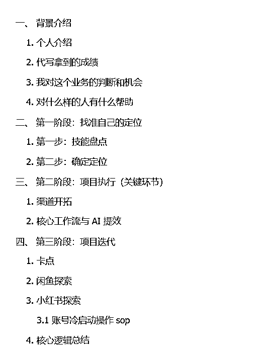

# (精华帖)(40 赞)从代写交付到流量拓客：淘宝-闲鱼-小红书 3 个平台的持续探索，实现商业文案 AI 代写月入 2w+

> 原文：[`www.yuque.com/for_lazy/zhoubao/gcm4g09zb801u9dg`](https://www.yuque.com/for_lazy/zhoubao/gcm4g09zb801u9dg)

## (精华帖)(40 赞)从代写交付到流量拓客：淘宝-闲鱼-小红书 3 个平台的持续探索，实现商业文案 AI 代写月入 2w+

作者： 豆子🌶

日期：2025-10-27

哈喽大家好，我是鱼 。商科背景 ，目前在传媒行业 。

本文主要复盘我的商业文案代写副业，如何利用业余时间从 0 做到月入 2 万+ ，以及后续如何打破瓶颈，探索闲鱼、小红书直客模式的全流程 。

本篇文章用于包含下面 4 个方面的内容：

下面是飞书好读版：

[`acnumo5k2una.feishu.cn/wiki/Qs65wqrbgi3e2ykiTaRcxlLynDh`](https://acnumo5k2una.feishu.cn/wiki/Qs65wqrbgi3e2ykiTaRcxlLynDh)

* * *

评论区：

芷蓝 : 👍👍代写是反馈最快的项目了

青霜 : 链接无法跳转

Doreen : 链接不能直接跳转

大树 : 老师，链接有问题，无法访问

李词宝 : 到生财官网里看

豆子🌶 : 🥹🥹难受，为什么会出现有人能打开，有人打不开的情况

偶尔的时光 : 可以称之为新手最好的入场教程