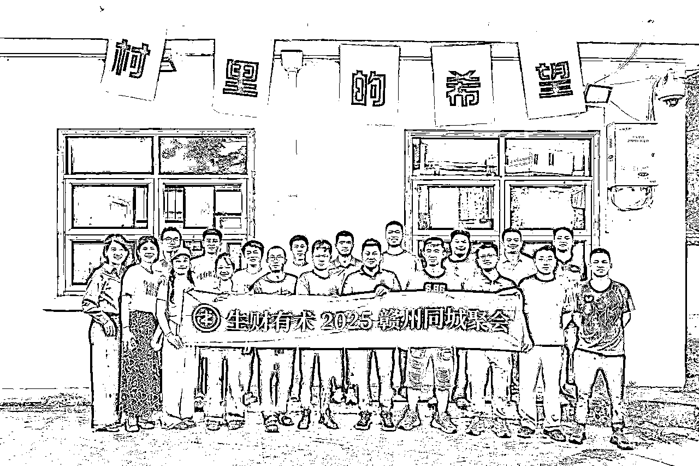
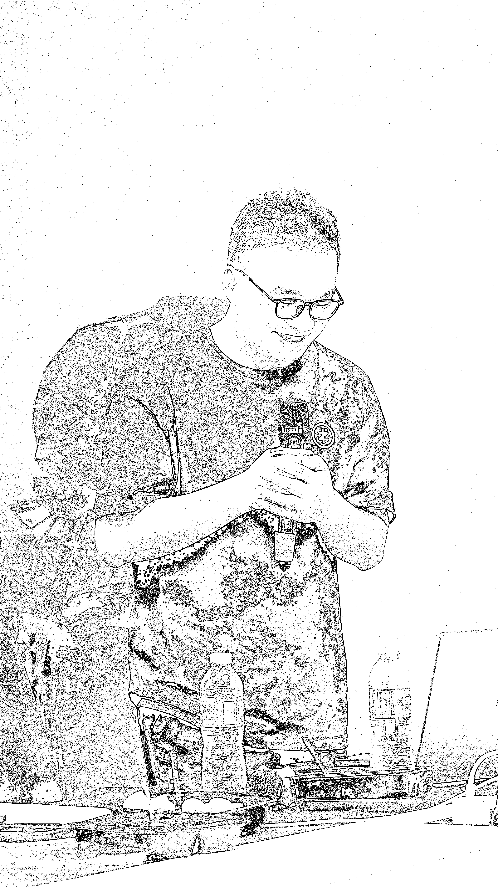

# (精华帖)(206 赞)生财 5 年从 “差生” 逆袭：不下牌桌，死磕公众号 8 年，搭出上瘾赚钱系统

> 原文：[`www.yuque.com/for_lazy/zhoubao/gz596cwnioql5gre`](https://www.yuque.com/for_lazy/zhoubao/gz596cwnioql5gre)

## (精华帖)(206 赞)生财 5 年从 “差生” 逆袭：不下牌桌，死磕公众号 8 年，搭出上瘾赚钱系统

作者： 刘智行

日期：2025-10-31

大家好，我是刘智行，之前在生财发布了一篇生财好事的帖子被亦仁老大推荐了，备受鼓舞。就像亦仁鼓励我那样，我希望把近期的一些心路历程和项目经验分享给大家，把这份力量传递出去。
补上亦仁老大推荐帖和我的好事链接： 非常建议大家去写写生财好事，门槛低，正反馈感强～就当是记录成长了
生财五年级学生，前四年毫无作为默默在生财潜水，第五年开始爆发，找到自己的人生之路。 今年是我下班后沉迷副业的第 1 年，也是和公众号垂直小号死磕的 8 年。
我在公众号垂直小号上硬扛了 8 年。阅读零阅读或者个位数阅读、变现受阻、AI 工具不会用的至暗时刻都遇过，但每次都咬牙闯过去。从项目一次次失败，到持续产出可复用的方法与结果。
1/ 聊聊我自己 2/ 取得的一些项目成绩、收获成长 3/ 垂直小号心路历程（掏心掏肺版，哈哈哈）
如果你也有和我相似的经历，希望我的经历和经验能给你带去一些启发和帮助，那我们就开始吧～ 全文有点长，请大家移步飞书阅读全文吧！ [`t.zsxq.com/UtwsX`](https://t.zsxq.com/UtwsX)[`xc8pgi2dy9.feishu.cn/wiki/BVM5wat1wizT9ckCHi7c2C1nnne?from=from_copylink`](https://xc8pgi2dy9.feishu.cn/wiki/BVM5wat1wizT9ckCHi7c2C1nnne?from=from_copylink)

* * *

评论区：

亦仁 : 赣州咱还有这么多圈友吗

刘智行 : 老大，有的哈，其实还挺多的。第一张是国庆的线下聚会，很多圈友从外地回来了，然后聚了一次。

袁星河 : 哇 终于等到啦[色]

刘智行 : 这篇主要是小灯塔哈，具体实操细节从 0 到 1，从 1 到 10 的打法正在写，已经写好一半了哈。也快面世了。感谢圈友支持哇。

袁星河 : 哈哈，那就更期待啦，从刘老师这里学习了好多干货[强][强][强]

平常 : 一直关注你，学习的榜样，厉害呀，期待具体实操细节

刘智行 : 感谢关注与支持，一起努力。[玫瑰][玫瑰]

周行今天学习了吗？ : 哇等到了🤩