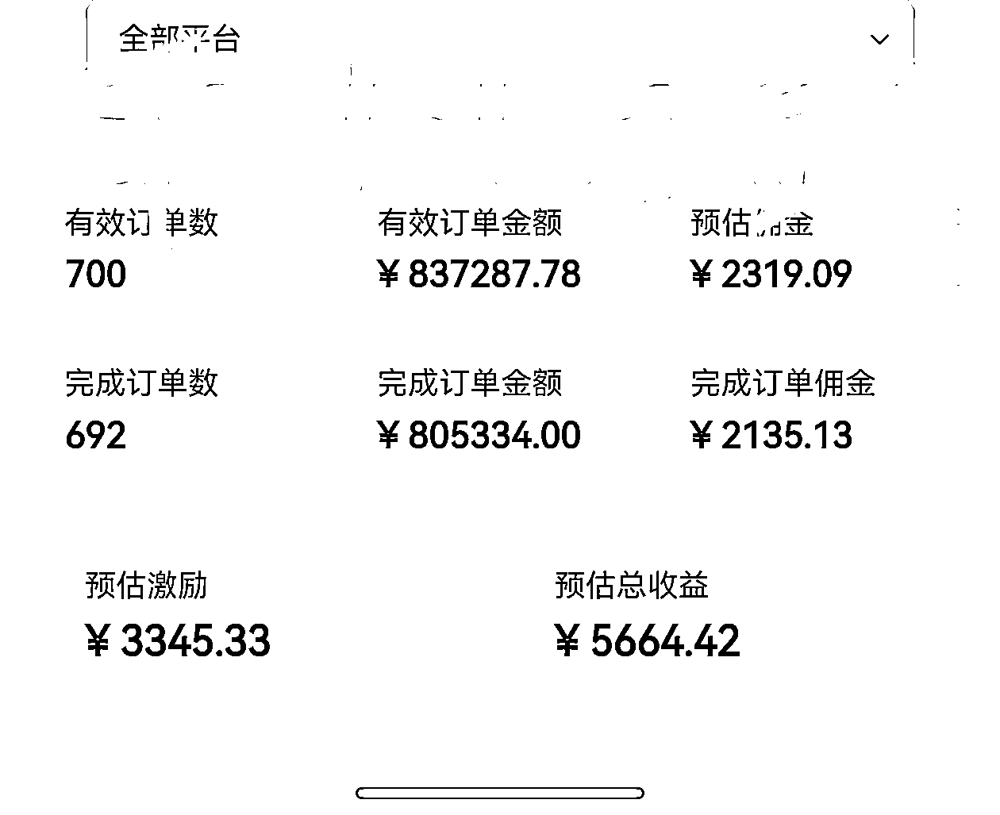
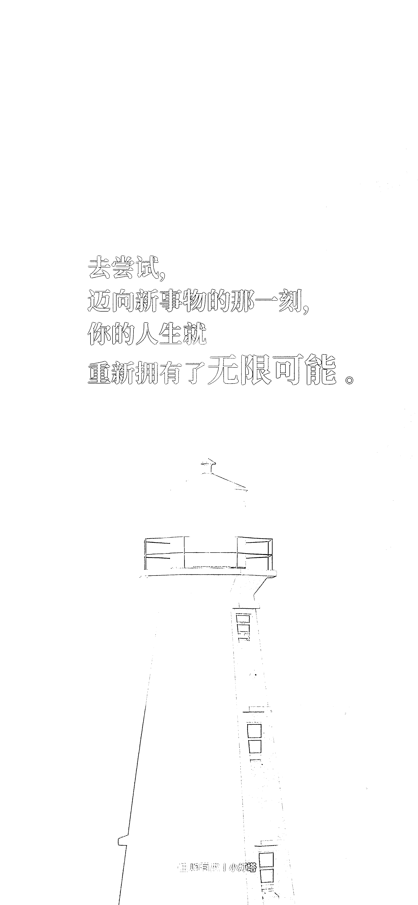

# (精华帖)(253 赞)47 岁大叔，尝试无数个第一次，从电脑小白到抖音自然流 CPS 航海 GMV 突破 83 万

> 原文：[`www.yuque.com/for_lazy/zhoubao/xzyrfrlgeif3nc2r`](https://www.yuque.com/for_lazy/zhoubao/xzyrfrlgeif3nc2r)

## (精华帖)(253 赞)47 岁大叔，尝试无数个第一次，从电脑小白到抖音自然流 CPS 航海 GMV 突破 83 万

作者： 平凡之路

日期：2025-12-09

47 岁大叔，尝试无数个第一次，从电脑小白到抖音自然流 CPS 航海 GMV 突破 83 万 各位圈友好，我是平凡之路。 47 岁，做了 23
年服装实体店，钓了半辈子鱼，电脑水平停留在能开机就不错的程度。
前段时间，我遇到了一件超出我人生想象范围的事，那种程度让我连最爱的钓鱼都暂时放在了一边。那就是： 10 月 16 号加入生财 10 月 21
号参加第一次航海 10 月 31 号挣到第一单佣金 0.01 元 11 月 14 号抖音 CPS 的 GMV 突破 83 万
我常说，那一分钱不是钱，那是一个我从未想象过的世界正在对我打开门。 接下来我会分享这段时间在抖音 CPS
的心路历程，希望告诉大家去尝试，迈向新事物的那一刻，你的人生从那一刻起重新拥有了无限可能。 同时也愿每位圈友都能走通 0—1，
愿你们的人生里，也能出现那一道 0.01 元的光。
具体内容请点击飞书链接：[`ai.feishu.cn/wiki/LslewFdRiijVt9kXduicJgxonNg?from=from_copylink`](https://ai.feishu.cn/wiki/LslewFdRiijVt9kXduicJgxonNg?from=from_copylink)

* * *

评论区：

怡然 : 写的太好啦！“面对一块不到 13 寸的屏幕，感觉比面对 200 平米服装仓库还无力”通过读文字又重新了解了走出这一步多么不容易，敬佩大哥的勇气和执行力！

平凡之路 : 动力源自于怡然教练金句：不会不懂没有关系，你只要按照教练讲的去做就行了，做了就比不做强。

亦仁 : 大哥都不钓鱼了 养成了新爱好[呲牙]

三点 : 很赞，有被赋能到，今天还有点烦躁，感觉前路漫漫，看到圈友的帖子，一下子又来了精神，“做了比不做强”今天第二次听到，很有力量！

渝小高 : 太牛了，大哥，为你点赞👍🏻👍🏻，佩服你重新出发的勇气和行动[太阳]

平凡之路 : 现在真的没空钓鱼了，搞钱比钓鱼有意思多了

纪钟 : 之前体验营聊到半夜，那时候还担心没基础进步会比较慢，但就像当时说的，时间会改变一切，没想到短短一个月就发生了翻天覆地的变化，真的证明了一切皆有可能[强]

L!N/林林/小林 : 感谢分享，不知道大哥啥时候来篇帖子讲讲前半生？不需要多成功，只需要真实，相信也能帮到不少年轻人。[抱拳][抱拳][抱拳]