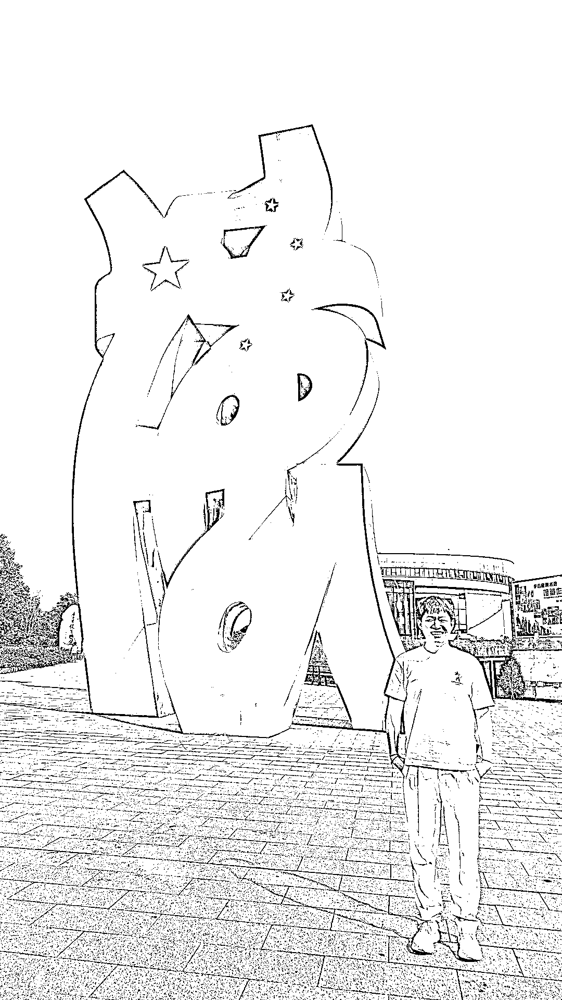

# (精华帖)(90 赞)3 个月没赚到钱到双 11 期间 GMV 破千万，我是怎么熬过无反馈期的？

> 原文：[`www.yuque.com/for_lazy/zhoubao/fz0v8gfog2mqcoog`](https://www.yuque.com/for_lazy/zhoubao/fz0v8gfog2mqcoog)

## (精华帖)(90 赞)3 个月没赚到钱到双 11 期间 GMV 破千万，我是怎么熬过无反馈期的？

作者： 星空海绵

日期：2025-12-08

3 个月没赚到钱到双 11 期间 GMV 破千万，我是怎么熬过无反馈期的？ 大家好，我是星空海绵，你们可以叫我阿星。
星空海绵的寓意是：心向星辰大海，也要像海绵一样不断汲取知识和能量。
11 月的时候，生财官方发起了一次小灯塔选题投票（），呼声最高的前五个选题里，有一个是：「项目一直没正反馈，怎么稳住心态继续干？」
看到这个选题，我心里咯噔了一下。因为，这正是我过去几个月最真实的写照。
刚好在这方面有一点点切身体会，所以借这次机会，把我在「B 站好物」这个项目上的完整经历，认真复盘、拆开分享给大家。也非常感谢生财官方的邀请，让我有机会把这段路走过之后的感受讲给圈友们听。
从 7 月 4 日加入生财，到现在 12 月，5 个月的时间，我对「项目」「反馈」「机会」这些词的理解，可以说发生了翻天覆地的变化。路虽难，行则将至。 1/
星空海绵：给自己找一个能撑很久的「身份」 2/ 记录和复盘：打磨最底层的心力 3/ 初遇生财有术：我看见了什么 4/ B 站好物，你好：项目从 0 到 GMV
破千万的全过程 5/ 写给正在努力的你：一些发自肺腑的建议 如果你现在正处在： 1/ 项目毫无起色、看不到结果的无反馈期 2/
越做越迷茫，不知道该不该继续的纠结期 3/ 已经在「放弃」和「再试一次」之间反复横跳……
可以花点时间看完这篇复盘。希望能让你多看到一点点方向和希望，多撑一会儿，多走几步。 饭要一口一口吃，路要一步一步走。
祝你、也祝我，每次都能熬过黑夜，迎来属于我们自己的星辰大海！ 为了方便阅读，正文请移步飞书： [`t.zsxq.com/phRlS`](https://t.zsxq.com/phRlS)[`ai.feishu.cn/wiki/KB5owkFf0iq1hVkUotXcSGzpnWb`](https://ai.feishu.cn/wiki/KB5owkFf0iq1hVkUotXcSGzpnWb)

* * *

评论区：

小源 : B 站掌管投流的神[坏笑]

周无限 : [666]

星空海绵 : [阴险]

烽火 : 写的真好，老弟必成大器！

清泉流响 : [强][强][强]

星空海绵 : 感谢烽火大哥夸奖，还在慢慢学习中，生财那么多大佬，学不完，根本学不完[皱眉][皱眉]

星空海绵 : 泉神[旺柴]

月亮 : 星神牛逼！