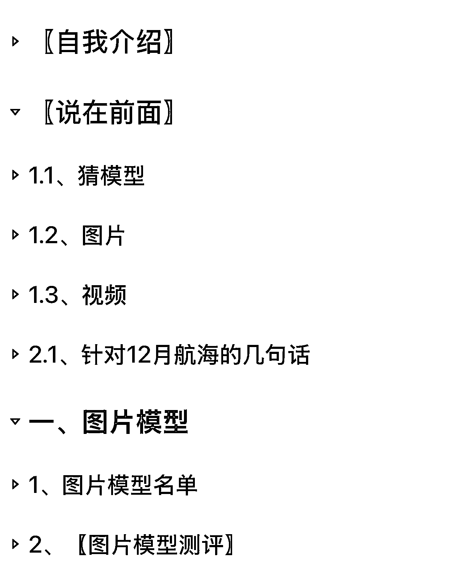
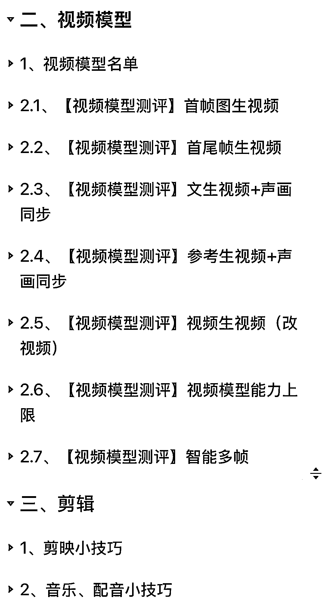

# (精华帖)(145 赞)《12 月 AI 图片&视频模型应用场景测评：AI 内容创作从入门到精通》20251212 更新

> 原文：[`www.yuque.com/for_lazy/zhoubao/bhnl2tc1wcmozgls`](https://www.yuque.com/for_lazy/zhoubao/bhnl2tc1wcmozgls)

## (精华帖)(145 赞)《12 月 AI 图片&视频模型应用场景测评：AI 内容创作从入门到精通》20251212 更新

作者： 蟹老板

日期：2025-12-12

《12 月 AI 图片&视频模型应用场景测评：AI 内容创作从入门到精通》20251212 更新
大家好，我是蟹老板，今年一月加入生财，三月参加油管航海，五月进入油管深海圈，现任深海圈答疑教练。
过往曾任职外企规划设计院、广告公司、两家互联网大厂、抖音电商创业，到如今全职油管。
目前在运营六个高级 ypp 账号，擅长 10-20 秒短脚本微创新，分别有过微创新和原创简单脚本的单视频 shorts 过亿播放。
25 年七八月份的时候开始更新这篇模型测评的帖子，到 25 年 12 月的这一版总共做过了三次大的更新，也通过测试观察到一些模型的细节特征和发展方向，分享给大家。
这是我第一次在生财发帖，几个月来迭代了三次。因为感觉到 AI 模型更新很快，而模型每次大的更新都可能会带来某些赛道的重新洗牌。
希望通过这篇帖子能够帮助各位 AI 视频生产者尤其是新人朋友们绕过独自试错的高昂成本与精力消耗，快速建立有效认知。
利用对模型的了解和对模型未来发展方向的判断，让脚下的路更加平坦。 详见飞书：
对应直播在 25 年 12 月 YouTube 航海高手领航中，直播链接：[`ai.feishu.cn/wiki/GvEJwi52ji9xOgkJJxfcbe6jnpc`](https://ai.feishu.cn/wiki/GvEJwi52ji9xOgkJJxfcbe6jnpc)[`shengcaiyoushu01.feishu.cn/minutes/obcnl96t3ett46y652hn9k25`](https://shengcaiyoushu01.feishu.cn/minutes/obcnl96t3ett46y652hn9k25)

* * *

评论区：

小黄快跑 : 最帅蟹老板

猫大人丶 : 蟹老板帅~

困困 : 蟹老板无敌👍

礼新 : 宇宙无敌帅蟹老板

走位 : 蟹老板无敌👍

杨鹏 : 专业！

文少 : 蟹老板牛逼！

波哥 : 现在 ai 大模型太多，API 接口也多，有这帖子少走很多弯路，少抽很多卡！