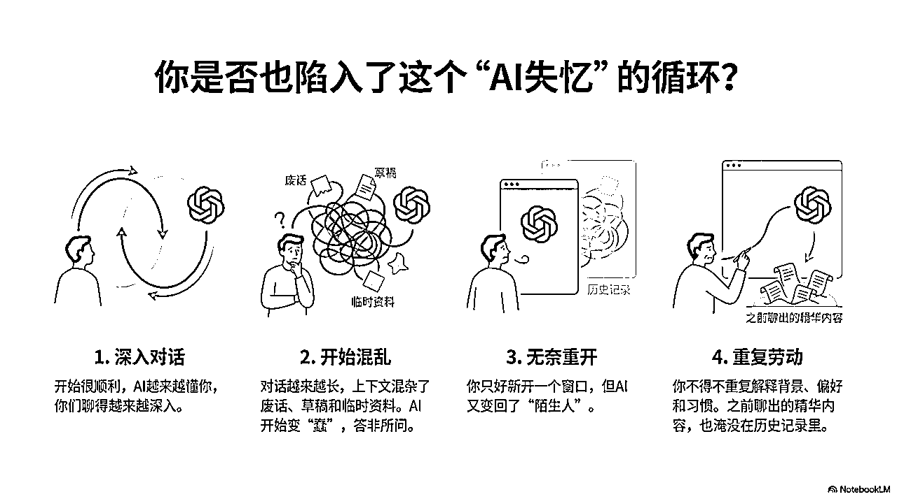
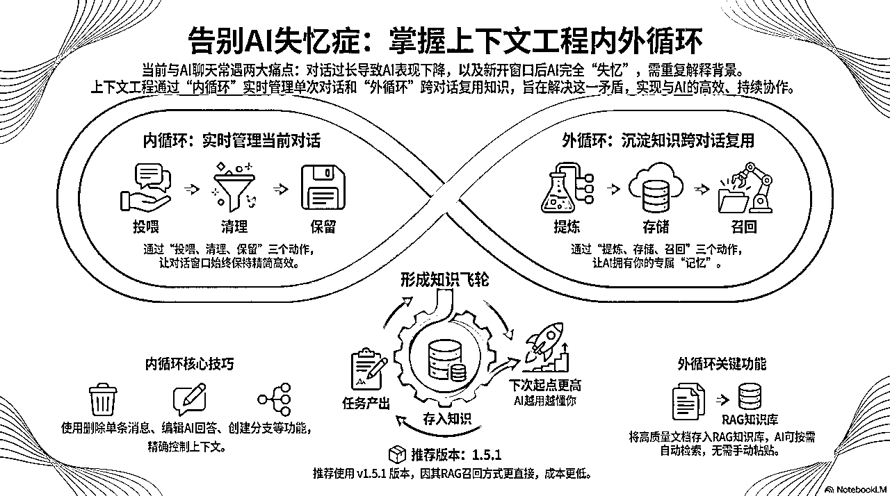

# (精华帖)(156 赞)《写给普通人的上下文工程完全指南：让每一次 AI 对话都能复利》

> 原文：[`www.yuque.com/for_lazy/zhoubao/kwqft4yx23m5we9f`](https://www.yuque.com/for_lazy/zhoubao/kwqft4yx23m5we9f)

## (精华帖)(156 赞)《写给普通人的上下文工程完全指南：让每一次 AI 对话都能复利》

作者： 夙愿学长

日期：2025-12-12

大家好，我是夙愿学长，资深传术师，02 年刚毕业，目前在一个企业 AI 转型咨询公司负责 AI 产品开发和智能体落地。 继 Vibe Coding
火了之后，现在又有一个概念火了，叫做 Context Engineering（上下文工程）。 有多火？Shopify 现在招聘之前，第一件事不是写
JD，而是先评估这个岗位能不能用 AI + 上下文工程来解决。如果可以，那就直接不招了。 为什么突然火起来？
因为大家发现：这一轮大模型的能力提升，已经接近瓶颈了，指望「等一个更强的模型」来解决问题，越来越不现实。
竞争焦点已经从「训练更好的模型」转向了「用好现有的模型」， 但回到我们个人的日常使用中，情况却很糟糕。
当聊天上下文过长时，你知道该怎么办：新开一个对话窗口。 但新窗口里，AI
又变回了“陌生人”。那些你在上个窗口里费了半天劲让它理解的背景、你的偏好、你的工作习惯，全没了。 这就是我们目前使用 AI 最大的瓶颈：
这篇文章，就是为了彻底解决这个问题。 这篇文章有点长，16500 字，读完大概需要 30 分钟。 但如果你每天都在用 AI，这 30 分钟是你非常值得花的。
因为它能帮你解决一个每天都在发生的问题： 我把我最近几个月摸索出来一套完整的工作流都写进来了，文章从概念讲到方法，从方法讲到工具配置，最后还有知识库搭建。
跟着做一遍，我相信你和 AI 的协作方式会发生本质变化。 飞书链接：
如果这篇文章对你有帮助，记得点个赞告诉我～[`zi6nfl20s5u.feishu.cn/wiki/CmpyweCxyihxx1kuH2hct4Kanbg?fromScene=spaceOverview`](https://zi6nfl20s5u.feishu.cn/wiki/CmpyweCxyihxx1kuH2hct4Kanbg?fromScene=spaceOverview)

* * *

评论区：

四夕 : 太干货了，外循环有点数据驱动的感觉，不断沉淀高质量内容

及时雨℃ : GPT 聊完之后直接和它说保存全部聊天记忆，以后和你所有的聊天记录都保存记忆。我一直都这样用的。它都记得呀

夙愿学长 : GPT 能记得的还是有限的

shu.p. : 我感觉 gpt 相对比其他要聪明一点

刘璐 : 还没具体看内容，不过确实存在这个问题。使用 GPT，只要经过多轮对话，它就会卡顿，记不清它之前的操作了，导致一些新问题的出现。

啊喂王默 : 干货

好运. : 哈哈为什么他妈的要用无序列表 深有感触