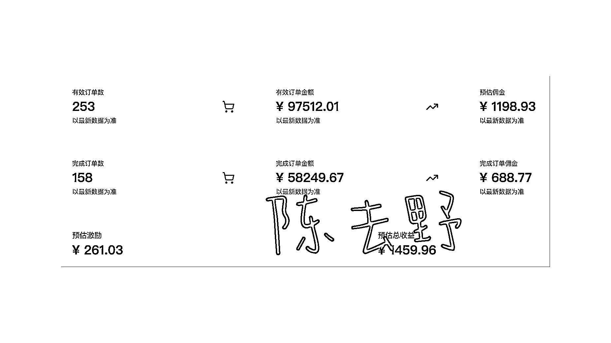
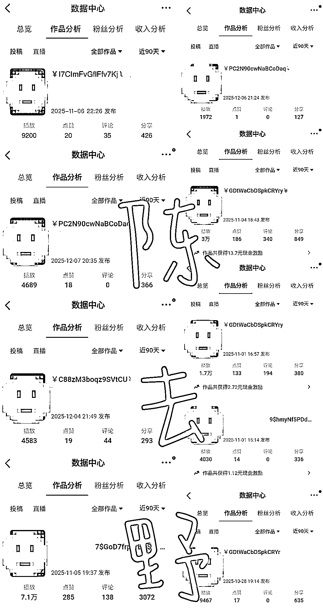
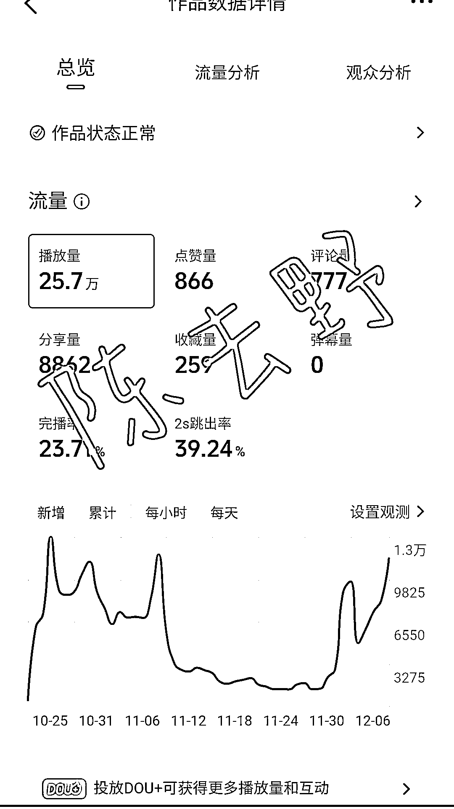

# (42 赞)抖音 CPS 玩家自曝：无经验、无粉丝、无上限…新手友好！快速入局！

> 原文：[`www.yuque.com/for_lazy/zhoubao/lq7d4d3wio7pcg6c`](https://www.yuque.com/for_lazy/zhoubao/lq7d4d3wio7pcg6c)

## (42 赞)抖音 CPS 玩家自曝：无经验、无粉丝、无上限…新手友好！快速入局！

作者： 陈去野

日期：2025-12-12

抖音 CPS 玩家自曝：无经验、无粉丝、无上限…新手友好！快速入局！ 第一期抖音 CPS 没报上，自己琢磨了玩法 第二期抖音 CPS 航海报上了，榜上有名自己却不满足
这次虽然成绩一般但感悟良多 今天在生财写点不一样的 自曝账号、拆解玩法 给入场的新人或者团队一些建议 让自己的账号发挥最后一点价值 从今天开始
督促自己更新迭代，进入新的增长期 在这个 CPS 项目上，我也是新人，把自己的实践经验奉上 希望有大佬看到可以带带我 具体实操过程请移步飞书阅读 [`ai.feishu.cn/wiki/GEoqwHZUfisLf3k5vnYcPKBenEc?from=from_copylink`](https://ai.feishu.cn/wiki/GEoqwHZUfisLf3k5vnYcPKBenEc?from=from_copylink)

* * *

评论区：

乔久伴 : 带野都牛

张凡成 : 👍🏻

龙云平* : 野姐厉害

小源 : 我为去野举大旗[咖啡]

怡然 :

万能的星星 i : 有和没有专属密令词佣金的差距大吗还是有其他方面的区别吗

陈去野 : 用密令词会有平台的额外激励，收益是会更多一些的

陈零 : 去野大哥牛