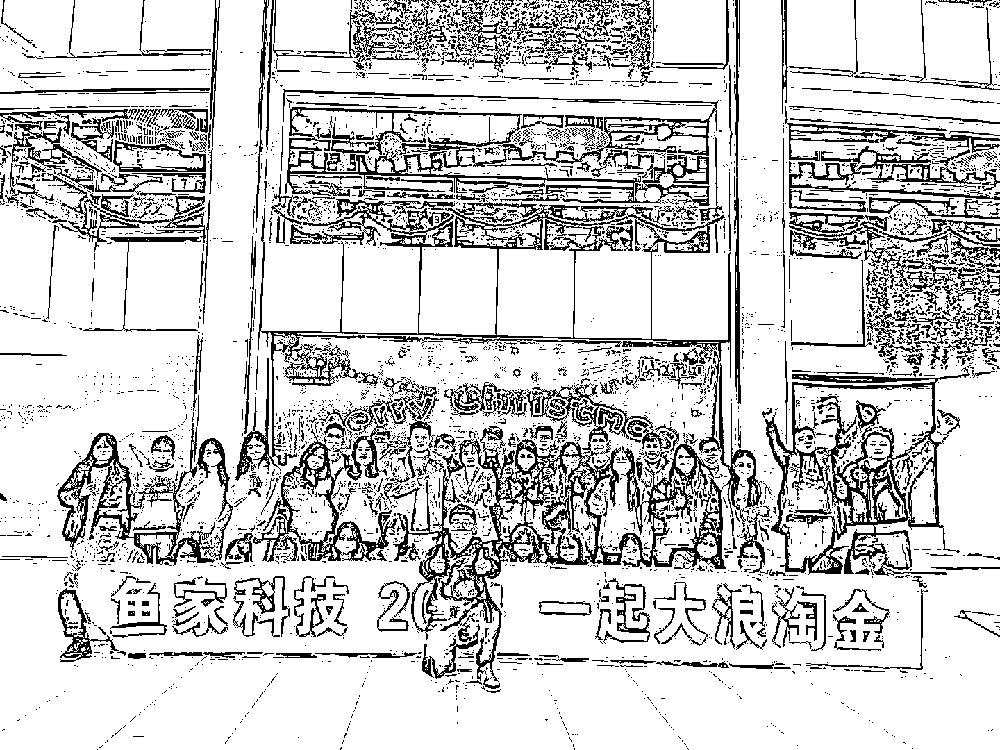
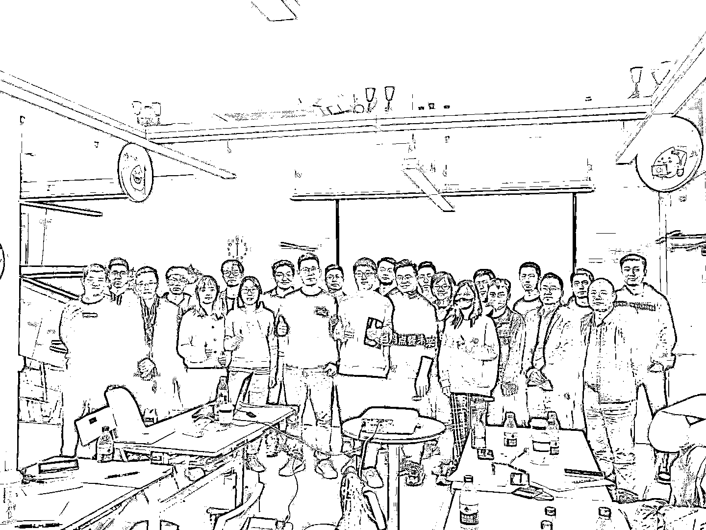
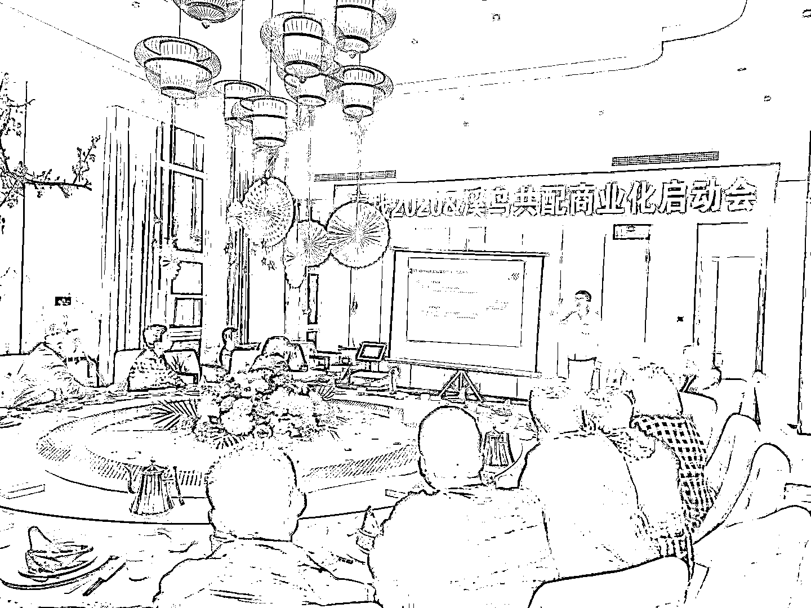
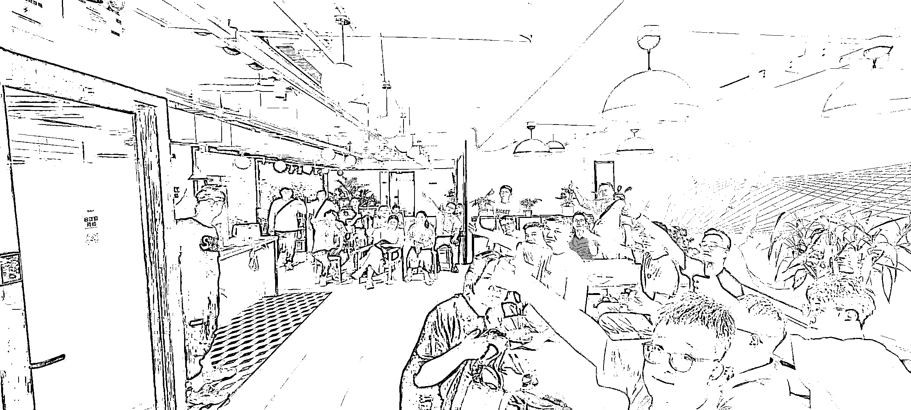
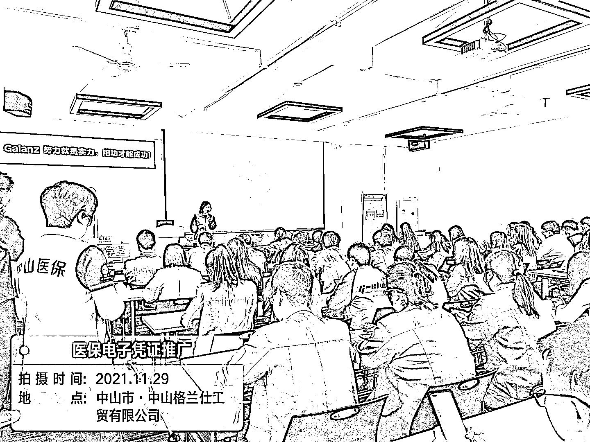

# (精华帖)(74 赞)（你需要的不是下一个风口，而是把一个模式复制 1000 遍，中国式阿米巴算是规模化比较好的一种方式）

> 原文：[`www.yuque.com/for_lazy/zhoubao/ln46sksdrgyea27w`](https://www.yuque.com/for_lazy/zhoubao/ln46sksdrgyea27w)

## (精华帖)(74 赞)（你需要的不是下一个风口，而是把一个模式复制 1000 遍，中国式阿米巴算是规模化比较好的一种方式）

作者： 孙策

日期：2025-12-10

【你需要的不是下一个风口，而是把一个模式复制 1000 遍，中国式阿米巴算是规模化比较好的一种方式】 我这几年带了几百人赚钱，也见了大量的创业者，
我发现的大量的创业赚不到钱，其实犯了一个巨大的错误， 就是不断的找项目，不断的从 0 到 1， 其实项目不在大小，最核心的点，在于复制，
就是看你如何完成第一个 1000 元利润后，怎么能规模化一万份，那就是 1000 万， 像淘宝客，拉一个群一天赚 100，那拉 1000 个群，一天就赚 10 万了，
像 app 下载，一个 app 下载给 100 元，那你只 d 需要找到 10 万人下载这个 app 就好了， 像实体服务，一个商家给 10000 服务，找到 1000 个商家就好了，
所以，赚到巨额利润的点，是在于复制，不在于找各种各样的项目，不断的完成从 0 到 1， 那估计很多粉丝会问， 策哥，我也想从 1 到 n，我该怎么进行规模化的复制呢？
今天我分享一个，我经常用的方式， 就是阿米巴， 这里的阿米巴不是日本的那个阿米巴，而是中国式阿米巴，
其实就是找到一批人，然后共同做一个业务，然后不拿底薪，然后进行项目分成， 我一共操盘过三个中国式阿米巴， 1、医保项目，以资源为驱动的阿米巴；
2、地推 app 项目，以 ip 驱动的阿米巴； 3、同城实体发售，以项目驱动的的阿米巴， 基本每个项目周期下来，分佣有大八位数，
所以，对于这个规模化的模式，我确实有资格说几句真话， 今天我系统化，讲一下阿米巴在规模化复制中一些卡点在哪，优势在哪，坑在哪里， 下方链接是详细的复盘： [`aso41gpxhm.feishu.cn/wiki/N4UVwcz4yisqVikoDb7ckqhAnFl?from=from_copylink`](https://aso41gpxhm.feishu.cn/wiki/N4UVwcz4yisqVikoDb7ckqhAnFl?from=from_copylink)

* * *

评论区：

诗语 : 生财许老师说过，每个生财项目都可以做两次

孙策 : 对的

小包 : 通过阿米巴可以做一千，一万，十万遍了