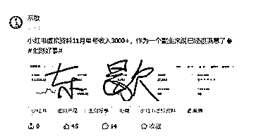
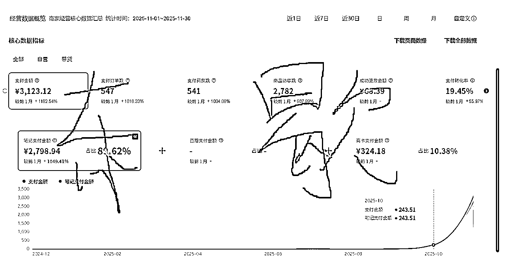

# (精华帖)(43 赞)《小红书虚拟资料公考赛道，抓住考试热点，从零到月入三千复盘》

> 原文：[`www.yuque.com/for_lazy/zhoubao/qgbzyz1tntwiwiy0`](https://www.yuque.com/for_lazy/zhoubao/qgbzyz1tntwiwiy0)

## (精华帖)(43 赞)《小红书虚拟资料公考赛道，抓住考试热点，从零到月入三千复盘》

作者： 东歇

日期：2025-12-10

《小红书虚拟资料公考赛道，抓住考试热点，从零到月入三千复盘》 大家好我是东歇，MBTI 是 infp，九零后，是今年八月份刚刚加入生财的新人。
非常感谢李李的邀请，来写这篇帖子。月初的时候在生财好事分享了自己十一月通过小红书虚拟资料月入三千，然后李李找到我问我愿不愿意分享，最开始我觉得自己是一个小白，没有什么值得分享的，但是李李的约稿邀请确实太热情，所以就有了这个帖子。
接下来我将从几个方面来分享一下我做小红书虚拟资料-公考赛道的过程，供大家讨论以及指正。 1.如何挖掘到公考这个赛道的 2.从零开始起号以及选品
3.考公赛道的坑 具体内容请见飞书文档： 小红书虚拟资料 [`ai.feishu.cn/wiki/FlRowe78pij37Uk3ss6cZYvpnqf?from=from_copylink`](https://ai.feishu.cn/wiki/FlRowe78pij37Uk3ss6cZYvpnqf?from=from_copylink)

* * *

评论区：

李李 : 真得是谦虚啦！每一位拿到正反馈的圈友，分享的经验对所有生财圈友来说都是超宝贵的干货。老师输出能力也是杠杠的，我们一周内就顺利落地啦，
后续如果有任何新进展、新感悟，也超期待再来和大家分享呀！

芷蓝 : 公考是刚需+复购👍👍

雨烟 : 优秀[强][强][强]

东歇 : [呲牙][呲牙]

东歇 : [玫瑰][玫瑰]

东歇 : 感谢李李~[玫瑰][玫瑰]