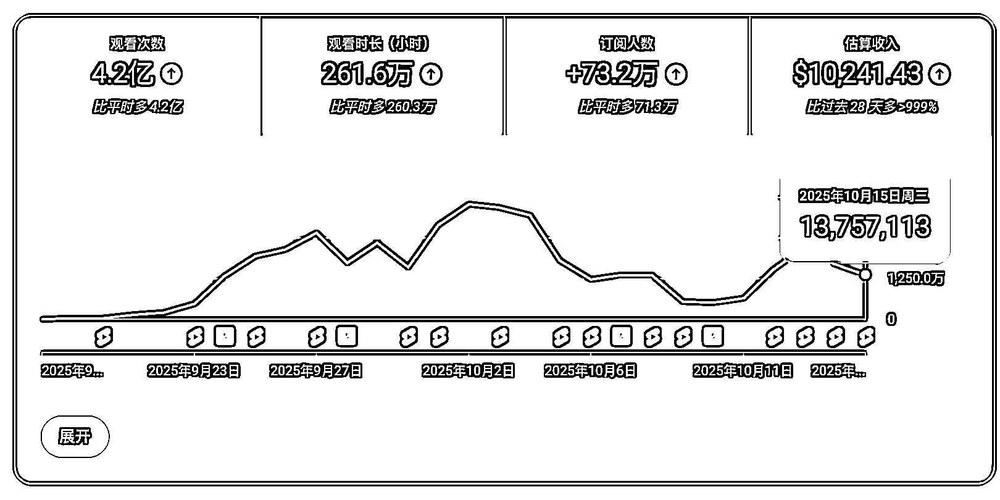

# (精华帖)(259 赞)（从 0 开始做 YouTube）月入万刀 10 个高级 YPP 的实操之道

> 原文：[`www.yuque.com/for_lazy/zhoubao/dgb17xe24wsyaih6`](https://www.yuque.com/for_lazy/zhoubao/dgb17xe24wsyaih6)

## (精华帖)(259 赞)（从 0 开始做 YouTube）月入万刀 10 个高级 YPP 的实操之道

作者： Zero

日期：2025-11-26

大家好 我是死磕 YouTube 的新人 Zero

死磕了 YouTube 一年 到这个月 共拿下订阅者 200 万+

开通了高级 YPP 共计 10 个

目前 还只是个月入万刀的小学生 拿得出手的成绩并不多

今天的分享的主题是《月入万刀 10 个高级 YPP 的实操之道》

这篇 是应很多人的期望 很多人找到我 想知道为什么我为什么总能出成绩 为什么文字那么有力量 为什么有那么坚实的心力

今天这篇 我就以此为主题展开讲讲

**看完这篇 你不仅可以完整的到我 YouTube 如何月入万刀的做事之道**

**更能通过我过去十年的经历 看到我是如何将各种副业做出些许成绩的**

让我们开始

[`avbdmra8fx.feishu.cn/wiki/MG5jwIeYWiBKNxkiL1ec5XLenKw`](https://avbdmra8fx.feishu.cn/wiki/MG5jwIeYWiBKNxkiL1ec5XLenKw)

* * *

评论区：

追风 yangfh : 说实话我被震撼到了，我必须好好拜读，向你学习。隐隐发现，失败的人千奇百样，但成功的人都要同样的品质，我要加油了，我要悟道！！！

烽火 : 为圈友点赞！

杨飞 : [强]感同身受

Dragon : 认认真真看完了，写的太牛了，而且非常详细，向你学习

时空 : 每次看到 Zero 大佬分享，都有被感染的力量

烽火 : 触动了，我感到我每天浪费了如此多的时间，我的执行力还有这么大的差距

福姐姐 : 为超级厉害的圈友点赞

池 sir : 卷王哥，想请教你一个问题！
在文中你提到了母婴自媒体、Ai 文档、红包封面等项目，而且都赚取了一定的收益，当你得知正在做的某个项目不怎么能赚到钱了（但又能零零碎碎的出单）你会在这个项目上挣扎吗？
是一直想翻盘然后慢慢被磨灭才下牌桌呢？还是像你自己说的不留后路直接舍弃去找新的机会？