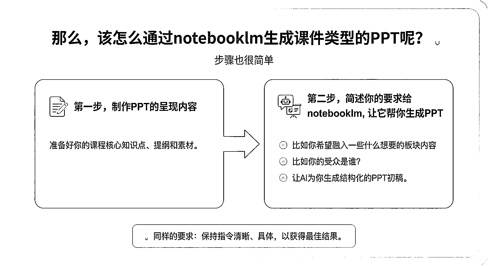
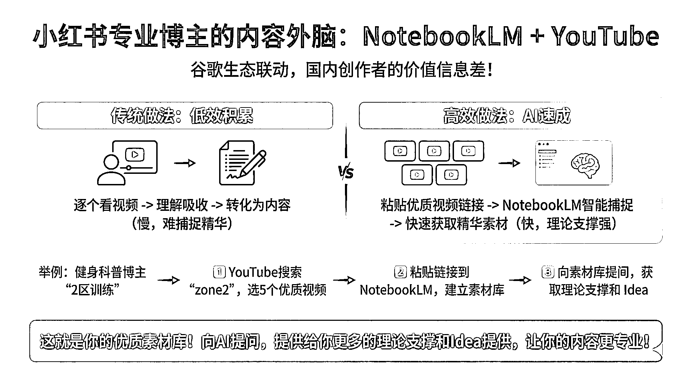
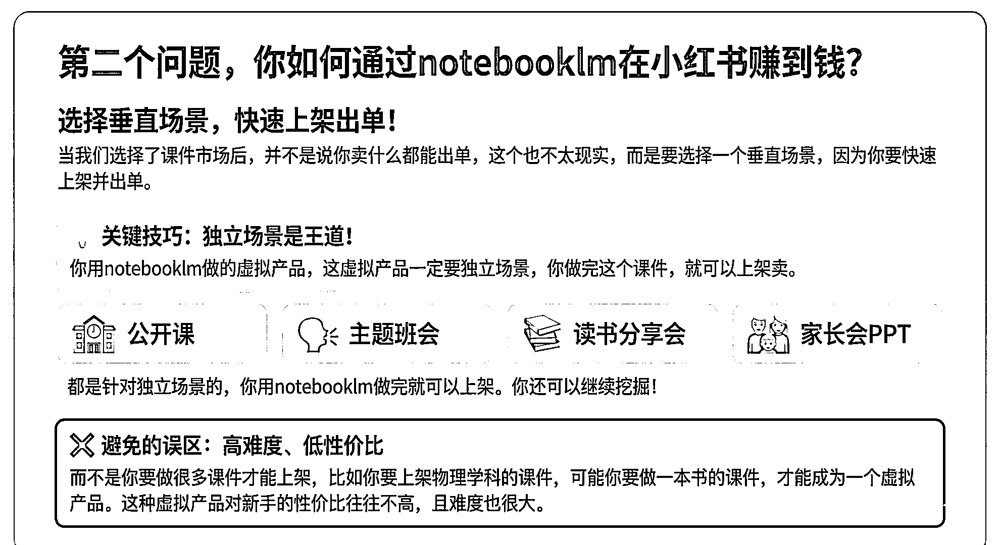

# (精华帖)(226 赞)普通人通过 NotebookLM 构建生意的方法论，含小红书虚拟产品操作思路

> 原文：[`www.yuque.com/for_lazy/zhoubao/yqsr3wuz2xx8wnod`](https://www.yuque.com/for_lazy/zhoubao/yqsr3wuz2xx8wnod)

## (精华帖)(226 赞)普通人通过 NotebookLM 构建生意的方法论，含小红书虚拟产品操作思路

作者： Luke

日期：2025-11-27

大家好，我是 luke 最近 notebooklm 很火，无论是国内还是海外，很多用户都在疯狂使用 notebooklm 去做 PPT
我从小红书虚拟产品视角和自媒体 IP 视角，总结了一套《普通人如何通过 notebooklm 构建自己的生意》方法论。 其中包括
1.如何通过 notebooklm+youtube+小红书做个人 IP 2.如何通过 notebooklm 原创虚拟产品，内含具体操作思路（原创课件）
3.一些通过 notebooklm 提效的个人经验 这篇文章是对上一篇超级术《普通人 24 小时如何在小红书构建的生意》的补充。 文章链接：
普通人如何通过 notebooklm 构建自己的生意！ 【内含 notebooklm 原创小红书虚拟产品方法论！】 [`ai.feishu.cn/wiki/UW5NwEY4wibWd2kUR9nc7vgCnvc?from=from_copylink`](https://ai.feishu.cn/wiki/UW5NwEY4wibWd2kUR9nc7vgCnvc?from=from_copylink)

* * *

评论区：

林一 : 谁懂这篇含金量，必须码住！

烽火 : 这篇含金量高

Yi : 知识密度好大，上一篇知识密度也好大[捂脸][捂脸][捂脸]读了两三遍还没缕明白，你写的真的是精品

御风行之 : 大佬就是大佬[强]真的太棒了

刘鑫 : 求选品网站

朝暮拾花 : 真大佬

Fluoxetine : LUKE，你是我的神