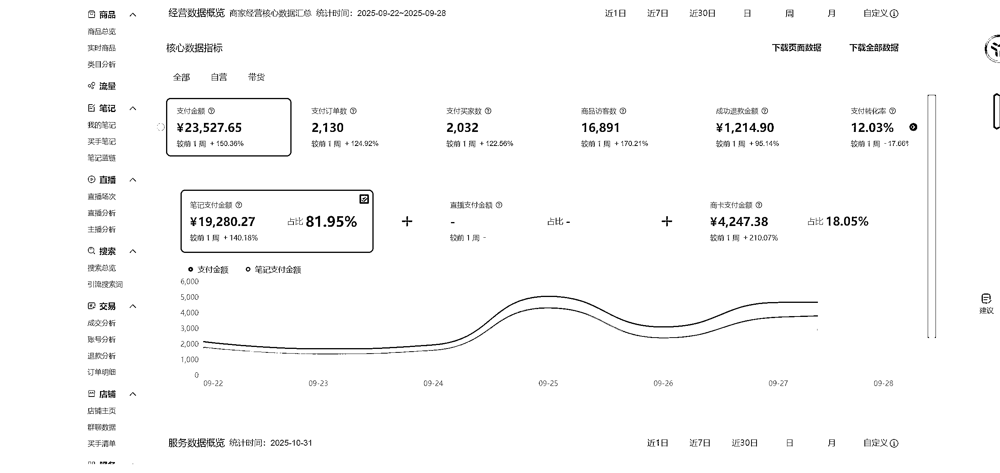
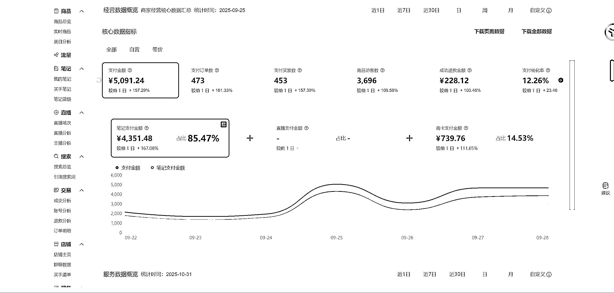
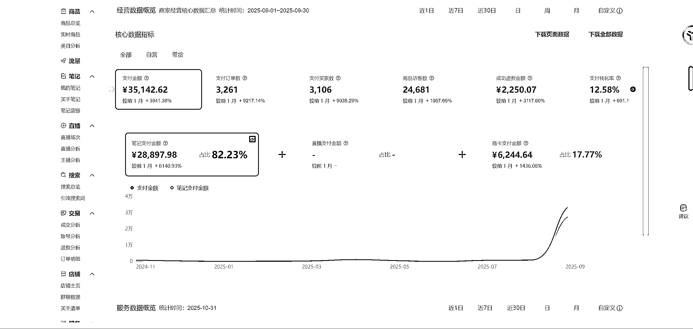
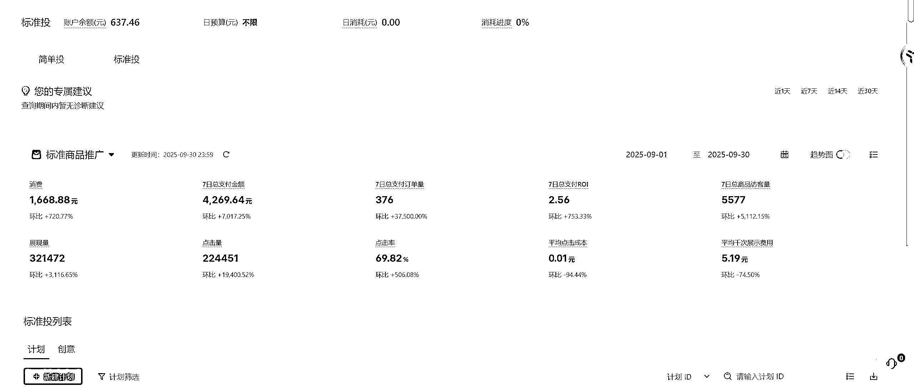
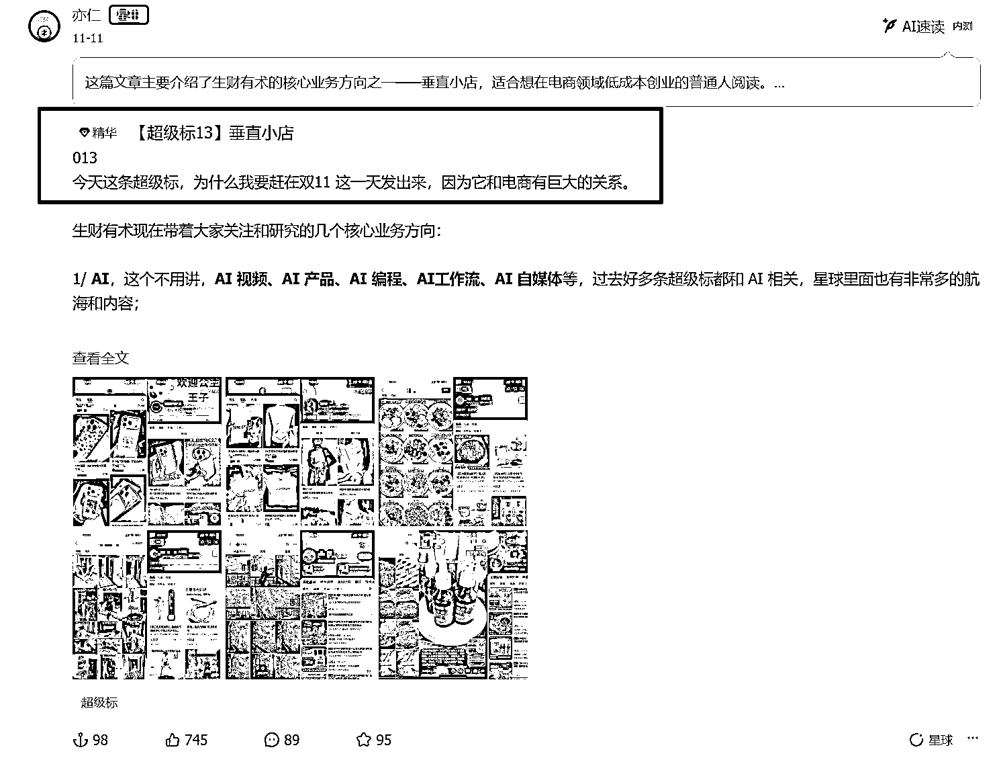

# (精华帖)(183 赞)一周爆卖 2100 单！小红书虚拟垂直小店复盘：揭秘我选品、测品及运营放大的关键动作

> 原文：[`www.yuque.com/for_lazy/zhoubao/ams4bsf49qb5rhvz`](https://www.yuque.com/for_lazy/zhoubao/ams4bsf49qb5rhvz)

## (精华帖)(183 赞)一周爆卖 2100 单！小红书虚拟垂直小店复盘：揭秘我选品、测品及运营放大的关键动作

作者： 苏晗

日期：2025-11-20

来到生财联合办公后，在亦仁，王燕楠，枸杞和黄亮等老师的指点下，以及和金天，虚虚的沟通后，我真正理解了笃定和耐心的重要性。

在 9 月份，我决定躬身入局自己并不太熟悉的内容电商平台，小红书。因为我之前拿到结果的项目都是虚拟产品相关的，并且选品和跑 MVP 是我比较擅长的事情，小红书也在红利期。

**虚拟产品对于我们普通人来说，0 库存，0 成本，没有售后，纯利润，自动化发货，稳定后可以做到睡后收入，是值的深入研究的一个好赛道。**

我采用的打法是单品打爆和垂直小店的运营思路，做细分人群的生意，就是用 1 个主店铺+3 个关联账号的方式，4 个账号只发 1 个产品的笔记，一天发布笔记 30-50 篇，从而迅速占据产品在平台的生态位。

**单人单店第 1 周 539，第 2 周 514，第 3 周 9300，第 4 周 23000，总销量 3200，单日最高 5K，月销售额 3W+**

**经过 1 周测试 20 个不同的投放计划，我用 1600 块跑出 2.56 的 roi 也就是 4200 元，千次展现控制在 5 元左右。**

为了打好这一仗，我暂时离开氛围很好的联合办公空间，在家里进行了为期一个月的闭关。

这也是我第一次尝试用内容电商的模式去卖非服务类的虚拟产品，所以我也是抱着边做边学的心态开始的。

**在写这篇复盘的时候，无意中发现踩中了亦仁老大 11 号发的超级标，小红书垂直小店。**

那刚好借着这个机会，**和大家分享一下我是如何做好小红书垂直小店的 4 个关键动作:选品、测品以及运营放大，我会用最简单和最详细的方式分享给大家，让大家看了之后就能直接上手实操。**

**  **

**内容大纲：**

为什么要做小红书虚拟垂直小店

一、怎么选品

二、怎么制作视频笔记，测品

三、怎么运营

四、怎么放大

五、One More Thing

相信相信的力量，不下牌桌，就能赢

**为了更好的观看体验，各位请移步飞书链接：**

[`eqr5180l7jb.feishu.cn/wiki/IxDww95FRiC57EkRZQCcAk2VnNc?from=from_copylink`](https://eqr5180l7jb.feishu.cn/wiki/IxDww95FRiC57EkRZQCcAk2VnNc?from=from_copylink)

* * *

评论区：

余琪琪 : 和苏神相识在 shein 航海，当时就是团队个人业绩 NO.1，12 月小红书垂直小店航海我才刚报名，这就看到苏神拿到结果的帖子了[憨笑]，向优秀者学习，努力追赶吧！

烽火 : 很赞啊 有数据分析

雨烟 : 请问 3 个关联号有实名了吗？还是未实名啊？

嗯 : 优秀

苏晗 : 不实名的

简哥 : 我有个疑问，为什么作为新手在运营层面你能思考的这么透彻，从选品、测品、运营、投流、矩阵，每个环节你貌似都非常的清晰和了解；一般个体根本想不到这么细的事情，需要做这些事情，这种对项目全方位的的思考判断能力，你是怎么养成的？

雨烟 : 那这三个关联号有出现跳实名的情况吗？

东宇 : 写的很棒，很真诚，有收获，感谢分享

晓言 : 学到了 明天就一天一个视频号发 20 条[坏笑]