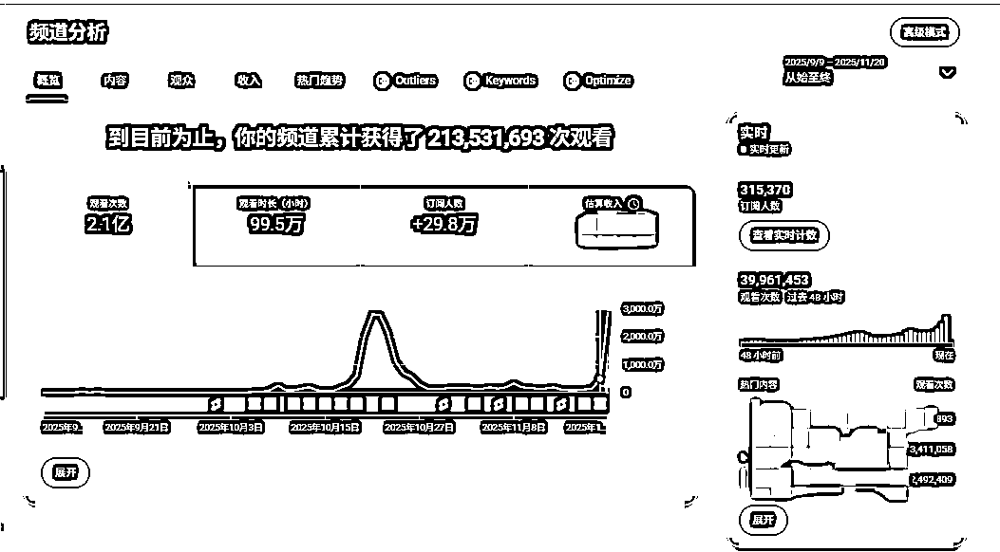

# (精华帖)(113 赞)两个月收获 2 亿播放，我如何确定工作流，复盘拆解。

> 原文：[`www.yuque.com/for_lazy/zhoubao/nssdfw7oineqro1x`](https://www.yuque.com/for_lazy/zhoubao/nssdfw7oineqro1x)

## (精华帖)(113 赞)两个月收获 2 亿播放，我如何确定工作流，复盘拆解。

作者： JuGo

日期：2025-11-21

大家好，我是贾羽 JUGO，一个即将辞职迈入全职 Youtube 的 TikTok 全域运营，一个音乐制作人，擅长 AI 工具提效，AI shorts 的快速复刻及改编。

感谢生财团队约稿，这篇文档，我想了很久。

刚好明天（2025.11.21）要在深海圈线下拆解我的实操工作流，今天先把这篇给发了。

关于那个两个月搞了 2 亿播放的账号。

这对我来说，是“质的飞跃”。 但在深海圈那些大佬眼里，这点成绩，真的，不值一提。

想写点东西，说说我的心路历程。 关于我怎么从“纯手搓”，跑到“全面拥抱自动化”，最后……又滚回“纯手搓”。

我管这个叫“伟大的回家”。

我好像真的明白了，做内容的本质，就是学会怎么“逐帧”去拆一个爆款。 然后，把“你”塞进去。 塞进你自己的想法、你自己的积累和构思。
这样，推流才可能“看上”你。

所以这篇贴子主要还是对过去 9 月份和 10 月份两个月在 Youtube 上深耕的一次全面复盘。

所以，对。 这篇东西，会很个人。 会很“废话”。

如果你也卡住了， 或者，你也像我一样， 在辞职的边缘， 一边兴奋，一边…… 怕得要死。

那，你留下。 我把我这两个月， 所有摔过的跤， 所有半夜自己扇自己的耳光， 都摊开给你看。

我的路，大概是这样的。内容较长，大家移步飞书：

[`oa3ruvm00oe.feishu.cn/wiki/Xot5wwHoLiVWeakmuNWcy0Txn6b?from=from_copylink`](https://oa3ruvm00oe.feishu.cn/wiki/Xot5wwHoLiVWeakmuNWcy0Txn6b?from=from_copylink)

* * *

评论区：

礼新 : 先赞后看，这个过亿流量的干货分享

Harris : 写得很不错

那时年少 : 你好，贾哥，能否链接一下呢

Rikki : 谢谢分享正在往 youtube 的赛道上行走走