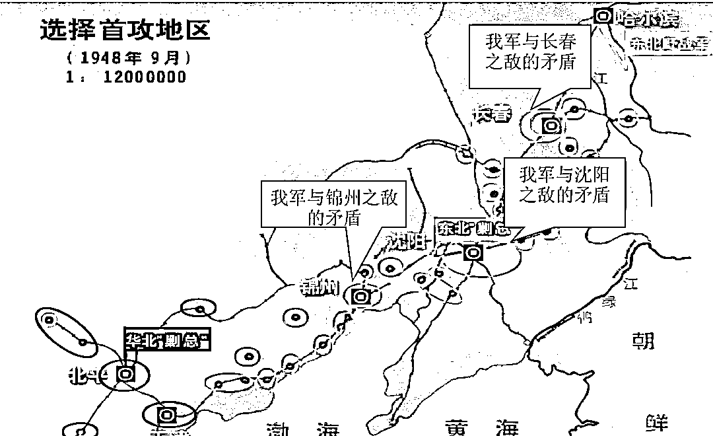

# (精华帖)(85 赞)老板是有段位的

> 原文：[`www.yuque.com/for_lazy/zhoubao/orw5a7iyzb2hftgs`](https://www.yuque.com/for_lazy/zhoubao/orw5a7iyzb2hftgs)

## (精华帖)(85 赞)老板是有段位的

作者： 盗坤

日期：2025-11-25

创业十年以后，我发现老板的认知与能力是有段位之分的。

**作为公司的最高决策者，老板的段位决定着这家公司发展的天花板** 。

但同时，老板的段位还需要与公司的发展阶段所匹配。

如果老板段位跟不上公司的发展速度，认知跟不上能力，则会阻碍和限制公司的发展。另一方面，公司处于初级阶段，但老板段位太高，则会造成错配，能力跟不上认知，也会给公司带来灾难。

一个初创小团队的老板，生存问题还没解决就天天高谈阔论企业文化、资本运作，这家公司离倒闭也不远了。

而如果一个已经小有成就，有了一定利润积累和团队规模的公司，老板仍然事必躬亲，不放过任何一个细节，公司的运转完全离不开他，这家公司的天花板也很有限。

在我眼中，老板的段位有**业务型老板、管理型老板、决策型老板和投资型老板、**

而这也是一个老板的迭代成长路线图。

一个高段位的老板，核心职责一定是**做对决策、用对人才、设计好顶层架构** ，而非沉溺于细节执行。

**一、业务型老板**

“生存是文明的第一需要”，这是科幻小说《三体》关于宇宙社会学里黑暗森林法则的第一条公理。

我认为，这也是企业经营哲学的第一公理。

一家刚刚诞生的初创企业，最核心的任务就只有一个，最大的战略目标也只有一个，**活下去** 。

这个时候没有资金、人才、技术，老板就是公司的**“超级业务员”** ，老板本人就是**公司收入的唯一责任人** 。

躬身入局，亲赴一线，跑通最小 MVP,赚取第一桶金，是作为创始人必须打的第一个怪。

刘邦的第一桶金是在芒砀山、在沛县身先士卒、冲锋陷阵，厮杀出来的。刘强东的第一桶金是北京中关村柜台里，一盒光碟一套刻录机吆喝出来的。

我的第一桶金是在淘宝平台，自己选品、作图、干预、发货，一个又一个链接攒出来的。

这个时候的老板，应该也必须有亲临一线的实干精神，对业务事无巨细的钻研精神，自己就是公司的王牌业务员。

我见过太多大厂员工、企业高管创业失败。原因无他，缺乏大平台的资源和体系支撑，却按大厂的标准去运作业务，脱离实际，不死才怪。

我也见过许多取得成功的老板在开拓新业务时总是失败。原因无他，在没有清晰的战略规划和靠谱的人才支撑之下，妄想依靠一个员工试试水就想把事情做成，基本上是痴心妄想。

**业务型老板，公司的核心竞争力，就是老板个人** 。

**二、管理型老板**

个人精力是有限的，个人能力更是有上限的。

一个人可以走得很快，但一群人才能走得更远。要想把公司做大做强做持久，需要从个人英雄主义过渡到团队系统作战模式。

当我们跑通最小 MVP，想要继续放大时，复制就成了一个关键的问题。

复制生产流程、销售流程、复制交付流程，从公司的“王牌业务员”转变为“系统总设计师”，打造一个能够不依赖于个人的系统，也就成了业务型老板过渡到管理型老板的必修课。

而这也是许多老板难以跨越的一个坎，**从“我”能赚钱，演变为“我们”能一起赚钱** 。

有些人需要几年时间才能跨越这个坎，而有些人可能一辈子也跨越不了这个坎。

首先是**不敢**

害怕试错，害怕犯错，不愿意承担不确定性所带来的风险。

放大团队时，新增的成本是确定性的，可能否带来利润却是不确定的。

好不容易稍微往前试探了一下，原本就没有经验，所以一开始犯错、失败也很正常。有些人会选择复盘调整，继续向前，而也有的人因噎废食，就此止步不前，最后永远困于业务型老板的局面。

其次是**不会**

并不是不舍得投入，而是不知道如何去投入。

既不会识人，也不会管人，又由于业务型老板的惯性使然，最后还是习惯个人操作。

白手起家的业务型老板对于一线业务都是相当擅长的，所以在跟员工沟通交流、协同工作的过程中只会觉得低效，进而习惯性地过度干预，甚至是代为操作。

而员工又因为得不到实操锻炼，能力也就无法获得成长，进而形成一个恶性循环。

这样的公司充满了“人治”色彩，整个公司的运转依旧脱离不了老板个人，整个公司的发展高度依赖老板个人能力。

老板无法从一线业务抽离出来，也就无暇学习和思考公司长远发展的诸多事宜。

所以大部分业务型老板，也就发展到 5-10 人的小规模。这些员工只是老板的“手脚”，做简单的执行，整个体系运转还是离不开自己这个“大脑”。

就比如许多做电商的，有的老板可以招个客服，招个兼职美工，然后招一个助理做好日常的上下架、订单核对、活动报名等基础性事宜。

但公司成败核心以及发展天护板都在老板本人。

少部分有点天赋的老板靠着识人本领以及向外学习，在找到了靠谱员工、搭建了基础的体系之后，也能勉强保证几十人的运转，而这也是大部分小老板管理天花板。

而真正优秀的管理者是**知人善用，搭建一个自动化运转的体系，合理地组织和利用资源** 。

但大家千万不要以为自动化运转体系就是一套数字化工具，又或者一套 SOP 文档。

真正的自动化运转体系是一个系统，由流程、制度、工具等组成的精密的系统。

这背后有包括关于招选育用留的人才体系，有人事部门、财务部门、行政部门的中台体系，有业务流程、数字化工具等构成的业务体系...

这一切的一切，就像一个有无数零件组成的自动运转的手表一样。

而这也是我所理解的管理本质（此处温馨提醒，我的理解不一定对），管理并不是要管人，控制人，而是设计一套不依赖强人的系统，一套可以保证下限的系统，一套可以自动挖掘人才、培育人才的系统。

**公司体系+人才密度就是公司组织能力的核心** ，这套体系保证公司运营的下限，而人才密度决定公司运营的上限。

人才密度让这套体系发挥得更有价值，但这套体系却并不会只依赖于某一个个人的能力。

这个时候，公司的核心竞争力已经不是老板本人了，而是这个公司的**体系、人才和资源** 。

**三、决策型老板**

1945 年的时候，毛主席就已经对解放战争做好了战略规划，抢占东北、经营东北、决战东北最后再席卷全国。

具体来说，抓主要矛盾，把解放全国的核心放在东北，因为当时候全国工业基础最强、资源最丰富的就是东北。

那么为了实现这一目标，就是把整体劣势（全国）转化为局部优势（东北），把全国最精锐的部队和干部派往东北，然后进行土改、打土匪、建设根据地。

最后，再在东北进行决战，一举歼灭敌军在东北的有生力量，然后南下解放全中国...

到辽沈战役开打前夕，我党无论是从军事，还是政治、经济、人口都已经对果党形成了绝对的优势。

而为了完成决战东北，全歼敌军的目标，那么必须在东北实现“关门打狗”的战略目标。

所以，主席把辽沈战役的开端选择在了锦州，**只要拿下了锦州，就锁住了整个东北之敌，实现“关门打狗”的态势** 。

大家可以看一看这个地图，你不得不佩服主席的眼光。

锦州就是整个东北的门户，拿下了锦州，关外之敌，就成了瓮中之鳖。

但是作为当时东北战场的总指挥，101 是希望先打长春再南下打锦州的。

其实从 101 的角度考虑也没错，锦州靠近华北，如果华北剿总傅作义率军北上支援，那么锦州部队就有可能面对南北夹击。反观长春，为东北最北之敌，我党可以轻松完成包围，更有把握。

不过 101 是从军事角度考虑，而主席是从政治角度考虑，更是从全国这盘大棋考虑。

抗日战争快不得，解放战争慢不得。如果等美苏在欧洲对峙结束（当时美苏在欧洲因为德国问题对峙，分为东德和西德），将精力转回中国，那么我国统一大业必将受到影响。

而如果不能把关外之敌全歼，让东北敌军逃窜到华北和傅作义合兵一处，那么就更难打了。

另外一方面，傅作义作为地方军阀，自保思想很严重，所以主席从政治角度考量他也不会出兵援助锦州。

结果大家都知道，主席力排众议，三令五申，要 101 必须先打锦州。

这也是决策型老板的责任，更是决策型老板的孤独，无人能替你看清远方的迷雾，除了你自己。

而四野也顺利拿下锦州，最后一举歼灭东北敌军。四野也一下子成为武器装备、兵员素质都极强的百万雄师，从东北扫到海南，一波解放全中国。

这就是什么，这就是牛逼的决策型老板！！

我只管大方向，基于全国乃至全世界的棋盘，来决定“打不打”、“何时打”、“打到什么程度”的问题。

至于怎么打，那是你管理型老板（101）和业务型老板（刘亚楼）的事情。我不了解一线情况，也就没有发言权，所以怎么打的事情，既不过问，也不插手。

清晰地给出目标，然后给足资源，你 101 就负责把我的战略意图转化为具体的战役计划，并合理组织利用分配给你的资源。

而刘亚楼你就负责具体执行，组织侦察、兵力部署、协调后勤...

反观主席的对手，蒋校长是出了名的“微操选手”。明明应该扮演好决策型老板的角色，却干起了业务型老板的事情。

绕过东北剿总司令，直接命令廖耀湘走哪条路线、何时行动。在淮海战役时甚至直接指挥干预师一级、团一级的调动。

我要是杜聿明，也得撂挑子！

正所谓“将在外，君命有所不受。”华为任正非也说过：“让听得见炮火声的人指挥战斗。”不在一线，却瞎指挥一线的战斗，对于一线的战士来说，可以说是灾难。

所以，为什么我在文章开头说，一个高段位的老板，核心职责一定是做对决策、搭建体系、任用贤能，而非沉溺于细节执行。

真正的决策型老板一定不是超级业务员，又或者管理高手，而是一个优秀的决策者，一个能识人、聚人、用人的首席人才官，一个能整合并分配好资源的裁判。

简单来说就是**判断方向、做好战略、用对人** 。

**四、投资型老板**

决策型老板再往上，就是投资型老板了。

公司规模越大，老板的时间越宝贵，精力越值钱，为了将掌握的资源发挥更大的价值，让公司的护城河更深更宽，通过资本去投资成了一个不可或缺的选项。

如果说决策型老板还是要找方向、找人、找资源，去把自己的战略规划落地，那么投资型老板只要做好判断就行了。

当然，关于这个段位的老板，我自己就没啥体感了，只可远观而无法深谈，所以也就不过多阐述了。

虽然我也做过一些小团队的财务投资，不参与日常管理经营，但是其实并不算特别成功。

而真正的投资型老板应该像腾讯、阿里、字节一样，展望未来，构建生态，通过资本去完成公司的战略布局。

公司的发展是分阶段的，不同的阶段，老板也需要扮演着不同的角色。

而作为一个创业者，**能够清晰认知到公司所处的阶段以及在这个阶段自己所该扮演的角色** ，在正确的时间做正确的事，并且能在关键节点完成自我蜕变和迭代，是一件极其重要的事情。

从管事，到管人，再到管势。

* * *

评论区：

盗坤 : 本月 29 号，生财航海家线下大会邀请我去做有关于 IP 的分享。我要分享的一个很重要的点，就是个人创业者如何向团队创业迈进，于是便将此文提前分享给大家。

剑渊 : 优秀👍

meta 增长实验室 : 厉害呀