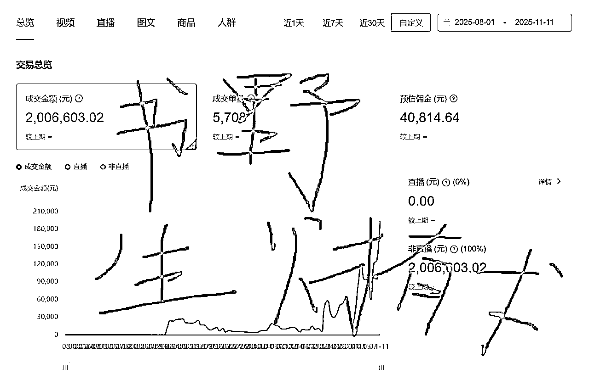

# (精华帖)(92 赞)《只想当个小 UP，却觉醒了 B 站好物系统》

> 原文：[`www.yuque.com/for_lazy/zhoubao/lk9y40ge79d6mkqc`](https://www.yuque.com/for_lazy/zhoubao/lk9y40ge79d6mkqc)

## (精华帖)(92 赞)《只想当个小 UP，却觉醒了 B 站好物系统》

作者： 鹿书野

日期：2025-11-19

我有主业，同时还是非全研究生，工作日干活，周末上课，每天只有两小时的全情投入，一个月撑死做出来 5 个视频（家蒙老师一开始就做了铺垫，一个月能做 5 个视频其实就挺牛的了，仰望星空还是需要先脚踏实地）
总体路程是一步一个脚印吧，第一个月拿到五位数收益，第二个月成为 b 站好物满级推荐官，第三个月进入 b 站百万榜（下个月能看到我）。
收益的话整体超 5w，佣金 4w，平台补贴+商单 1w+，品牌方给的东西一屋子。
看过我之前的帖子的友友应该知道我的帖子都是比较干的，这一篇当然也延续了这种风格，本篇帖子是当时作为优秀学员的直播稿，虽然是两个月前的了，可这段时间以来，整个工作流程的核心没有变。之所以现在才发布，来去验证我的方向是否正确，而不是一时的侥幸，第二是因为备战双十一太忙了，最后外加。
做长视频嘛，就是在慢慢爬坡~~~ 大伙会遇到的卡点可能有这三个 剪辑最耗时，成片又不满意；返工多、效率低、节奏乱，如何能稳定的输出质量还不错的视频？
生产稳定了，那接下来，“管他三七二十一，先做了再说”. 前期没问题，但若注意选品，更可能事半工倍！猛猛出单！
目标不清、焦虑与恐惧、反馈机制弱、难形成稳定正循环。 本篇主要有两个核心模块： [`psborr04us.feishu.cn/docx/OxMKdWy0moMo6Mx28gWcGETbn6d`](https://psborr04us.feishu.cn/docx/OxMKdWy0moMo6Mx28gWcGETbn6d)

* * *

评论区：

老师傅 : 又干又专业的分享[强]，估计同行看到都会直呼分享内容太精彩了[强]，条理清晰，逻辑严谨，步步递进，实战后的精华经验[强]

篮子🍀 : 真的很高精力啊！感谢分享

Dustin : 现在登场的是！深海圈全员认可的 B 站天选之子！

周无限 : 精华帖预定[强]

Mr Bean 憨豆* : 太强了

鹿书野 : [阴险][阴险][玫瑰]

小源 : 敏锐的判断，强大的执行，研究能力的具象化，明年会是起飞的书野[强]

星空海绵 : B 站之子在 B 站犹如鱼入大海，鸟上青天，实力这一块绝对拿捏了[社会社会][社会社会]