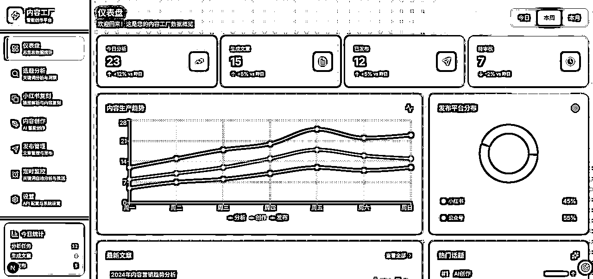

# (精华帖)(89 赞)内容工厂 Agent 航海复盘，小白照做也能轻松复刻

> 原文：[`www.yuque.com/for_lazy/zhoubao/pnguvu52yizl3y8g`](https://www.yuque.com/for_lazy/zhoubao/pnguvu52yizl3y8g)

## (精华帖)(89 赞)内容工厂 Agent 航海复盘，小白照做也能轻松复刻

作者： A 米

日期：2025-11-26

花了两天时间搭建的内容工厂 Agent，以前一周要做的内容，现在自己几个小时就搞定了—— 内容工厂 Agent 是真的香！

1.  按关键词批量采集抓取公众号文章、小红书笔记

2.  根据批量的内容，一键生成数据分析+内容选题洞察

3.  快速改写/创意生成 新的公众号文章、小红书笔记

4.  直接把内容发步到公众号、小红书的草稿箱

举个例子：之前在小红书做职场内容，光找选题、找对标就得扒几十篇笔记，再分析半天数据，改写+配图到最后发布，折腾 1
天下来心力憔悴。现在有了内容工厂 Agent，冲杯咖啡的功夫，就能全搞定了：

输入 “2025 职场高效工具”，1 分钟就能扒来 100+ 篇高赞的公众号 + 小红书内容

再用 1 分钟分析，然后直接生成洞察：“把 AI 工具结合时间管理一起写，互动率能提高 40%”

基于这个洞察，几分钟就能改出 3 篇笔记，然后一键发布到小红书草稿箱里

连笔记里加什么 emoji 、加什么标签，都直接参考对标的爆款笔记弄好了

不管是公众号、小红书、小绿书，还是国外的 X、Reddit，内容工厂 Agent 都能实现 “指数级提效”—— 帮助我们把精力聚焦在更重要的事情上

对自动化提效感兴趣的朋友，一定要看 @钱塘江鲤
教练这篇干货帖：[`wx.zsxq.com/group/1824528822/topic/45811414221158288`](https://wx.zsxq.com/group/1824528822/topic/45811414221158288)

大家好，我是 A 米，前企业信息化咨询，23 年加入生财入局短视频和直播电商，25 年开始探索 AI 产品和内容出海。这次跟着钱塘江鲤教练学习 “内容工厂
Agent”，不光把核心功能跑通了，更重要的是学会了搭建思路和方法，收获满满。趁热打铁做下复盘，把本次航海学习做个系统的梳理，希望能帮大家快速了解内容工厂 Agent 的实现路径，搞懂如何从 0-1 落地～下面是详细内容：

详情请移步飞书文档👇：

[`awt020sbslg.feishu.cn/wiki/UZ4KwoLrxiXcFXkUKeacpjjyn1g?from=from_copylink`](https://awt020sbslg.feishu.cn/wiki/UZ4KwoLrxiXcFXkUKeacpjjyn1g?from=from_copylink)

* * *

评论区：

0xCrypto.v* : 你是我们的课代表！

Fly : 总结的真好[强]，请教下你的 AI 工具加上调用第三方的 api 每一个都开通会员购买了？

A 米 : 前端用的 gemini 3（免费），后端用的 codex（chatgpt 充值），只用了这两个

礼新 : 厉害呀，a 米

A 米 : 航海教的好[愉快]

七月 : 太厉害了，抓紧抱大腿[色]

A 米 : 共同进步[握手]

七月白粥 : 圈友想请教一下在哪能买到小红书的 api 呢[流泪][流泪][流泪]没抢到本次航海

A 米 : 文档中提示词有哦