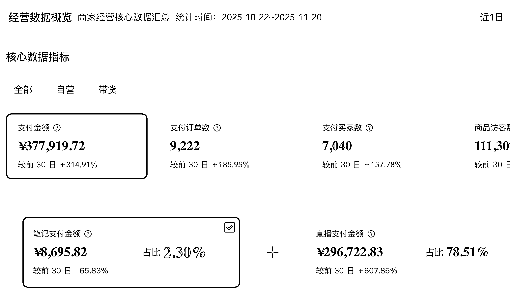

# (精华帖)(83 赞)（项目复盘：一个人做小红书手播直播间，70%利润 30 天卖了 30w）

> 原文：[`www.yuque.com/for_lazy/zhoubao/ovgdudge9x3rsca7`](https://www.yuque.com/for_lazy/zhoubao/ovgdudge9x3rsca7)

## (精华帖)(83 赞)（项目复盘：一个人做小红书手播直播间，70%利润 30 天卖了 30w）

作者： 申铭呀

日期：2025-11-22

各位生财的圈友们好，我是曾在娱乐圈练习第七年半的申铭。 上个月
，也就是 10 月 9 号，我在小红书新起了一个不露脸的自营直播间，到今天，这个新店基本就靠直播，以及直播带动的笔记出单，未投流，新号单店最近 30 天做了差不多 30w 销售额，整体毛利在 60%–80%左右，不同产品会有一点差别。
这篇帖子想跟大家把这项目从起号前的蓄水、10 月 9 日首播，一直到现在稳定出单的整个过程，按时间线拆开，把我当时的完整思路和每一步具体是怎么执行的完整复盘和思考，都尽量讲清楚，分享给大家。
先简单介绍一下自己，之前因为分享过关于虚拟资料副业的一些帖子，大家对我有所了解。虚拟资料项目还在做，但是因为盗版太多，已经没再开新品了，毕竟是副业嘛。我的主业是直播电商，做了将近五年直播电商的直播运营工作，早期主要在抖音平台做带货，2023 年 4 月在小红书开始的第一场直播带货，然后就一直持续到现在。期间陆续做废过很多直播间，所有经验也算是站在账号废墟上总结出来的。再之前，就是在娱乐圈、风投圈搬砖、打打黑工。
全文请移步飞书： [`a033a8trbo.feishu.cn/docx/ZmpgdaY6GohKJHxFuC8cwbwDnxc?from=from_copylink`](https://a033a8trbo.feishu.cn/docx/ZmpgdaY6GohKJHxFuC8cwbwDnxc?from=from_copylink)

* * *

评论区：

申铭呀 : 欢迎大家报名 12 月小红书直播航海，领航直播的时候会讲的更详细一些

晴子 : 申铭老师是教练啊，欢迎大家报名小红书直播航海😉😉😉😉

戴巍 : 晴子推崇的教练肯定是高手[愉快][强]

、God : 感谢教练讲的好细

申铭呀 : [抱拳][抱拳]

申铭呀 : [抱拳][抱拳]也是给自己复盘一下

冬日暖阳 : 求带带

Kammy : 好详细！真的很用心！！