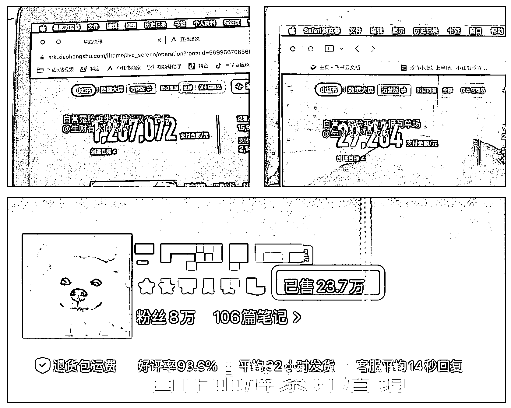

# (精华帖)(71 赞)垂直小店是上半场，小红书垂直直播间是下半场

> 原文：[`www.yuque.com/for_lazy/zhoubao/wrz75wsaiuklfgt8`](https://www.yuque.com/for_lazy/zhoubao/wrz75wsaiuklfgt8)

## (精华帖)(71 赞)垂直小店是上半场，小红书垂直直播间是下半场

作者： 申铭呀

日期：2025-11-26

哈喽，各位圈友们好，我是申铭，之前在娱乐圈练习七年半，现在主要在做小红书电商直播。平时的大部分时间，混迹在各种直播间里划水，每天是看不完的数据、选不完的品和复不完的盘。
截止到目前，我们小红书自营直播间最好成绩是在这次双 11 达到了单场 120 万 GMV，这个是垂直且露脸的家居向垂类直播间。不露脸垂向单人直播间单场 GMV 是 2.9 万 GMV。合作的品牌垂类店铺号，牛仔为主，客单价在 500-600 元左右，累计销量 23.7 万。
这两天看完亦仁的垂直小店超级标，我哭着第一反应是：怎么就有人把我们的秘密公开了、还讲这么透。接下来那么多人进场，压力是有的，但也从侧面验证了我们这条路，方向是对的，而且空间是大的。
所以我想借这个机会，补充一点我在小红书直播上的理解和经验，7000 字深度长文可戳： [`ai.feishu.cn/docx/URDldlVMIoEGdSxTjgoc1JyxnIh?from=from_copylink`](https://ai.feishu.cn/docx/URDldlVMIoEGdSxTjgoc1JyxnIh?from=from_copylink)

* * *

评论区：

篮子🍀 : 没想到会看到直播类型的分享耶，感谢分享。

吴泽承 : 感谢分享

申铭呀 : [抱拳][抱拳]客气呀

申铭呀 : [抱拳][抱拳]客气啦

ling : 感谢分享

申铭呀 : [抱拳]