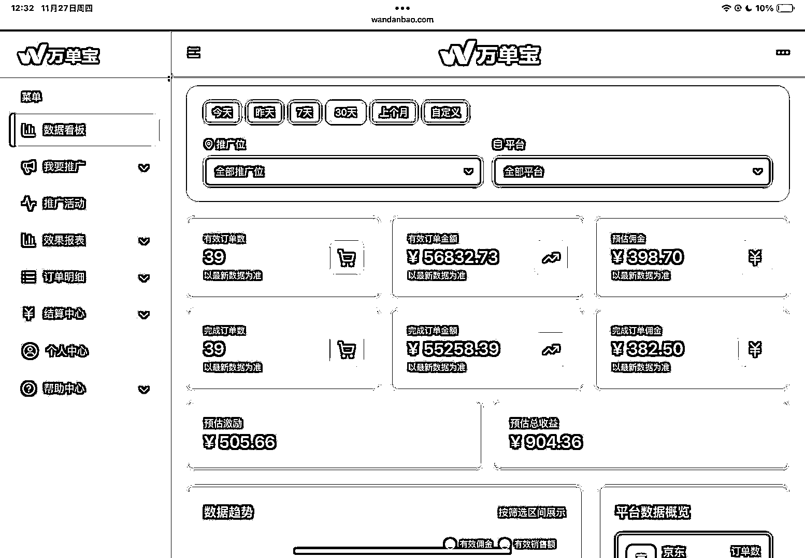
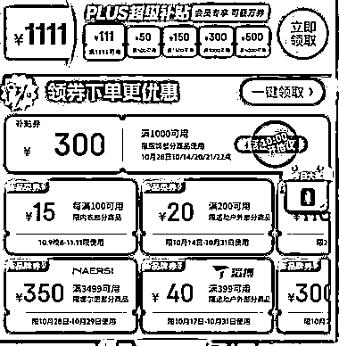
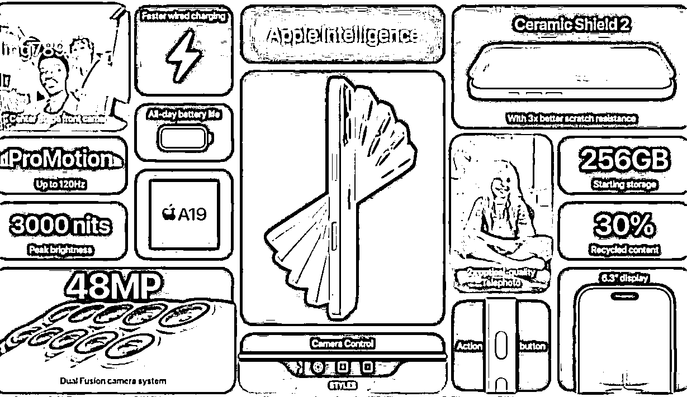
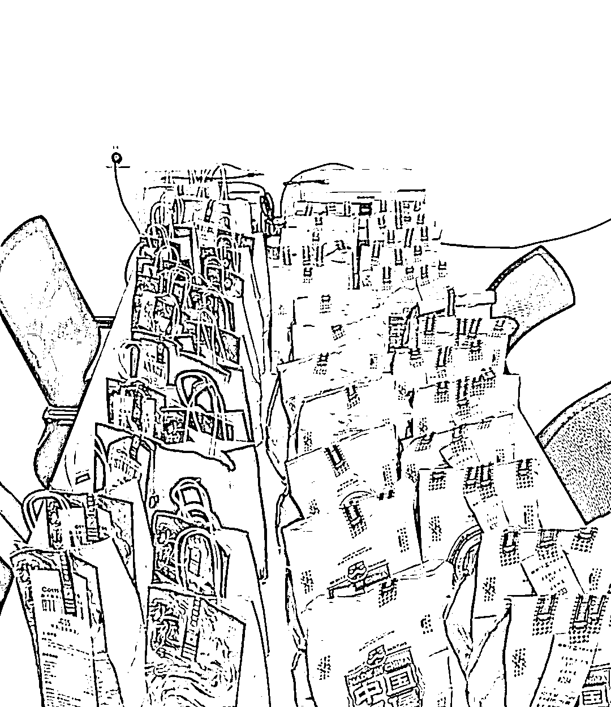

# (精华帖)(62 赞)新手小白怎么从抖音 cps 赚到第一块钱

> 原文：[`www.yuque.com/for_lazy/zhoubao/pwkefxxlkuk98drx`](https://www.yuque.com/for_lazy/zhoubao/pwkefxxlkuk98drx)

## (精华帖)(62 赞)新手小白怎么从抖音 cps 赚到第一块钱

作者： 毛小雨

日期：2025-11-27

新手小白怎么从抖音 cps 赚到第一块钱
圈友们好，我是毛小雨，在生财待了两年时间，大大小小的航海参加了十几次，这次在抖音 cps 做到 5w 的销售额，排名 40/450，也算跑通了第一个小闭环，赚到了第一千块的佣金，作为第一期纯新手入局 cps，想为大家分享一下自己踩的坑，也为这次刚报名 cps 的伙伴们对齐颗粒度，用最简单的话梳理下我自己做 cps 的流程和感悟，包括
1.第一期 cps 的实操感悟 2.cps 的底层逻辑：种草 3.新人怎么入局抖音 cps 4.怎么找对标，什么叫好对标 5.做好利益点输出，建议先拆解好流量品
6.视频节奏 7.怎么模仿 8.维护评论区和用户引导 9.口播和曼波注意点 飞书👉 [怄火]我们都是在不断试错，等着属于自己的爆款，慢慢来[`icn5limdg3ns.feishu.cn/wiki/NYz5wrUrZiX0XokvlfHcoZwbnnc`](https://icn5limdg3ns.feishu.cn/wiki/NYz5wrUrZiX0XokvlfHcoZwbnnc)

* * *

评论区：

Harris : 先收藏再看

毛小雨 : [跳跳]