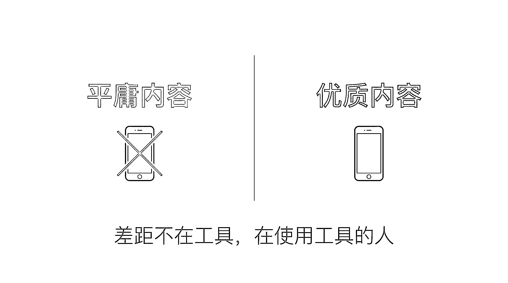
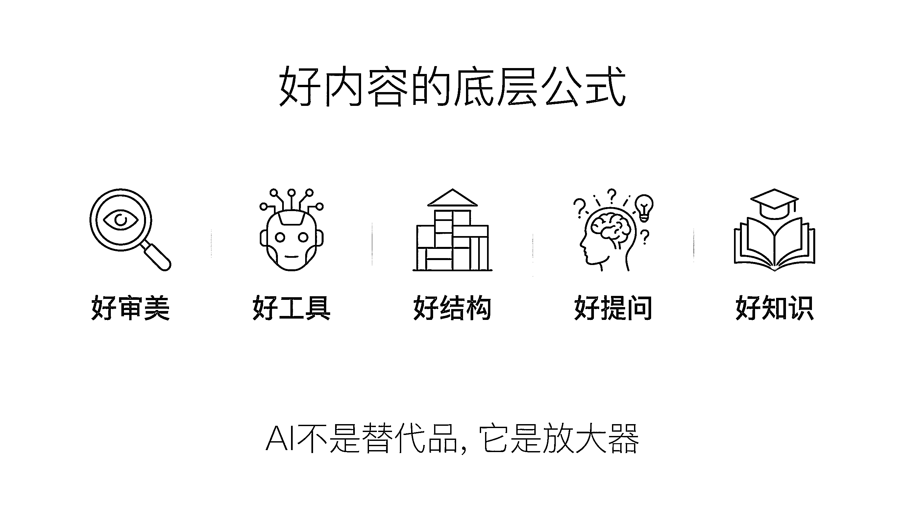
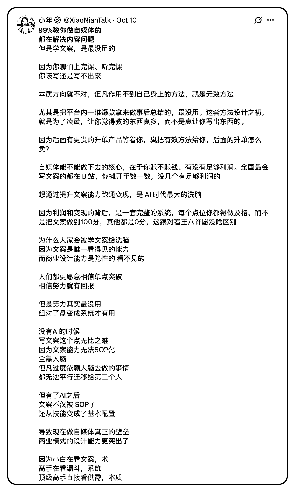
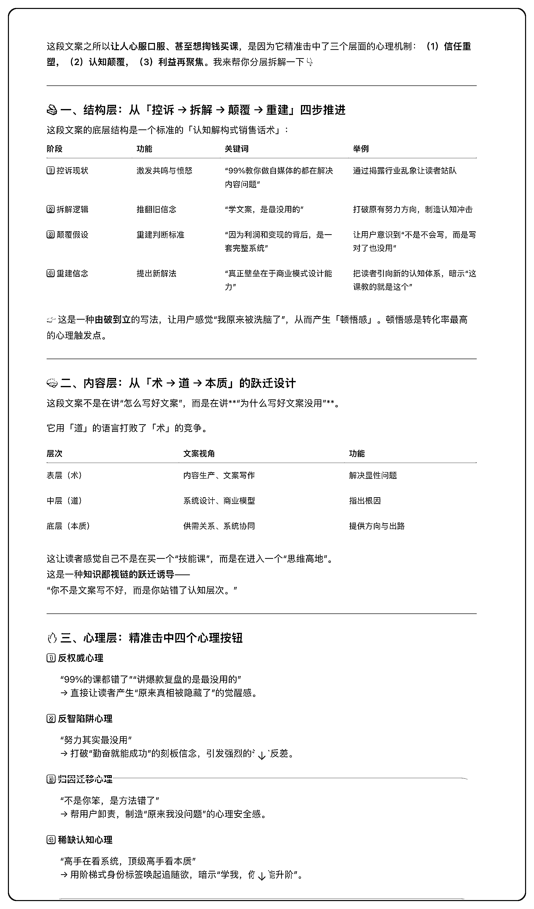
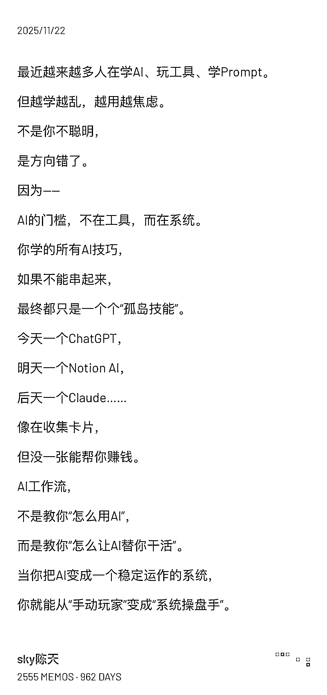
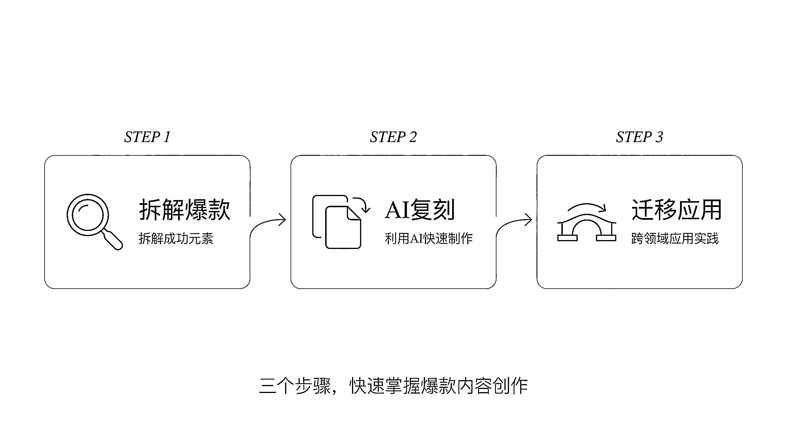
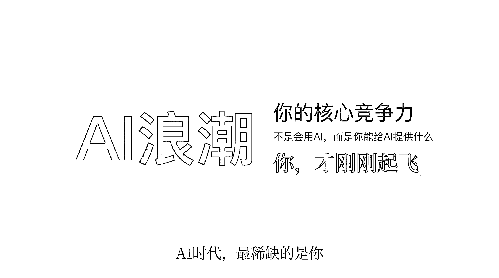
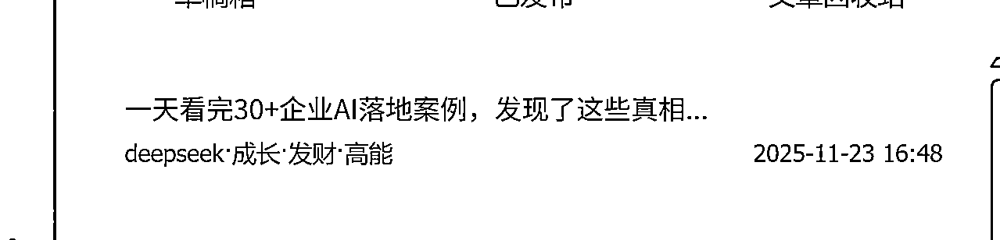

# (34 赞)关于 AI 写爆款文案，99%的人都搞错了重点：审美和知识远比提示词重要

> 原文：[`www.yuque.com/for_lazy/zhoubao/bgyngqegicnkilda`](https://www.yuque.com/for_lazy/zhoubao/bgyngqegicnkilda)

## (34 赞)关于 AI 写爆款文案，99%的人都搞错了重点：审美和知识远比提示词重要

作者： sky 陈天

日期：2025-11-23

各位生财圈友大家好，我是 sky 陈天，一名 AI 企业培训讲师、企业 AI 业务提效顾问。

最近我在给一家雅思培训机构做 AI 小红书的陪跑服务，在我给他们做 AI 赋能文案写作培训时，遇到了一个让我深思的场景。

当我问在座的老师们"有没有人在用 AI 写内容"时，几乎所有人都举起了手。但紧接着，一位老师特别真诚地说了一句话，让全场都笑了：

**"Sky 老师，我也在用豆包啊，但写出来的东西...我自己都不好意思发朋友圈。"**

这句话击中了我。因为这恰恰是当下 AI 应用最核心的矛盾——**大家都在用同一个工具，但产出的质量却天差地别。**

有的人用 AI 写的内容能获得上千点赞，有的人写出来的东西连自己都不想看。

这让我想起自己刚开始做 AI 培训时的困惑。那时候我也纳闷：

明明给企业讲了同样的工具、同样的方法，为什么有些学员能立刻上手产出高质量内容，有些学员却始终摆脱不了"AI 模板感"？

经过服务 100 多家企业、700 多天 AI 实操的经验积累，我终于找到了答案。

今天，我想把这个答案完整地分享给你。

## 好内容的底层公式：五个"好"缺一不可

在那场培训中，我给老师们总结了一个公式，这也是我这两年 AI 实战提炼出的核心方法论：

### **好内容 = 好审美 + 好工具 + 好结构 + 好提问 + 好知识**

看起来简单，但每一个"好"背后都藏着深刻的洞察。

## 第一个"好"：审美，才是最被忽视的核心能力

我把"好审美"放在第一位，不是没有原因的。

想象一下这个场景：

你让 AI 写了一篇小红书文案，逻辑没问题、没有错别字、排版整齐。你会觉得"这个挺好的"，然后就发了。

但发完之后——**石沉大海，零互动。**

为什么？

因为**AI 写的东西"看起来很好"，但不等于"真的好"。**

如果你之前从来没做过小红书，压根没看过 100 篇爆款笔记，你怎么可能知道什么样的内容用户真正喜欢？

你只是在用自己的"专业视角"判断，而不是"用户视角"。

这就像一个从没吃过米其林的人，很难分辨出餐厅的菜到底好不好吃一样。

**审美，需要大量的"输入"来建立。**

所以我给老师们布置的第一个作业就是：去看 100 篇爆款笔记，分析为什么用户要点赞、收藏、评论。

1.  **点赞** 代表情绪价值的认同

2.  **收藏** 代表使用价值

3.  **评论** 代表想要互动和 battle

你要挖掘的，是这些行为背后的用户心理。

只有建立了审美，你才能在 AI 给你生成内容时，一眼看出哪里对、哪里不对，需要怎么调整。

否则，你永远在盲人摸象。

## 我的实战案例：拆解爆款，复刻到 AI 领域

说到这里，我想分享一个真实的案例。

有一天，我在刷 x 时，看到了一篇关于自媒体写作的文案。第一段就把我吸引住了——

**"99%的人都搞错了，写作其实不是你的瓶颈..."**

我当时的第一反应不是"这个观点对不对"，而是"**卧槽，这个人好厉害，我想看看他有没有卖课，我有点想买"** 。

你发现没有？这才是好内容的标准：**让用户看完之后，产生强烈的行动意愿。**

但我没有止步于"觉得好"，我做了三件事：

### **第一步：存下来**

我立刻把这篇文案截图和复制保存到了我的笔记本里，因为我知道这是一个值得学习的样本。

### **第二步：用 AI 拆解**

我把这段文案复制给 AI，告诉它：

**"我看完这个文案特别有冲动，想找这个老师买课。请帮我分析一下，这个文案为什么这么有吸引力？"**

AI 给我的分析让我眼前一亮：

1.  反权威心理("99%的人都错了")

2.  反认知陷阱("努力其实最没用")

3.  归因迁移心理

它帮我把这些我隐约感觉到但说不清楚的底层逻辑，全部串联了起来。

### **第三步：让 AI 复刻到我的领域**

我继续对 AI 说：

**"这个文案是讲自媒体写作的，我现在是做 AI 培训的。请你站在 AI 的角度，模仿这个文案的结构和心理策略，帮我写一篇。"**

几秒钟后，AI 给我生成了这样一段：

看到了吗？

**完全不同的领域，但底层的心理策略、结构逻辑是一模一样的。**

这就是"好审美+好工具+好提问"组合的威力。

我把这个方法称为**"拆解-复刻-迁移"三步法** 。

它让我可以快速学习任何领域的爆款内容，并迁移到自己的领域。

这也是为什么我能在短时间内帮企业做出高质量 AI 智能体，帮助他们真正获取客户的秘密。

## 其他四个"好"：让内容真正有温度

如果说"好审美"是地基，那这四个就是让你的内容真正有温度、有个性的关键：

### **好工具**

不同的 AI 工具写出来的东西确实有差异。豆包、文心一言、DeepSeek，各有各的风格和擅长点。

工具不在多，在于选择最好的，并且把它**真正用透** 。

### **好结构**

结构就像房子的框架，有了框架，内容才能立得住。

但结构不是死的，要根据不同平台、不同用户群灵活调整。

### **好提问**

你会发现我在演示时的每一个提问都是有方法、有套路的。

**同样的需求，不同的提问方式，AI 给出的答案天差地别。**

提问力，才是 AI 时代最核心的能力。

### **好知识**

这一点，是很多人最容易忽略的，但恰恰是**让你的内容与众不同的关键** 。

什么是"好知识"？

**就是你的私有知识库——你的产品特性、你的服务案例、你的个人经历、你的独特见解。**

AI 可以搜到全网的公开信息，它知道什么是小红书爆款结构，知道怎么写吸引人的开头。

但**AI 唯一不知道的，就是你是谁，你的产品解决了什么独特的问题，你的客户经历了怎样的转变。**

当我们把这些私有知识喂给 AI，它写出来的内容立刻就有了温度、有了细节、有了说服力。

所以我帮企业做营销 AI 智能体，几乎有一半的时间都在帮他们梳理私有知识库。

**这也是为什么我一直强调：在 AI 时代，你的核心竞争力不是会用 AI，而是你能给 AI 提供什么独特的知识和视角。**

## 我的一个深刻感悟

从职场打工人转型到 AI 企业顾问这两年，我最深刻的体会就是：

**AI 是工具，但让工具发挥价值的，永远是你的个人积累、你的实战经验、你的独特洞察。**

回到那场培训，当我把这套方法教给老师们，并现场用豆包的"问问豆包"功能演示如何拆解、如何复刻时，我看到了他们眼中的光。

那是一种"原来还可以这样"的顿悟。

但我也反复强调一点：

**AI 不是替代品，它是放大器。**

它放大的是你的审美、你的判断、你的知识储备、你的策略思考能力。

如果你自己都不知道什么是好内容，如果你没有独特的知识可以提供，AI 只会放大你的平庸。

这就是为什么同样用豆包，有人能写出 10 万+阅读的爆款，有人连自己都不想看自己写的东西。

**差距不在工具，在使用工具的人。**

这两年的创业和 AI 企业咨询经历，让我深刻理解了一件事：

**AI 时代，最稀缺的不是工具，而是那些能把个人经验、专业知识和 AI 能力完美结合的人。**

那些能快速建立审美标准、持续积累私有知识、不断优化提问方法的人，才能在 AI 浪潮中脱颖而出。

AI 的浪潮才刚刚开始。

而掌握了这五个"好"的你，才刚刚起飞。

* * *

评论区：

礼新 : 很有启发，感谢分享

sky 陈天 : [抱拳][抱拳][抱拳]