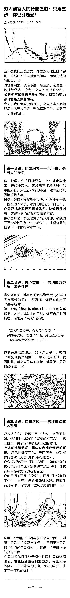

# (39 赞)一键手搓！从 0 到 1 编译你的公众号“内容军团”，Gemini 3 最强落地实战

> 原文：[`www.yuque.com/for_lazy/zhoubao/rmqiq9ym7qkrhumg`](https://www.yuque.com/for_lazy/zhoubao/rmqiq9ym7qkrhumg)

## (39 赞)一键手搓！从 0 到 1 编译你的公众号“内容军团”，Gemini 3 最强落地实战

作者： 黄金号

日期：2025-11-26

# 大胆预测 超级标 15：gemini3 应用生态的个性化定制

💰  **别再手动码字了！这套“自动化工厂”正在收割公众号最后的技术红利**

🔥  **昨晚小红书炸了，今天公众号继续！手把手教你搭建 AI 自动化变现闭环**

🛑  **在此之前，你对“自动化”一无所知。**

先来分析下传统的文章号内容创作流程：

❌  **手动** 找选题，耗时 2 小时；

❌  **人工** 磨大纲，耗时 1 小时；

❌  **逐字** 敲键盘，耗时 3 小时。

等你发出一篇文章，热点早就凉透了

今天的这个分享我最早考虑要不要自己吃一波再来分享

但是自己吹过的牛逼还是要兑现的，何况生财的精神就是分享

下面是效果图：

生财有太多精华帖告诉我们自己去做自动化的内容，但是实操过来，发现对小白不是太友好

今天我的分享可能对于大佬来说，嗤之以鼻，但是对小白绝对友好

只需要一个提示词就能写出这个工具，让圈友们实现公众号文章创作自由

话不多说，直接跳转到飞书链接去看吧

[`ai.feishu.cn/docx/NkqEd5sq6o7kFixReqscUZFAnJe?from=from_copylink`](https://ai.feishu.cn/docx/NkqEd5sq6o7kFixReqscUZFAnJe?from=from_copylink)

如果对你有帮助请一定要点赞收藏哦

* * *

评论区：

象限灰 : 要调用 API 吗？

黄金号 : 使用 谷歌 AI 实验室的 API 就行了

孙源梓 : 你简直就是天才

烽火 : 再哪里找到这个 api

微微 : 厉害[强][强]