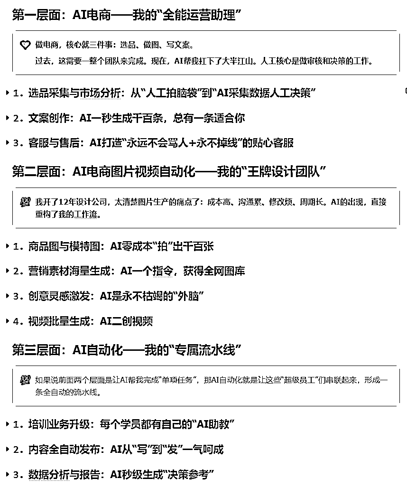
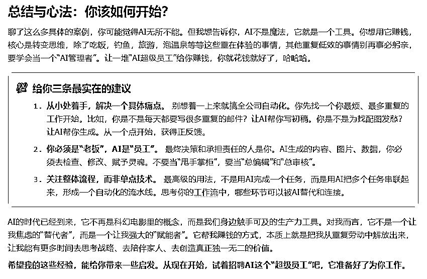

# (35 赞)我是如何用 AI 多个“超级员工”，从三个层面帮我赚钱

> 原文：[`www.yuque.com/for_lazy/zhoubao/fzy8ec8ggm9hggvl`](https://www.yuque.com/for_lazy/zhoubao/fzy8ec8ggm9hggvl)

## (35 赞)我是如何用 AI 多个“超级员工”，从三个层面帮我赚钱

作者： 来来

日期：2025-11-20

大家好，我是来来，一名写了三本 AI 畅销书的作者，11 次生财有术航海教练**（AI 绘画 4 次+AI 视频 2 次+AI 工作流 2 次 N8N 和 COMFYUI+AI 电商 1 次+AI 知识库 1 次+飞书多维表格 1 次)，**
已创办 12 年的电商设计公司的 CEO，AI 企业顾问和培训讲师（客户有中国移动、长江商学院、三节课等），你看我的头衔很多，就知道事情很多很杂，时间永远不够用。但这三年来，我是把 AI 当做我的超级员工的。

**AI 是我解决问题的“万能钥匙”。我不是把 AI 当成一个高深技术，而是把它当成我公司里的员工，ta24 小时不睡觉、不要工资（电费会员费相对员工工资简直就是九牛一毛）、而且不会抱怨，能力超强的“超级员工”。并且我雇佣了不止一个，最少三个，下面请听我详细说说。**

今天，我就从 AI 电商、AI 电商图片视频自动化、AI 自动化这三个层面，跟你聊聊我这个“人类老板”，怎么管理和使用多个“AI 超级员工”来降本增效、开拓业务、最终赚到更多钱的。

**下面是目录截图，详情请看飞书：**[`aigcstudy.feishu.cn/wiki/BZkFwJwR8iqVtzkQFnRccGfinYg`](https://aigcstudy.feishu.cn/wiki/BZkFwJwR8iqVtzkQFnRccGfinYg)

**  **

**这段是我的总结和心法，如果前面不想看，直接看这里吧，省流。**

* * *

评论区：

秋水 : 值得学习！

凯 : 谢谢来来老师的分享[抱拳]