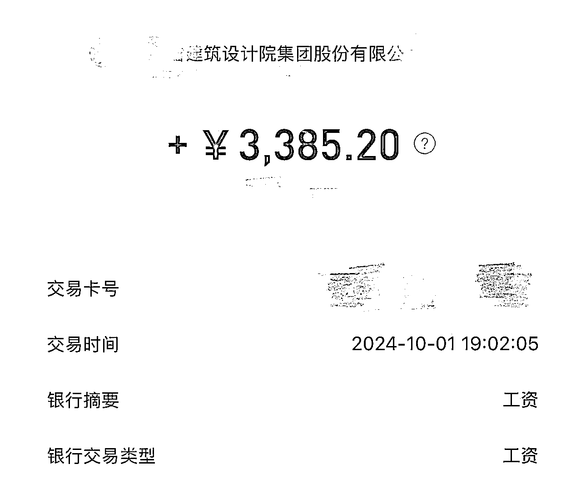
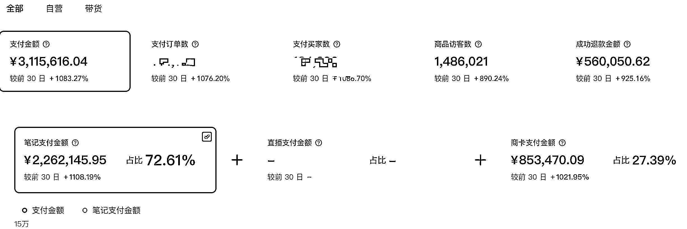
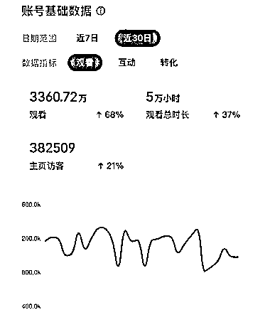
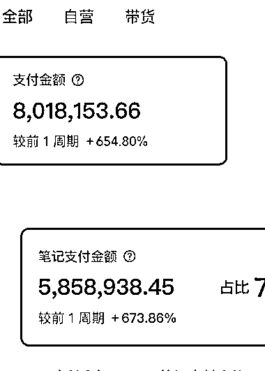
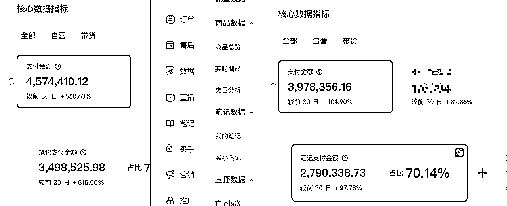

# (44 赞)从国企月薪 3000，到小红书月销 100 万的电商达人--00 后女孩小红书日产 1000 条爆款笔记的邪修大法!

> 原文：[`www.yuque.com/for_lazy/zhoubao/vi4q3gg33ld9n9vx`](https://www.yuque.com/for_lazy/zhoubao/vi4q3gg33ld9n9vx)

## (44 赞)从国企月薪 3000，到小红书月销 100 万的电商达人--00 后女孩小红书日产 1000 条爆款笔记的邪修大法!

作者： deizi‮脸小的你*

日期：2025-11-25

从国企月薪 3000，到小红书月销 100 万的电商达人--00 后女孩小红书日产 1000 条爆款笔记的邪修大法! 前言
大家好，加入生财有术 4 年了吧，去年分享过《单店月销 200W+，小红书电商最强打法保姆级教程》
今天分享在我们最初始的体系里面诞生的日产 1000 条爆款笔记的小红书高效素材 Sop。方法来源于我们项目的一个 00 后女生主理人，她从体制内月入 3000 到辞职创业做我的主理人在小红书月销 100 万的一套总结工作流。
她在小红书上当过博主、当过主理人。之前是学建筑学专业的，在国企设计院上班过两年，了解建筑业的知道，这是一个工科与艺术结合的工种，同时也是一个非常要求速度的行业，一天从设计到建模到出图纸到出汇报文件都是常事。这也决定了她的工作习惯，快、路径要短、工作流优化再优化。
她也很好的把设计院学到的 sop 和各种高效工作流应用到了小红书的素材产出方面，最终做到了月销近 100 万。 内容较长。详情移步至飞书： 小红书电商 小红书运营 [`n4dbdw6xhe.feishu.cn/wiki/Z26dwLjHLiETLQk6t6Nctx5znAC?from=from_copylink`](https://n4dbdw6xhe.feishu.cn/wiki/Z26dwLjHLiETLQk6t6Nctx5znAC?from=from_copylink)

* * *

评论区：

灵动 : 好像没写完？不过已经很好了，感谢分享