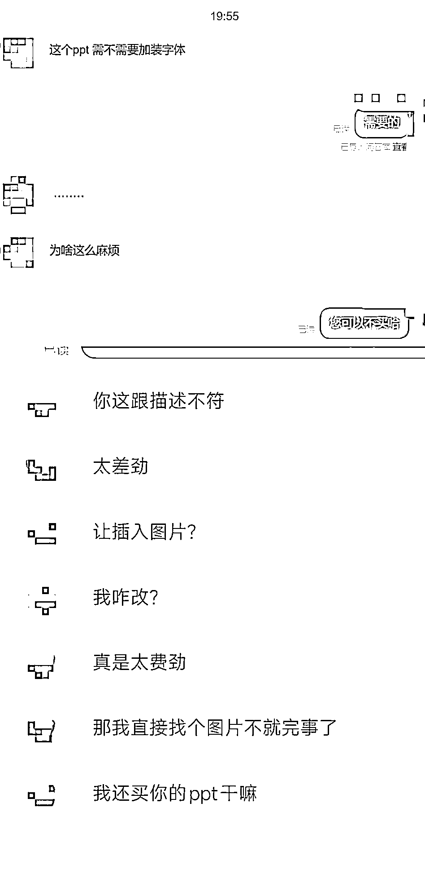
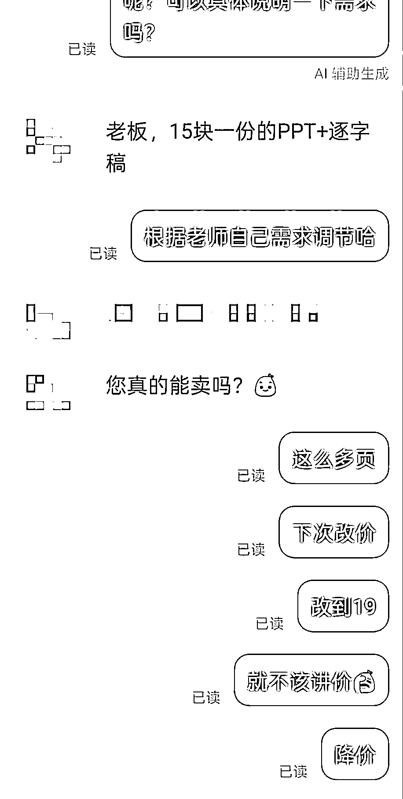
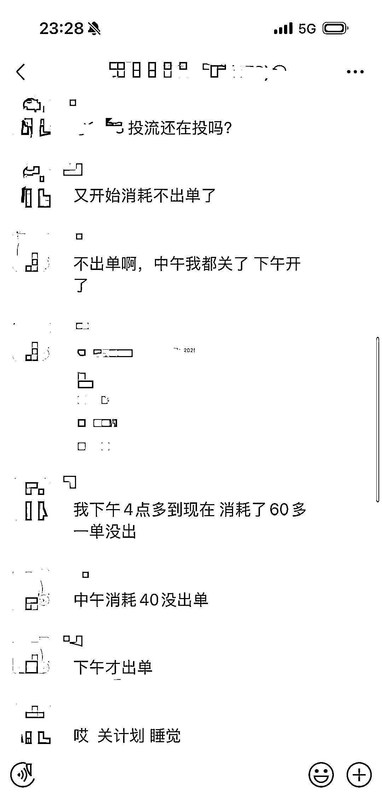
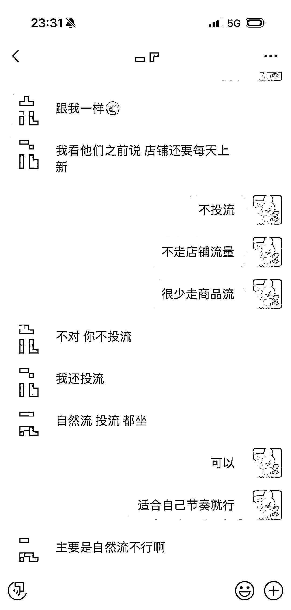
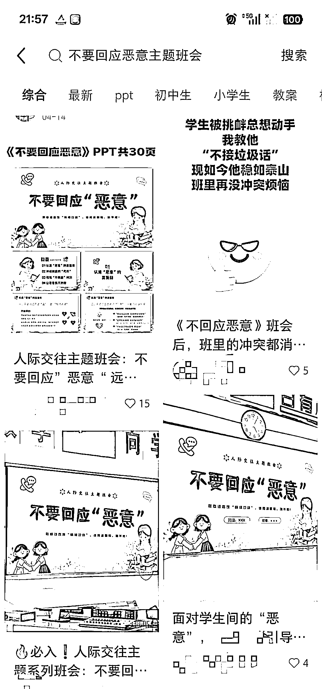
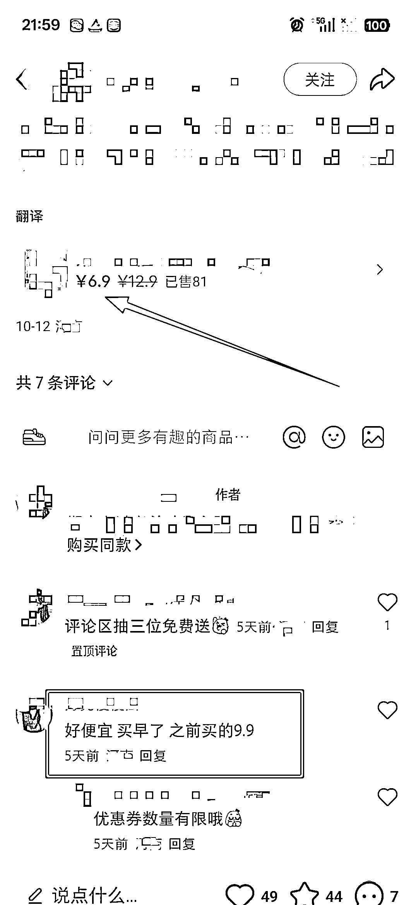
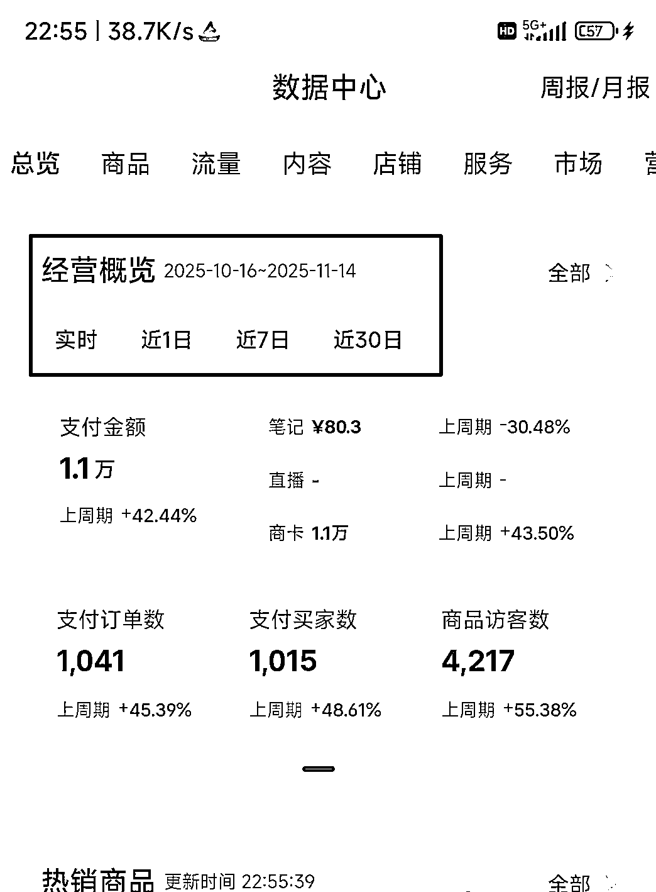
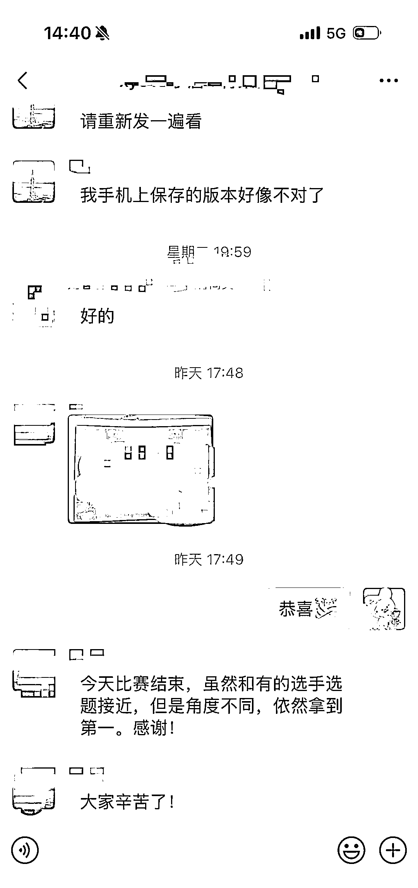
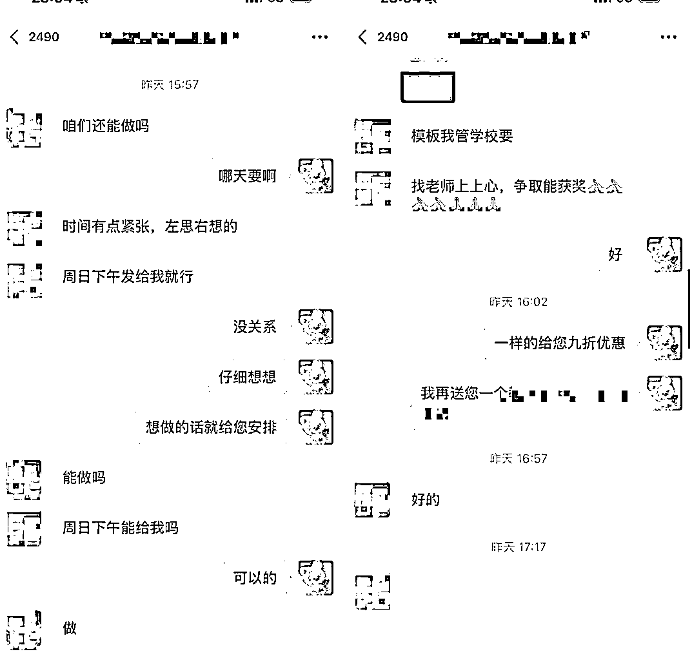

# (48 赞)小红书虚拟电商的 5 种越来越邪门的死法

> 原文：[`www.yuque.com/for_lazy/zhoubao/lqi2eegyv5mqldtq`](https://www.yuque.com/for_lazy/zhoubao/lqi2eegyv5mqldtq)

## (48 赞)小红书虚拟电商的 5 种越来越邪门的死法

作者： 星荧

日期：2025-11-15

**大家好，我是星荧
每个月下来我都要接触上百位小红书虚拟电商伙伴，发现现在的死法真是越来越邪门。以前顶多是品不行或没流量，现在却死于一些你想都想不到的姿势。**

**第一种死法：死于投流——客单价不高，有的卖 9.9、8.9 的客单价要花几百块推广，而吸引的用户很多低质量，钱少、事多、后续还会胡搅蛮缠，而且占完便宜他还嫌不够,明明只花几块钱，恨不得买到几百块钱的价值，不想花钱外、对产品的价值和服务要求还巨多。**

**  **

**  **

**这是最惨烈的死法，没有之一。**

**  **

**有的人做发售个，前端投流成本干到很高，单价也低，完全指望后端升单来填坑，结果升单率没上来，投流倒是花了不少，而且一旦用过投流之后，之后的笔记不推广几乎没人看。**

**  **

**为什么虚拟电商更容易死于投流？**

**  **

**因为很多人把电商公司开成了投流公司。核心能力不是做产品，而是研究平台算法、优化投放策略，很多工作室也在这么干。电商的本质就是竞价排名。不管你是搜关键词、看短视频还是刷直播间，你的产品再好，用户刷不到就是零。**

**  **

**怎么办？**

**  **

**小红书 roi 溢价肯定是值得的，如果你擅长投流且拿到了不错的结果，那就按照你的方式继续走下去，如果你没有投流经验，不要盲目跟风，除非你的笔记已经是热门，你再懂点推广，可能会有点效果，不然基本上就是丢水里。大多人通过走自然流，不断优化虚拟产品 seo、不停换品类、提升原创度、换平台也能拿到不错的结果。一个 seo 词烂大街了就换下一个，不恋战，开学季卖课件，期末卖复习资料，节假日卖活动方案。小红书不行就转视频号，视频号不行再找下个新平台，虚拟资料类目、远不止小红书。适当放弃一些低质量客户，时间成本也是成本。**

**  **

**  **

**第二种死法：死于跟品——你出的爆款，明天就是别人的**

**  **

**在义乌，同样一把勺子，工厂能有几十种做法。你在小红书上一旦出了爆款课件，第二天就能出现十个同款。**

**虚拟产品的跟品速度更快，不用安排生产，直接复制改改就能上架。你的某个班会课件"卖爆了，三天后就能出现价格只有一半的"同款优化版"。**

**    **

**我的一份课件原本是 15，后面爆了，我料到有同行拿去低价，改了 9.9，没想到对方是真没下限，拿去卖 6.9！！！**

**  **

**  **

**现在不光是用户比价，平台也在比价。有些活动，如果你不是全网最低价，根本报不了名。**

**虚拟电商的活路只有一条：差异化。**

**我的账号，无论老号还是新号，无论是开店铺还是引流私域，能持续爆单**

**  **

**  **

**不是因为我有多专业、课件本身做的多完美，而是我做到了这三点：**

**  **

**场景差异化：聚焦开学、期中、期末，节假日等各种特殊时间点**

**内容差异化：加入语义 seo，产品内容布局私域钩子**

**价值差异化：从店铺售卖单粉资料筛选愿意付费的客户，引流至私域，服务好，维系升级高客单代写文稿、定制课件、视频，定制的资料尽善尽美，主打利他、增加复购率。**

**  **

**  **

**如果你的产品无法差异化，那就做渠道差异化——同行都在小红书，你去视频号；同行做图文，你做视频。**

**  **

**第三种死法：死于供应链——虚拟电商也有"库存危机"**

**  **

**很多人以为只有实物电商才会被供应链拖垮，其实小红书虚拟电商同样面临"交付危机"。**

**刷到有做女装的网友，库存 500 件衣服，卖了 1500 单，结果库存还剩 300 件——那一千多单全是下单、退款、再下单、再退款的无效循环。**

**  **

**虚拟电商的供应链问题更隐蔽但同样致命：**

**资料包链接失效，用户收不到货**

**网盘资源被和谐，售后问题爆发**

**课程视频无法播放，差评如潮**

**客服响应慢，用户直接申请退款**

**最要命的是，退款不退广告费。**

**  **

**如果你做的是投放流，你在投流上花的每一分钱，只要用户退款，就全部打水漂。现在可以把所有虚拟产品都转到小红书官方自动发货系统——用户付款后秒收链接，不同于阿奇索，就算电脑关闭没有登陆千帆后台也能发货、大大降低了设备成本、售后压力和退款风险，算是一个新的机遇。**

**  **

**第四种死法：死于扩张——在缺氧的地方跑得越快，死得越快**

**  **

**电商人有个通病：没流量时焦虑流量，有流量时更焦虑，总怕明天流量就没了。**

**  **

**于是疯狂投新项目、扩充品类。**

**  **

**但小红书虚拟电商真的和实体逻辑有所区别，制造业的账期、节奏、模式跟虚拟电商完全不是一个逻辑，还是要敬畏实体制造业。**

**  **

**我带的很多学员在教师课件这个垂直领域能活得好，就是因为拒绝诱惑、专注深耕。**

**很多同行倒在了盲目扩张的路上——今天做课件，明天做教辅，后天搞教师培训，最后哪个都没做透。**

**  **

**在缺氧的环境里，跑得越快，死得越早。**

**  **

**第五种死法：死于合规——你以为的捷径，都是埋好的坑**

**  **

**虚拟电商的合规风险比想象中更大：**

**平台规则：小红书一直在打击侵权非原创素材、AI 假内容**

**虚拟商品：资料版权问题、课程资质问题随时可能爆雷**

**更可怕的是，很多人根本不知道这些规则，直到被罚才知道踩了坑。**

**  **

**我账号能赚钱，不是因为我多会投流，而是我会规避版权、提升原创度、精准抓住了在对的场景，把对的产品卖给对的人这一原则。**

**  **

**虚拟电商的未来，属于那些：**

**深耕垂直领域，不做万金油**

**专注用户需求，不痴迷假象流量**

**建立产品差异化壁垒，不打价格战**

**用好内容工具（比如批量拼图、用各种 AI 提质增效），不盲目扩张**

**遵守平台规则，不碰红线的人**

**客户不会为你的投流成本买单，但会为你的产品价值和积累的信任付费，谁掌握流量，谁就有定价权。**

* * *

评论区：

暂无评论