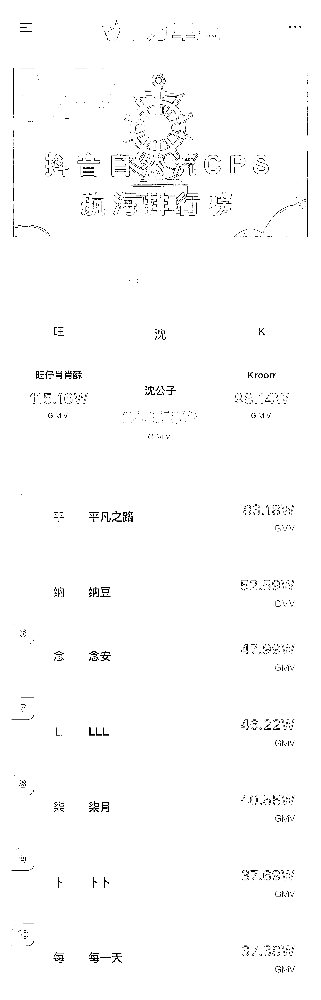

# (42 赞)为执行力干杯——写在抖音自然流 CPS 航海结束

> 原文：[`www.yuque.com/for_lazy/zhoubao/gpex36bngt0xs1cz`](https://www.yuque.com/for_lazy/zhoubao/gpex36bngt0xs1cz)

## (42 赞)为执行力干杯——写在抖音自然流 CPS 航海结束

作者： 海宇

日期：2025-11-19

抖音自然流 CPS Mini 航海第一期正式结束，和伙伴们分享一下最终的航海排行榜：

本次航行，有许多完全没有做过短视频的伙伴剪辑并上传了第一条视频；

体会到第一次从制作内容-上传视频-获得流量-用户成交-获取 CPS 收益的闭环；

在 21 天的坚持和放大后，交上本次航行的成绩单。

## 和各位“云船员”汇报一下本次航行的成绩

本次航海连同一起航行的志愿共 467 人；

收益 5000+以上的伙伴 10 人；

达到返航激励 327 人，占比 327/467=70.02%

0-1 拿到结果的伙伴 424 人，占比 424/467=90.79%

接下来我将从项目初期准备、执行细节和感受、不足反思和自然流的想象空间四部分和大家分享抖音自然流 CPS 的这次航海；为了保障阅读体验，请移步飞书文档：[为执行力干杯——写在抖音自然流 CPS 航海结束](https://wfj1j8pfk7.feishu.cn/wiki/UFhIwb8syimIwHkCBMxcOCLznpb?from=from_copylink)

航海结营不是结束，而是大家把航海中教学的方法修炼出自己招式，走出新手村真正进入游戏主线。

期待每一位伙伴在自己接下来的主线游戏中，不断挑战和提升，拿下更多结果！

咱们第二期的抖音自然流 CPS 航海也将会在今晚正式启动报名，期待有更多的伙伴们一起航行，一起见证自然流 CPS 的奇迹！

* * *

评论区：

怡然 : 海宇教练已经在马来西亚了[得意]

海宇 : 学习下船员们的执行力，提前一天下午决定，当天凌晨就是飞[跳跳]

天道酬勤 : 已经财富自由去的马来西亚吗

刘先生ㄥO : 新来的没抢上，能给个机会吗？

瓶子 bottle : 已报名二期，求问一期的航海手册可以开放出来不，提前学习下~

池月白 : 生财已有的信息已经沉淀了不少内容，搜索挖掘能拼凑出整体内容[阴险]