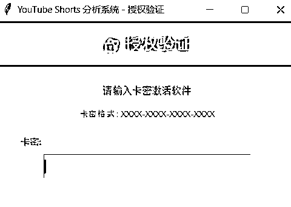
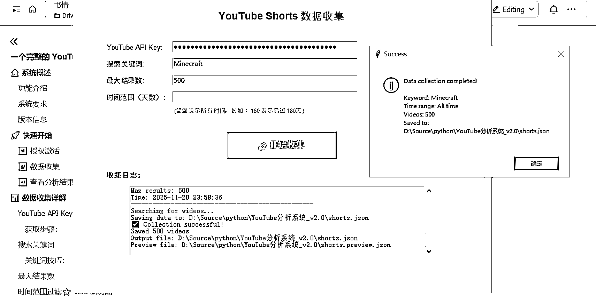
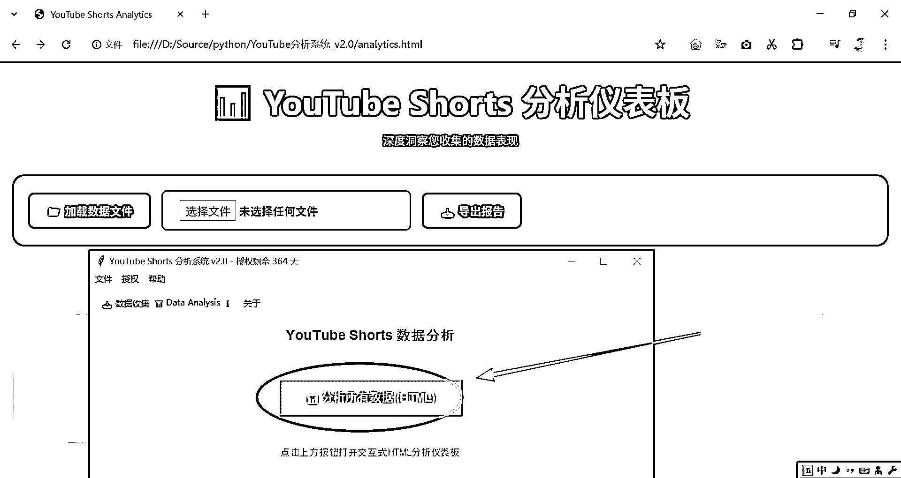
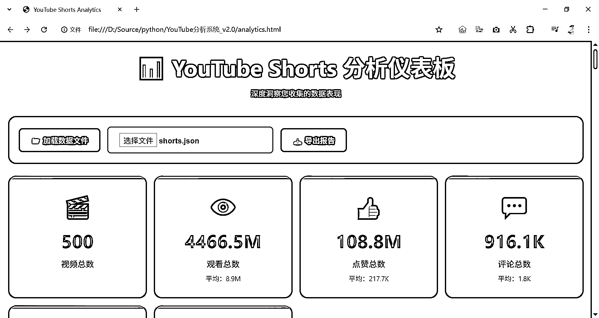
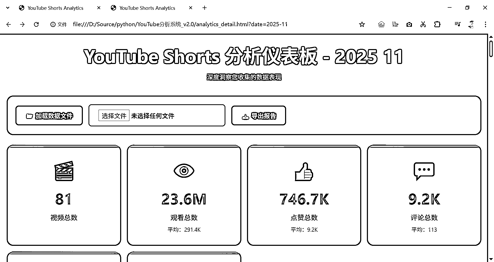
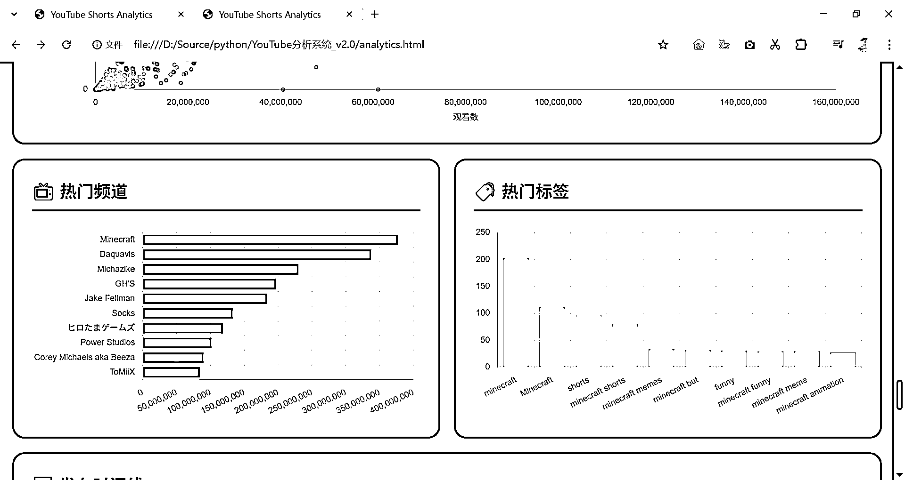

# (28 赞)YouTube 快速找爆款的方法-一个完整的 YouTube Shorts 数据收集和分析系统

> 原文：[`www.yuque.com/for_lazy/zhoubao/lcz5g6ft6w6c9y3t`](https://www.yuque.com/for_lazy/zhoubao/lcz5g6ft6w6c9y3t)

## (28 赞)YouTube 快速找爆款的方法-一个完整的 YouTube Shorts 数据收集和分析系统

作者： 书情小跟班

日期：2025-11-21

前言：更好的阅读体验见飞书文档

一个完整的 YouTube Shorts 数据收集和分析系统 [`rlwxa0zgke.feishu.cn/docx/YImFdq9DbopPB5xaEUSczCGunDP`](https://rlwxa0zgke.feishu.cn/docx/YImFdq9DbopPB5xaEUSczCGunDP)

📊 YouTube Shorts 分析系统

版本 v2.0

一个完整的 YouTube Shorts 数据收集和分析系统

# 🏠 系统概述

## 功能介绍

YouTube Shorts 分析系统是一个专业的数据收集和分析工具，帮助您：

1.  ✅ 通过关键词批量收集 YouTube Shorts 视频数据

2.  ✅ 支持时间范围过滤，精确控制数据收集时段

3.  ✅ 提供交互式 HTML 分析仪表板，直观展示数据

4.  ✅ 多维度统计分析：观看数、点赞数、评论数、时长等

5.  ✅ 热门频道分析和标签趋势追踪

6.  ✅ 支持数据分页浏览和月度数据详细分析

7.  ✅ 一键导出分析报告

## 系统要求

1.  操作系统：Windows 7 及以上版本

2.  浏览器：Chrome、Edge、Firefox 等现代浏览器

3.  网络：需要互联网连接以访问 YouTube API

4.  授权：需要有效的卡密激活许可证

## 版本信息

当前版本：v2.0

发布日期：2025-11-20

# 🚀 快速开始

按照以下三个步骤，快速开始使用系统：

## 1️⃣ 授权激活

1.  1. 启动程序，在授权界面输入您的激活卡密,找我要，点赞过 100，送 100 个激活码

[卡密授权问卷](https://wj.qq.com/s2/24931360/jrtj/) 填写你的生财有术数据 ID 即可

1.  2. 点击"激活"按钮

2.  3. 等待服务器验证，激活成功后自动进入主界面

卡密会自动保存在本地，下次启动时自动验证，无需重复输入。

## 2️⃣ 数据收集

1.  1. 切换到"数据收集"标签页

2.  2. 输入 YouTube API Key（首次使用需要获取，详见下文）

3.  3. 输入搜索关键词（例如：Roblox）

4.  4. 设置最大结果数（建议 50-10000）

5.  5. 可选：设置时间范围（留空表示所有时间）

6.  6. 点击"🚀 开始收集"按钮

收集完成后，数据会自动保存到 shorts.json 文件。

## 3️⃣ 查看分析结果

1.  1. 切换到"Data Analysis"标签页

2.  2. 点击"📊 分析所有数据 (HTML)"按钮

3.  3. 系统会在浏览器中打开分析仪表板，自动加载数据

4.  4. 浏览各种图表和统计信息

分析仪表板会自动从 localStorage 加载数据，无需手动导入文件。

# 📊 数据收集详解

## YouTube API Key 获取

YouTube API Key 是访问 YouTube 数据的必要凭证。

### 获取步骤：

1.  1. 访问 Google Cloud Console

2.  2. 创建新项目或选择现有项目

3.  3. 启用"YouTube Data API v3"

4.  4. 创建凭据 → API 密钥

5.  5. 复制生成的 API Key

API Key 会自动保存在本地（api_key.txt），使用 Base64 编码存储，下次启动时自动填充。

## 搜索关键词

关键词用于搜索相关的 YouTube Shorts 视频。

### 关键词技巧：

1.  单个词：Roblox、Minecraft、Python

2.  多个词："iPhone 16 review"（使用引号表示精确匹配）

3.  热门话题：trending、viral、challenge

4.  语言：支持中文、英文等多种语言

## 最大结果数

设置要收集的视频数量上限。

**数量范围**

**适用场景**

**预计耗时**

50-100

快速测试、小规模分析

1-2 分钟

500-1000

中等规模分析、趋势观察

5-10 分钟

5000-10000

大规模数据分析、深度研究

30-60 分钟

YouTube API 有每日配额限制（默认 10,000 单位/天），每次搜索消耗约 100 单位配额。合理规划使用量。

## 时间范围过滤⭐ v2.0 新功能

限制只收集最近 N 天内发布的视频。

### 使用方式：

1.  留空：收集所有历史视频（默认）

2.  填写天数：例如 180 表示最近 180 天

### 典型应用场景：

**天数**

**用途**

**说明**

留空

历史数据分析

获取所有时间的视频

7

一周热门

追踪最新热点话题

30

月度趋势

分析最近一个月表现

90

季度分析

观察三个月趋势

180

半年报告

半年期数据洞察

365

年度总结

一整年数据回顾

时间范围过滤在 YouTube API 服务器端执行，可以提高收集效率并节省配额。

## 数据存储位置

收集的数据保存在以下位置：

1.  开发模式：D:\Source\python\youtube3-fnally\shorts.json

2.  打包后 (EXE)：与 exe 文件同目录下的 shorts.json

3.  预览文件：shorts.preview.json（前 3 个视频）

# 📈 数据分析详解

## HTML 分析仪表板

系统提供交互式 HTML 分析仪表板，包含以下功能：

1.  📊 6 大统计卡片：视频总数、观看总数、点赞总数、评论总数、平均数据

2.  📈 8 个交互式图表：互动分布、时长分析、观看点赞相关性、时间轴、频道排行等

3.  🎯 关键洞察分析：自动识别数据特征和趋势

4.  📄 热门视频列表：支持分页浏览

5.  📥 导出报告功能

## 自动数据加载⭐ v2.0 新功能

系统现在使用 localStorage 技术自动保存和加载数据。

### 工作原理：

1.  1. 在主页面加载 shorts.json 文件时，数据自动保存到浏览器 localStorage

2.  2. 打开分析页面时，自动从 localStorage 读取数据

3.  3. 无需手动点击"加载数据文件"按钮

4.  4. 数据在浏览器本地存储，更安全、更快速

现在您只需点击"分析所有数据"按钮，页面会自动显示分析结果，无需任何额外操作！

## 分页功能⭐ v2.0 新功能

热门视频列表支持灵活的分页浏览。

### 功能特点：

1.  每页显示数量：可选 10 / 20 / 50 / 100 条

2.  智能按钮显示：第一页：只显示"下一页 →"中间页：显示"← 上一页"和"下一页 →"最后一页：只显示"← 上一页"

3.  第一页：只显示"下一页 →"

4.  中间页：显示"← 上一页"和"下一页 →"

5.  最后一页：只显示"← 上一页"

6.  页面信息：显示"第 X / Y 页"

分页功能解决了"只能看 10 个视频"的问题，现在可以轻松浏览成千上万条数据！

## 时间轴交互功能⭐ v2.0 新功能

时间轴图表支持鼠标交互，查看特定月份的详细数据。

### 交互方式：

1.  鼠标悬停：显示该月份的视频数量

2.  点击：打开新页面，显示该月份的详细分析只分析该月发布的视频所有图表和统计数据都针对该月页面标题显示"YouTube Shorts 分析仪表板 - 2025 11"

3.  只分析该月发布的视频

4.  所有图表和统计数据都针对该月

5.  页面标题显示"YouTube Shorts 分析仪表板 - 2025 11"

示例：

点击时间轴上的 "2025 11" 点

↓

打开新页面 analytics_detail.html?date=2025-11

↓

自动从 localStorage 读取所有数据

↓

筛选出 2025 年 11 月发布的视频

↓

展示该月份的专属分析报告

## 频道点击跳转⭐ v2.0 新功能

"热门频道"图表支持点击跳转到 YouTube 频道页面。

### 使用方法：

1.  1. 在"热门频道"图表中，鼠标悬停在橙色横向柱状图上

2.  2. 点击柱状图

3.  3. 自动在新标签页打开该频道的 YouTube 页面

区分鼠标悬停和点击：悬停只显示数据提示，点击才会跳转到 YouTube。

## 图表详解

分析仪表板包含 8 个专业图表：

### 1.  📊 互动分布（柱状图）

1.  展示观看数、点赞数、评论数的分布情况

2.  帮助识别高互动视频

### 2.  ⏱️ 时长分析（直方图）

1.  按时长区间统计视频数量

2.  识别最受欢迎的视频时长

### 3.  👁️ 观看数与点赞数相关性（散点图）

1.  分析观看数和点赞数的关系

2.  识别异常高点赞率的视频

### 4.  📅 发布时间趋势（折线图）

1.  按月份展示视频发布数量

2.  支持点击查看月度详细数据⭐ 新功能

### 5.  📺 热门频道（横向柱状图）

1.  展示发布视频最多的前 10 个频道

2.  支持点击跳转到 YouTube 频道⭐ 新功能

### 6.  🏷️ 热门标签（词云图）

1.  展示最常用的标签

2.  字体大小表示使用频率

### 7.  🎯 参与度指标（雷达图）

1.  综合评估视频的互动表现

2.  包括观看、点赞、评论等多个维度

### 8.  📊 观看数分布（饼图）

1.  按观看数区间展示视频占比

2.  识别热门视频的比例

## 导出报告

系统支持一键导出分析报告。

### 导出步骤：

1.  1. 在分析仪表板页面，点击"📥 导出报告"按钮

2.  2. 系统会生成包含所有统计数据的报告

3.  3. 报告以 JSON 格式保存，包含：总体统计数据前 20 个热门视频前 10 个热门频道前 20 个热门标签

# 🔧 高级功能

## 时间范围筛选详解

深入理解时间范围过滤的工作原理。

### 三层筛选机制：

第一层：YouTube API 服务器端过滤

↓

参数：publishedAfter = "2024-05-24T00:00:00Z"

作用：YouTube 只返回此日期之后发布的视频

优势：减少数据传输，节省配额

第二层：客户端时长筛选

↓

条件：duration_seconds <= 60

作用：确保只收集真正的 YouTube Shorts

原因：API 的 "short" 参数包含 0-4 分钟视频

第三层：客户端数量限制

↓

条件：len(collected) >= max_results

作用：确保不超过用户设置的最大结果数

### 计算示例：

假设当前时间为 2025-11-20，用户输入时间范围为 180 天：

from datetime import datetime, timedelta

# 当前时间

now = datetime.now() # 2025-11-20 00:00:00

# 计算 180 天前

days = 180

published_after = (now - timedelta(days=180)).isoformat() + 'Z'

# 结果

published_after = "2024-05-24T00:00:00Z"

# 传递给 YouTube API

search_params['published_after'] = "2024-05-24T00:00:00Z"

## 数据格式说明

shorts.json 文件采用 JSON 数组格式存储视频数据。

### 数据结构示例：

[

{

"video_id": "Wo_3-OTOOGA",

"title": "ROUBE UM BRAINROT ao VIVO #roblox",

"channel_id": "UCrbsOc3NRxMHPu_TjrdrBoQ",

"channel_title": "Gxstavo7",

"published_at": "2025-11-19T14:58:25Z",

"duration_seconds": 56,

"view_count": 5201,

"like_count": 344,

"comment_count": 0

},

{

"video_id": "abc123xyz",

"title": "Another Video",

...

}

]

### 字段说明：

**字段名**

**类型**

**说明**

video_id

字符串

YouTube 视频唯一标识符

title

字符串

视频标题

channel_id

字符串

频道唯一标识符

channel_title

字符串

频道名称

published_at

字符串

发布时间（ISO 8601 格式）

duration_seconds

整数

视频时长（秒）

view_count

整数

观看次数

like_count

整数

点赞次数

comment_count

整数

评论次数

## API Key 存储机制

为了便利性和基本安全性，系统会保存您的 API Key。

### 存储位置：

1.  文件名：api_key.txt

2.  开发模式：D:\Source\python\youtube3-fnally\api_key.txt

3.  打包后：与 exe 文件同目录

### 存储方式：

使用 Base64 编码（基本隐私保护）：

# 保存时

import base64

encoded = base64.b64encode(api_key.encode()).decode()

# 存储到文件

# 加载时

import base64

api_key = base64.b64decode(encoded.encode()).decode()

# 自动填充到输入框

Base64 不是加密，只是编码。任何人都可以解码还原原始 API Key。请妥善保管您的 api_key.txt 文件。

# ❓ 常见问题 (FAQ)

**Q1: 如何获取 YouTube API Key？**

A:访问 Google Cloud Console → 创建项目 → 启用 YouTube Data API v3 → 创建凭据 → API
密钥。详细步骤请参考"数据收集详解 - API Key 获取"章节。

**Q2: API 配额限制是多少？**

A:YouTube Data API v3 默认每天 10,000 单位配额。每次搜索请求消耗约 100 单位，获取视频详情每 50 个视频消耗 1
单位。建议合理规划使用量。

**Q3: 为什么收集的视频少于设置的数量？**

A:可能原因：1) 该关键词的 Shorts 视频总数不足；2) 时长筛选（>60 秒的被过滤）；3) 时间范围限制（超出时间范围的被过滤）；4) API
配额不足。

**Q4: 数据文件保存在哪里？**

A:开发模式下保存在脚本所在目录，打包后保存在 exe 文件同目录。文件名为 shorts.json 和 shorts.preview.json。

**Q5: 如何备份数据？**

A:直接复制 shorts.json 文件到其他位置即可。也可以使用"导出报告"功能生成摘要报告。

**Q6: API Key 保存在哪里？安全吗？**

A:保存在 api_key.txt 文件中，使用 Base64 编码（基本隐私保护，不是加密）。建议不要将此文件分享给他人。

**Q7: 如何查看特定月份的数据？**

A:在分析仪表板中，点击"发布时间趋势"图表上的任意月份点，即可打开该月份的专属分析页面。

**Q8: 为什么现在不需要手动加载 JSON 文件了？**

A:v2.0 版本引入了 localStorage 自动加载机制。主页面加载数据时会自动保存到浏览器本地存储，分析页面打开时自动读取，无需手动操作。

**Q9: 时间范围过滤和时间轴点击有什么区别？**

A:时间范围过滤是在数据收集阶段限制收集的时间范围（例如只收集最近 180 天的视频）。时间轴点击是在已收集的数据中筛选查看特定月份的分析结果。

**Q10: 分页功能如何使用？**

A:在热门视频列表上方，选择每页显示数量（10/20/50/100），然后使用"上一页"/"下一页"按钮浏览。系统会智能显示可用的导航按钮。

# 📝 更新日志

## v2.0 (2025-11-20)

**重大更新：**

1.  ✅时间范围过滤器：在数据收集阶段支持按天数过滤（留空=所有时间，填写天数=最近 N 天）

2.  ✅localStorage 自动加载：分析页面自动从浏览器本地存储加载数据，无需手动导入文件

3.  ✅分页功能：热门视频列表支持 10/20/50/100 条分页浏览，智能按钮显示

4.  ✅时间轴点击查看月度数据：点击时间轴上的月份可以打开该月份的详细分析页面

5.  ✅热门频道点击跳转：点击"热门频道"图表的柱状图可以直接跳转到 YouTube 频道页面

6.  ✅中文界面优化：所有 UI 文本中文化（数据保持原始语言）

7.  ✅移除过时提示框：移除了"请手动加载 JSON 文件"的成功提示框，简化操作流程

8.  ✅API Key 自动记忆：首次输入后自动保存，下次启动自动填充

9.  ✅完整使用手册：提供本 HTML 格式的交互式使用手册

**改进：**

1.  🔧 优化数据收集流程，支持三层筛选机制

2.  🔧 改进分析仪表板布局和交互体验

3.  🔧 增强错误提示信息的清晰度

4.  🔧 优化 API 配额使用效率

**修复：**

1.  🐛 修复变量重复声明导致的 JavaScript 错误

2.  🐛 修复 CORS 策略阻止文件访问的问题（改用 localStorage）

3.  🐛 修复分页按钮显示逻辑

## v1.0

**初始版本：**

1.  ✅ 基本数据收集功能

2.  ✅ HTML 分析仪表板

3.  ✅ 8 个数据可视化图表

4.  ✅ 卡密授权系统

5.  ✅ 导出报告功能

* * *

评论区：

AI 卷王龙哥 : 有点东西呀